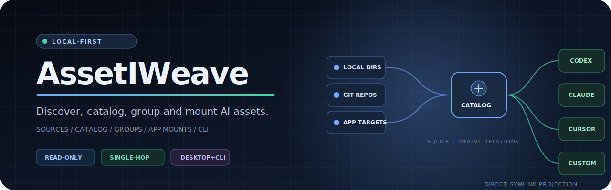
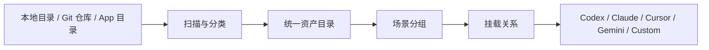
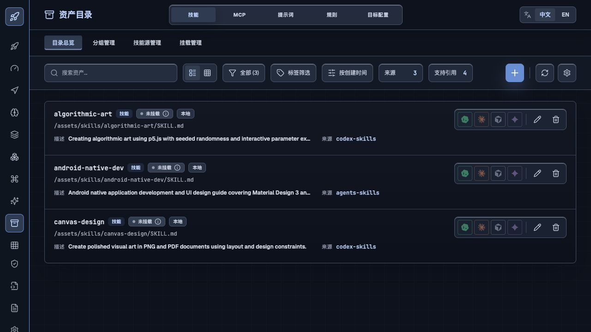
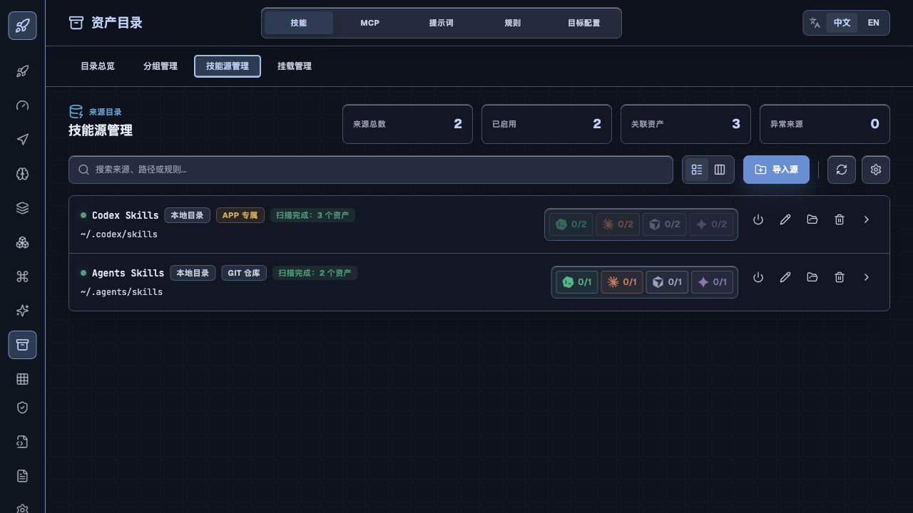
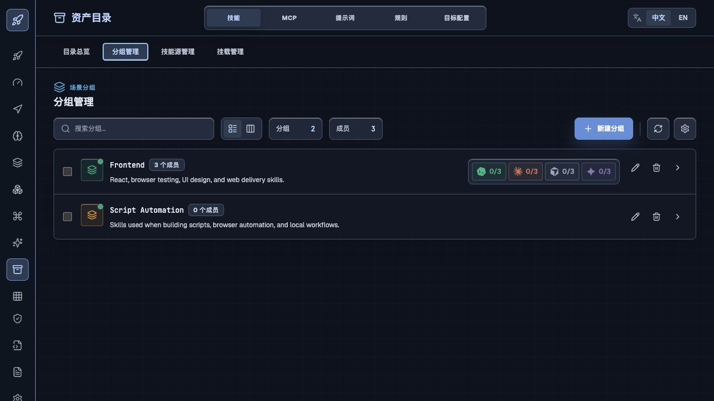
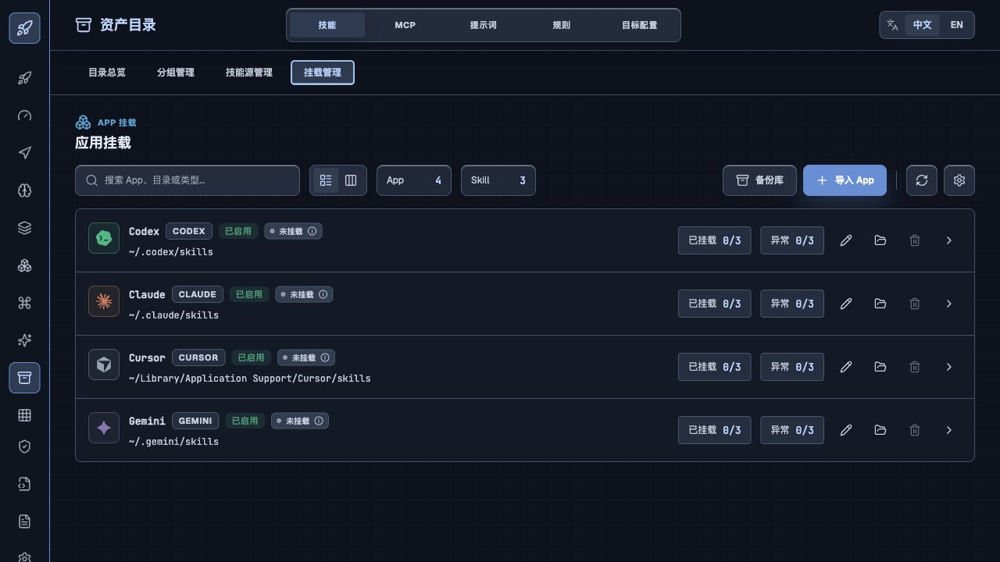
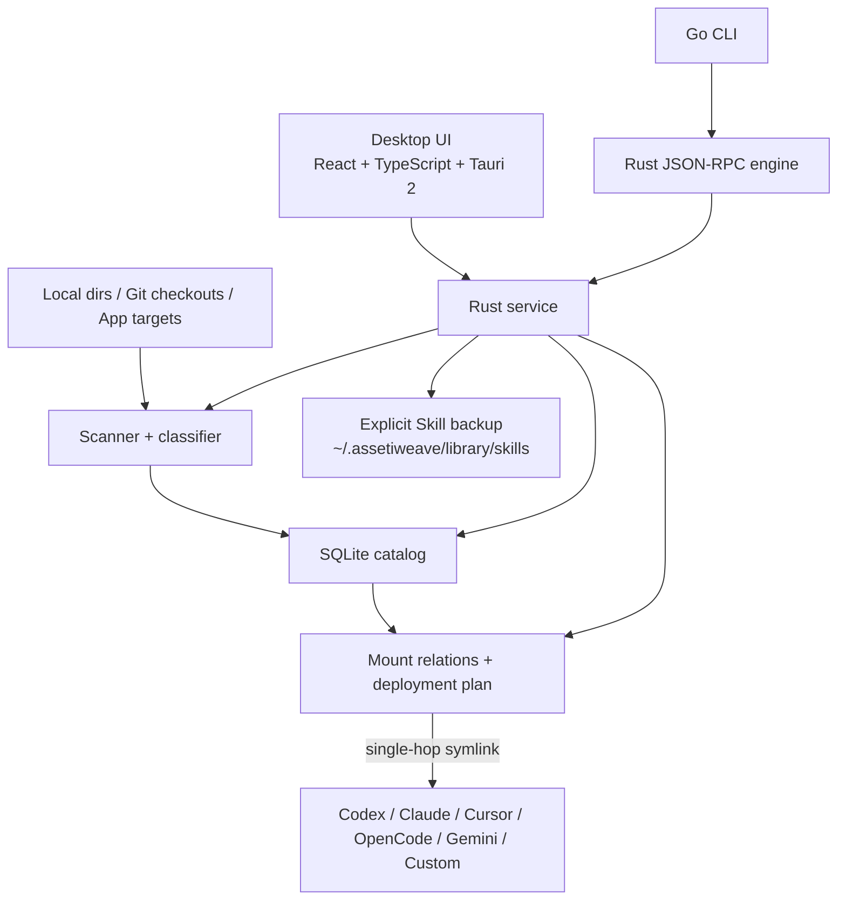

<div align="center">

# AssetIWeave

**把散落在本机、Git 仓库与多个 AI App 中的文件资产，织成一套可发现、可分组、可挂载、可自动化的本地目录。**

Local-first AI asset catalog and mount manager.

[](https://github.com/util6/assetiweave/actions/workflows/ci.yml)
[](https://github.com/util6/assetiweave/tags)
[](https://github.com/util6/assetiweave/releases)
[](https://github.com/util6/assetiweave/releases)
[](https://v2.tauri.app/)



</div>

> [!IMPORTANT]
> AssetIWeave `v0.1.1` 已接入应用内自动更新，当前产品重点是 **Skill 的发现、编目、分组、备份、App 挂载与 CLI 自动化**。导航中可见的其他资产类型正在持续完善。更新包使用 Tauri updater 签名验证；当前安装包尚未接入操作系统代码签名。

## 为什么需要 AssetIWeave

随着 Codex、Claude、Cursor、Gemini、OpenCode 等工具同时进入工作流，Skills、Prompts、Rules 和配置文件很容易散落在：

- 各个 App 的专属目录中；
- 多个 Git 仓库和项目目录中；
- 临时下载目录与手动备份目录中；
- 不同工具要求的不同目标路径中。

手工复制会带来重复文件、版本漂移、挂载状态不清晰和上下文膨胀。AssetIWeave 将这些文件作为统一的 **Asset** 编目，并通过可解释的挂载关系投影到目标 App。



## 核心能力

### 1. 统一资产目录

在一个目录中搜索和浏览来自不同来源的 AI 文件资产，查看类型、描述、来源路径和挂载状态；通过 App 快捷入口直接控制单个 Skill 的挂载关系。

<p align="center">
  
</p>

### 2. 多来源发现与批量管理

将本地目录、Git checkout 和 App 专属目录注册为 Source。每个来源可以配置扫描规则、启停状态和优先级，并支持按来源批量挂载 Skill。

<p align="center">
  
</p>

### 3. 按工作场景组织 Skill

通过手动成员或规则匹配创建 Skill Group，例如 `Frontend`、`Research`、`Release`。可以将一个或多个场景分组批量挂载到指定 App，减少无关 Skill 带来的上下文负担。

<p align="center">
  
</p>

### 4. 面向 App 的挂载管理

集中管理 Codex、Claude、Cursor、OpenCode、Gemini、Antigravity、OpenClaw 与自定义目标。默认使用 **单跳软链接**，目标 App 直接指向真实源资产，不经过中间软链接池。

<p align="center">
  
</p>

### 5. 显式备份与自动化入口

- 默认不复制或改写 Source 中的真实资产；
- 需要归档时，可将 Skill 显式复制到 `~/.assetiweave/library/skills` 备份库；
- 桌面 App 与 CLI 共用 Rust 业务规则，自动化不会绕过挂载和安全边界；
- CLI 的变更命令支持 `--dry-run`，破坏性命令要求 `--yes`。

## 当前支持范围

| 能力 | 当前状态 |
| --- | --- |
| Skill 扫描、编目、搜索、描述与来源展示 | 可用 |
| Skill Source 导入、扫描规则与来源级批量挂载 | 可用 |
| Skill Group 创建、规则匹配、批量与独占挂载 | 可用 |
| 单个 Skill 快捷挂载、状态刷新与部署计划 | 可用 |
| Skill 备份库、导入与删除 | 可用 |
| Codex / Claude / Cursor / OpenCode / Gemini / Antigravity / OpenClaw / Custom Profile | 可用 |
| Prompt / Rule / Custom 基础扫描与目录展示 | 基础能力可用 |
| 应用内自动检测、下载、安装与重启更新 | 可用 |
| MCP / Agent / Command / Workflow 专用工作流 | 规划中 |
| 中文 / English 界面与多主题 | 可用 |

## 工作方式

AssetIWeave 将 **来源** 与 **目标投影** 分开处理：

```text
source repo asset
  -> AssetIWeave SQLite catalog + mount relation
  -> target app directory symlink
```

它默认不会这样做：

```text
source repo asset
  -> copied or intermediate symlink pool
  -> target app directory
```

这意味着源仓库仍是事实来源，目标 App 目录可以根据挂载关系重新生成；只有显式执行 Skill 备份时，AssetIWeave 才会复制真实文件。

## 快速开始

1. 在 **技能源管理** 中导入一个包含 `SKILL.md` 的目录。
2. 扫描 Source，将 Skills 加入统一目录。
3. 在 **分组管理** 中按工作场景组织 Skills。
4. 在 **目录总览** 或 **挂载管理** 中选择目标 App。
5. 刷新挂载状态，确认目标目录中的投影结果。

## 安装

前往 [GitHub Releases](https://github.com/util6/assetiweave/releases) 下载对应平台的预发布包。

| 平台 | 发布产物 |
| --- | --- |
| macOS | Apple Silicon / Intel `.app.zip`，以及构建成功时上传的 `.dmg` |
| Windows | `.msi` 或 `.exe` 安装包 |
| Linux | `.AppImage`、`.deb` 或 `.rpm` |
| CLI | 对应平台的 `assetiweave-tools-*` 压缩包，内含 `assetiweave-cli` 与 `assetiweave-engine` |

### 未签名安装包说明

当前预发布包尚未进行 macOS / Windows 代码签名，系统可能显示额外的信任提示。请只从本项目的 GitHub Releases 下载并核对来源。

macOS 无法打开时，可以先在 **系统设置 -> 隐私与安全性** 中选择“仍要打开”。确认下载来源可信后，也可以执行：

```bash
xattr -dr com.apple.quarantine "/Applications/AssetIWeave.app"
```

## CLI 自动化

CLI 由 Go + Cobra 提供命令入口，通过 Rust JSON-RPC engine 与桌面 App 共用同一套业务规则。

```bash
assetiweave-cli doctor
assetiweave-cli overview
assetiweave-cli source list
assetiweave-cli source add --name LocalSkills --path ./skills --dry-run
assetiweave-cli source scan --kind skill

assetiweave-cli skill list
assetiweave-cli skill import --from ./downloaded-skill --name downloaded-skill
assetiweave-cli skill backup <asset-id>
assetiweave-cli skill mount downloaded-skill --profile codex
assetiweave-cli skill unmount downloaded-skill --profile codex
```

完整命令、JSON 输出约定和通用 API 调用方式见 [CLI 文档](docs/cli.md)。

## 本地优先与数据安全

- **无需云端账号**：核心目录、分组、挂载与备份工作流在本机完成。
- **源目录默认只读**：删除 Source 只取消注册，不删除源目录。
- **安全挂载**：默认不覆盖、不删除目标目录中的非托管真实文件。
- **本地元数据**：Source、Asset、Profile、挂载关系与部署状态存储在本机 SQLite。
- **可控联网**：应用更新检查会访问 GitHub Releases；核心资产管理不依赖项目自建云服务。

默认数据位置：

| 数据 | 默认位置 |
| --- | --- |
| SQLite Catalog | 系统应用数据目录下的 `AssetIWeave/app.db` |
| Skill 备份库 | `~/.assetiweave/library/skills` |
| 目标投影 | 各 Profile 配置的目标目录 |

## 架构



| 层 | 技术与职责 |
| --- | --- |
| Desktop | React 19、TypeScript、Vite、Tailwind CSS、Tauri 2 |
| Service / Engine | Rust，统一扫描、存储、挂载、部署计划与文件系统规则 |
| CLI | Go 1.24 + Cobra，提供友好命令与通用 API 调用 |
| Storage | SQLite + 本地文件系统 |

## 本地开发

### 前置要求

- Node.js 22
- pnpm 10
- Rust stable
- Go 1.24
- 对应平台的 [Tauri prerequisites](https://v2.tauri.app/start/prerequisites/)

### 启动桌面应用

```bash
pnpm install
pnpm tauri:dev
```

只预览前端界面：

```bash
pnpm dev
```

### 构建

```bash
pnpm tauri build
pnpm cli:install
pnpm cli:run -- doctor
```

### 验证

```bash
pnpm typecheck
pnpm test
pnpm build
pnpm cli:test
cargo test --workspace
```

## Roadmap

- 深化 MCP、Prompt、Rule、Agent、Command 与 Workflow 的专用管理工作流；
- 增加带 manifest 的显式资产导出；
- 增加复用部署计划与安全规则的文件 watcher / 自动同步；
- 完善冲突解释、执行结果与回滚体验；
- 接入 macOS / Windows 代码签名与发布公证。

## 参与项目

- 通过 [Issues](https://github.com/util6/assetiweave/issues) 报告问题或提出功能建议；
- 提交改动前运行完整验证命令；
- 涉及挂载或删除行为时，请附上 `--dry-run` / 部署计划结果与测试用例。
