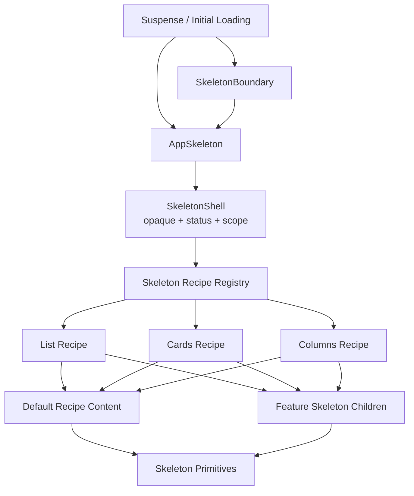

# AssetIWeave 前端统一 Skeleton 架构 SPEC v1

## 0. 文档元数据

| 字段 | 值 |
|---|---|
| 状态 | Implemented；当前代码与自动化验收已完成 |
| 版本 | v1.0 |
| 日期 | 2026-08-16 |
| 适用范围 | `frontend/src/` |
| 目标读者 | 前端开发者、代码执行 Agent、代码审查 Agent、测试 Agent |
| 决策性质 | 前端 Foundation 公共组件与加载状态架构 |
| 依赖变更 | 不新增第三方依赖 |

本 SPEC 是统一 Skeleton 架构的实现依据。实现模型必须以本文的接口、边界、迁移顺序和验收条件为准，不得根据页面名称继续扩展一套平行 Skeleton 系统。

## 1. Objective

建立一套统一、可组合、可快速接入并可渐进迁移的前端 Skeleton 架构，覆盖 AssetIWeave 当前和未来页面的初始加载状态。

该架构必须同时支持两种使用模式：

1. **快速默认骨架**：开发者只声明 `list`、`cards` 或 `columns`，立即获得可用的页面级或内容区级 Skeleton。
2. **基于布局定制的骨架**：业务模块复用同一个布局 Recipe 和统一基础设施，在 Recipe 内组合业务专属骨架，例如 Conversations 的会话列表、问题列表和预览区。

完成后应满足：

- 新页面接入默认 Skeleton 时只需选择布局和加载标签，不需要创建页面专属 kind。
- Conversations 等复杂页面可以保留接近真实结构的具体 Skeleton，但不再维护第二套动画、颜色、背景、可访问性和加载状态语义。
- Skeleton 根表面完全不透明，可作为 WebKit 合成过程中的背景兜底。
- 页面级 Suspense、路由切换覆盖层和普通数据加载状态使用同一套基础设施。
- Skeleton 架构不依赖组件精确高度、真实组件形状或业务数据参数。
- 未来新增布局 Recipe 时不修改 `AppSkeleton` 的控制流。

## 2. 背景与现状审计 (Background and Current-State Audit)

当前代码已经具备一部分可复用基础：

- `frontend/src/components/foundation/Skeleton.tsx`
  - `Skeleton`
  - `SkeletonText`
  - `PageSkeleton`
  - `ListContentSkeleton`
  - `WorkbenchContentSkeleton`
  - Memory 相关页面骨架
- `frontend/src/styles/index.css`
  - `.aurora-skeleton`
  - shimmer 动画
  - `prefers-reduced-motion` 处理
- `frontend/src/router/AppRouter.tsx`
  - Suspense fallback
- `frontend/src/router/RouteTransition.tsx`
  - 路由过渡 Skeleton 覆盖层

当前主要问题：

1. `PageSkeletonKind` 由页面名称驱动，例如 `catalog`、`sources`、`groups`、`memory-overview`，新增页面必须修改联合类型和多处分支。
2. `ListSkeleton`、`CardGridSkeleton`、`WorkbenchSkeleton` 已经接近三种目标布局，但没有形成稳定、通用、可组合的公共接口。
3. Conversations 通过 `ConversationLoadingState`、`ConversationPreviewLoadingState` 和 `conversation-loading-*` CSS 维护了第二套组合实现。
4. `ConversationScriptResourcePanel` 等局部区域仍存在手写 `animate-pulse` 骨架块。
5. Skeleton 根表面和 Surface 大量使用带透明度的背景及 `backdrop-filter`，不能保证 WebKit 合成时不暴露底层背景。
6. 当前测试以查找 class 字符串为主，不能约束统一 API、Recipe 注册、业务组合边界和不透明表面。

本次改造不是从零重写，而是将已有 Skeleton 能力重组为可维护的 Foundation 架构。

## 3. Goals

### 3.1 Functional goals

- 提供统一入口 `AppSkeleton`。
- 提供统一加载包装 `SkeletonBoundary`。
- 首批内置 `list`、`cards`、`columns` 三种 Layout Recipe。
- 支持默认模式与定制模式。
- 支持 `page` 与 `content` 两种 Scope。
- 支持业务模块在自己的目录中定义 Feature Skeleton。
- 统一接入路由 Suspense、路由过渡和初始数据加载。
- 迁移现有页面和 Conversations 自定义实现。

### 3.2 Quality goals

- TypeScript strict 模式下类型完整。
- 公共 API 使用稳定的视觉语义，不使用 Catalog、Source、Conversation 等业务类型。
- 无新增运行时依赖。
- 根 Skeleton 表面完全不透明。
- 遵循项目语义主题 token，不引入原始调色板值。
- 具备完整的单元测试、组件测试和 Tauri WebKit 手工验证步骤。

### 3.3 Developer-experience goals

普通页面的默认接入不超过以下复杂度：

```tsx
<AppSkeleton label={t("common.loading")} layout="list" />
```

普通布尔加载状态不超过以下复杂度：

```tsx
<SkeletonBoundary label={t("common.loading")} layout="cards" loading={loading}>
  <Dashboard />
</SkeletonBoundary>
```

业务定制必须通过组合完成，而不是复制 Foundation 实现：

```tsx
<AppSkeleton label={t("common.loading")} layout="columns">
  <SkeletonColumn>...</SkeletonColumn>
  <SkeletonColumn>...</SkeletonColumn>
</AppSkeleton>
```

## 4. Non-goals

v1 明确不包含：

- 不实现虚拟列表。
- 不实现滚动速度检测。
- 不实现高速滚动时自动把真实内容替换为 Skeleton。
- 不实现动态高度测量、ResizeObserver Size Cache 或滚动位置补偿。
- 不要求 Skeleton 与真实组件高度一致。
- 不要求 Skeleton 精确复刻真实组件形状。
- 不为 Markdown、Code、Tool、Image、Diff、Mermaid 分别建立降级渲染器。
- 不引入 MUI、Chakra、react-loading-skeleton、react-content-loader 等依赖。
- 不在本次改造中改变后端、Tauri、Engine 或 CLI 合约。
- 不把 Skeleton 当作错误状态、空状态或后台刷新状态。

未来如果实现虚拟化渲染调度，可以复用本 SPEC 的 Primitive、Shell 和业务 Feature Skeleton，但必须另立 SPEC。

## 5. Terminology

| 术语 | 定义 |
|---|---|
| Primitive | 最小骨架元素，例如 `Skeleton`、`SkeletonText` |
| Shell | 统一提供不透明表面、加载语义、页面 Chrome 和布局边界的外壳 |
| Chrome | 页面标题骨架和工具栏骨架，不包含业务内容区 |
| Layout Recipe | 只描述结构的布局配方，v1 包含 `list/cards/columns` |
| Quick Default Mode | 未提供 `children`，由 Recipe 生成默认内容 |
| Customized Layout Mode | 提供 `children`，Recipe 只提供布局容器，业务提供内部形状 |
| Feature Skeleton | 位于业务模块内、通过 Foundation 组件组合出的具体骨架 |
| Scope | `page` 或 `content`，决定是否包含页面 Chrome |
| Initial Loading | 页面或内容尚无可展示数据时的首次加载 |
| Refreshing | 已有数据仍可展示时的后台刷新，不应替换为整页 Skeleton |

### 5.1 Normative language

本文使用以下规范性词语：

- **MUST / 必须**：实现不可偏离，否则不满足本 SPEC。
- **MUST NOT / 禁止**：实现不得出现该行为。
- **SHOULD / 应当**：默认必须遵循，只有记录了具体理由时才可偏离。
- **MAY / 可以**：实现可按实际需要选择。

### 5.2 Requirement identifiers

| ID | 规范性要求 |
|---|---|
| SK-FR-001 | 系统必须提供唯一高层入口 `AppSkeleton`。 |
| SK-FR-002 | `AppSkeleton` 必须支持 Quick Default 和 Customized Layout 两种模式。 |
| SK-FR-003 | v1 必须提供 `list/cards/columns` 三种 Layout Recipe。 |
| SK-FR-004 | 两种使用模式必须经过同一个 Recipe Registry。 |
| SK-FR-005 | Feature Skeleton 必须通过 Foundation Primitive 和 Structural components 组合。 |
| SK-FR-006 | 系统必须支持 `page/content` 两种 Scope。 |
| SK-FR-007 | Suspense、RouteTransition 和 Initial Loading 必须可使用同一公共基础设施。 |
| SK-FR-008 | `SkeletonBoundary` 必须严格二选一渲染 Skeleton 或真实内容。 |
| SK-NFR-001 | Skeleton 根表面必须完全不透明。 |
| SK-NFR-002 | 每个独立 loading region 必须只有一个 status root。 |
| SK-NFR-003 | 业务模块禁止定义第二套 Skeleton 动画和基础颜色。 |
| SK-NFR-004 | 实现不得新增第三方运行时依赖。 |
| SK-NFR-005 | 默认 Skeleton 页面必须符合 DOM budget。 |
| SK-NFR-006 | 全部公共 API 必须通过 TypeScript strict 检查。 |
| SK-MIG-001 | 现有页面名称型 `PageSkeletonKind` 必须在迁移完成后删除。 |
| SK-MIG-002 | Conversations 必须迁移为基于 columns Recipe 的 Feature Skeleton。 |

## 6. Architectural decisions

### 6.1 一套架构，两种使用模式 (One Architecture, Two Usage Modes)

“快速默认骨架”和“基于布局定制的骨架”不是两套组件系统，而是同一个 `AppSkeleton` 的两种使用模式。

判定规则：

- 未提供 `children`：Quick Default Mode。
- 提供一个或多个有效 `children`：Customized Layout Mode。
- `children` 为 `null`、`undefined` 或空数组时视为未提供，进入 Quick Default Mode。

### 6.2 Recipe 属于共享基础设施 (Recipes as Shared Infrastructure)

`list/cards/columns` 不从属于某个页面，也不只服务定制模式。两种模式都必须经过相同的 Recipe：

```text
AppSkeleton
  -> SkeletonShell
  -> selected Layout Recipe
      -> default children OR feature children
```

### 6.3 业务 Feature Skeleton 是组合而非新基础设施

允许并鼓励存在：

- `ConversationsSkeleton.tsx`
- `MemoryDreamSkeleton.tsx`
- `PromptEditorSkeleton.tsx`

Feature Skeleton 可以决定：

- 内部骨架块数量。
- 各栏的大体内容。
- 哪一栏更宽。
- 列表项、卡片和预览区的大体排列。

Feature Skeleton 不得重新实现：

- Skeleton 动画。
- Skeleton 颜色。
- Skeleton 不透明根背景。
- `role="status"`、`aria-busy` 和加载标签。
- 页面 Scope 和 Chrome。
- reduced-motion。
- 新的全局 Skeleton CSS 基础类。

### 6.4 优先采用组合，而非页面特化变体

禁止重新引入下列模式：

```ts
type SkeletonKind = "catalog" | "sources" | "conversations" | ...;
```

也禁止：

```tsx
<AppSkeleton layout="conversations" />
```

Conversations 必须以 `columns` 为布局基础，通过 `children` 定制。

### 6.5 静态注册表，无运行时变异

Recipe 使用构建期静态 Registry：

- 保证类型推导。
- 保证 tree shaking 和可搜索性。
- 避免运行时注册顺序问题。
- 不提供 `registerSkeletonRecipe()` 一类全局可变 API。

## 7. Target architecture



## 8. Project structure

目标目录：

```text
frontend/src/components/foundation/skeleton/
├── AppSkeleton.tsx
├── SkeletonBoundary.tsx
├── SkeletonPrimitive.tsx
├── SkeletonShell.tsx
├── SkeletonChrome.tsx
├── SkeletonSurface.tsx
├── skeletonRecipes.ts
├── skeletonTypes.ts
├── index.ts
├── recipes/
│   ├── ListSkeletonRecipe.tsx
│   ├── CardsSkeletonRecipe.tsx
│   └── ColumnsSkeletonRecipe.tsx
└── Skeleton.test.tsx
```

Feature Skeleton 与业务组件共置：

```text
frontend/src/components/conversations/ConversationSkeleton.tsx
frontend/src/components/memory/MemorySkeletons.tsx
```

约束：

- 不建立 `legacy/`、`new/`、`v2/` 平行目录。
- 迁移期间允许旧 `frontend/src/components/foundation/Skeleton.tsx` 作为兼容 re-export；所有调用方迁移完成后删除该兼容文件或将其缩减为 `index.ts` 的 re-export。
- 测试与源文件共置。
- Skeleton 样式继续进入 `frontend/src/styles/index.css` 的 Foundation 区域，不创建业务专属动画样式表。

## 9. Public API contract

### 9.1 Primitive types

```ts
export type SkeletonDensity = "compact" | "default" | "comfortable";
export type SkeletonScope = "page" | "content";
```

### 9.2 Skeleton primitive

```ts
export interface SkeletonProps
  extends Omit<React.HTMLAttributes<HTMLDivElement>, "aria-hidden"> {}

export function Skeleton(props: SkeletonProps): React.ReactElement;
```

行为：

- 恒定设置 `aria-hidden="true"`。
- 默认使用统一基础 class。
- 允许调用方通过 `className` 描述几何尺寸。
- 不接受 `loading`、业务 variant、颜色或动画参数。
- 不拥有 `role="status"`。

### 9.3 SkeletonText

```ts
export interface SkeletonTextProps {
  className?: string;
  lines?: number;
}

export function SkeletonText(props: SkeletonTextProps): React.ReactElement;
```

行为：

- `lines` 默认值为 `3`。
- `lines < 1` 时规范化为 `1`。
- 最后一行默认宽度为前面行的约三分之二。
- 整个组件和内部 Primitive 均不向辅助技术暴露内容。

### 9.4 Layout props map

必须使用类型映射描述 Recipe Props，避免在 `AppSkeleton` 中写布局条件分支：

```ts
export interface ListSkeletonRecipeProps {
  children?: React.ReactNode;
  density?: SkeletonDensity;
  rows?: number;
}

export interface CardsSkeletonRecipeProps {
  cards?: number;
  children?: React.ReactNode;
  columns?: 2 | 3;
  density?: SkeletonDensity;
}

export interface ColumnsSkeletonRecipeProps {
  children?: React.ReactNode;
  columns?: 2 | 3;
  density?: SkeletonDensity;
}

export interface SkeletonRecipePropsMap {
  list: ListSkeletonRecipeProps;
  cards: CardsSkeletonRecipeProps;
  columns: ColumnsSkeletonRecipeProps;
}

export type SkeletonLayoutName = keyof SkeletonRecipePropsMap;
```

默认值：

| Layout | 默认值 |
|---|---|
| `list` | `rows = 7` |
| `cards` | `cards = 6`、`columns = 2` |
| `columns` | `columns = 3` |
| 所有布局 | `density = "default"` |

数量规范化：

- `rows` 和 `cards` 必须被限制在 `1..12`。
- `columns` 由类型限制为 `2 | 3`。
- Customized Layout Mode 下，`rows` 和 `cards` 只作为可选布局提示，不得自动重复业务 `children`。

### 9.5 Registry contract

```ts
export interface SkeletonRecipeDefinition<
  Props extends { children?: React.ReactNode },
> {
  component: React.ComponentType<Props>;
  defaults: Omit<Props, "children">;
}

export type SkeletonRecipeRegistry = {
  [Layout in SkeletonLayoutName]: SkeletonRecipeDefinition<
    SkeletonRecipePropsMap[Layout]
  >;
};

export const skeletonRecipes: SkeletonRecipeRegistry;
```

Registry 规则：

- 每个 `SkeletonLayoutName` 必须有且只有一个 Recipe。
- Registry 不得包含页面名称。
- `AppSkeleton` 通过 Registry 解析组件，不得包含 `if (layout === ...)` 或 `switch (layout)`。
- 未来新增 Layout 时必须同时扩展 Props Map、Recipe 文件、Registry 条目和自动测试矩阵。

### 9.6 AppSkeleton

```ts
export interface AppSkeletonBaseProps {
  children?: React.ReactNode;
  className?: string;
  label: string;
  scope?: SkeletonScope;
}

export type AppSkeletonProps = {
  [Layout in SkeletonLayoutName]: AppSkeletonBaseProps & {
    layout: Layout;
    layoutProps?: Omit<SkeletonRecipePropsMap[Layout], "children">;
  };
}[SkeletonLayoutName];

export function AppSkeleton(props: AppSkeletonProps): React.ReactElement;
```

行为：

1. `label` 必填；`label.trim()` 为空时必须抛出 `Error("AppSkeleton requires a non-empty label")`，测试必须覆盖。
2. `scope` 默认 `page`。
3. `scope="page"` 渲染统一 Page Frame、Header Skeleton、Toolbar Skeleton 和 Layout Recipe。
4. `scope="content"` 只渲染 Layout Recipe，但仍保留统一不透明根表面和加载语义。
5. `React.Children.count(children) === 0` 时使用 Recipe 默认内容。
6. `React.Children.count(children) > 0` 时原样把 children 传给 Recipe。
7. `AppSkeleton` 不读取业务数据、不发请求、不持有 timer。
8. `AppSkeleton` 根节点必须是唯一的加载状态节点。

Recipe 解析算法必须等价于：

```tsx
const definition = skeletonRecipes[layout];
const Recipe = definition.component;
const recipeProps = {
  ...definition.defaults,
  ...layoutProps,
  children,
};

return (
  <SkeletonShell className={className} label={label} scope={scope}>
    <Recipe {...recipeProps} />
  </SkeletonShell>
);
```

实现可以为满足 TypeScript Registry 索引约束增加局部类型辅助函数，但不得改为页面或布局 `switch`。

### 9.7 SkeletonBoundary

`SkeletonBoundary` 存在真实内容与定制 Skeleton 内容的命名冲突，因此定制 Skeleton 内容必须命名为 `fallbackChildren`。由于 `AppSkeletonProps` 是可辨识联合，必须使用 distributive omit 保留 `layout` 与 `layoutProps` 的类型关联：

```ts
type DistributiveOmit<T, Key extends PropertyKey> = T extends unknown
  ? Omit<T, Key>
  : never;

export type SkeletonBoundaryProps = DistributiveOmit<
  AppSkeletonProps,
  "children"
> & {
  children: React.ReactNode;
  fallbackChildren?: React.ReactNode;
  loading: boolean;
};

export function SkeletonBoundary(
  props: SkeletonBoundaryProps,
): React.ReactElement;
```

最终行为：

```tsx
return loading ? (
  <AppSkeleton {...skeletonProps}>{fallbackChildren}</AppSkeleton>
) : (
  <>{children}</>
);
```

使用边界：

- 只用于 Initial Loading。
- 已有数据的 Refreshing 必须继续显示已有内容，使用按钮 spinner、进度状态或后台任务指示器。
- Error 和 Empty 必须使用现有 Error/Empty 组件，不显示 Skeleton。

### 9.8 Structural composition components

Foundation 必须导出以下定制构件：

```ts
SkeletonSurface
SkeletonList
SkeletonCardGrid
SkeletonColumns
SkeletonColumn
```

推荐接口：

```ts
export interface SkeletonSurfaceProps {
  children: React.ReactNode;
  className?: string;
}

export interface SkeletonListProps {
  children: React.ReactNode;
  className?: string;
  density?: SkeletonDensity;
}

export interface SkeletonCardGridProps {
  children: React.ReactNode;
  className?: string;
  columns?: 2 | 3;
  density?: SkeletonDensity;
}

export interface SkeletonColumnsProps {
  children: React.ReactNode;
  className?: string;
  columns?: 2 | 3;
}

export interface SkeletonColumnProps {
  children: React.ReactNode;
  className?: string;
  grow?: 1 | 2;
  header?: React.ReactNode;
}
```

Structural components：

- 只负责结构和间距。
- 不重复 `role="status"` 或 `aria-busy`。
- 默认 `aria-hidden="true"`，避免 Feature Skeleton 被屏幕阅读器逐项读取。
- 可以被 Recipe 默认内容和 Feature Skeleton 同时使用。

## 10. Recipe specifications

### 10.1 List Recipe

用途：

- 资产列表。
- 来源列表。
- 日志列表。
- 普通记录列表。

默认结构：

```text
Opaque Content Surface
├── Row
│   ├── Leading block
│   ├── 2–3 text lines
│   └── Trailing block
├── Row
└── ... total 7
```

规则：

- 始终单列。
- 默认渲染 7 行。
- 行高度只需稳定，不要求匹配真实记录。
- `compact/default/comfortable` 只影响 padding、gap 和大体最小高度。
- Customized Layout Mode 下，Recipe 只提供 `SkeletonList` 容器，调用方 children 是直接列表项。

### 10.2 Cards Recipe

用途：

- Dashboard。
- Memory Overview。
- 卡片型资源页。
- 表单/编辑器页面的近似 fallback。

默认结构：

```text
Responsive Card Grid
├── Card Surface
│   ├── Header block
│   ├── SkeletonText
│   └── Action block
└── ... total 6
```

规则：

- 小屏单列。
- `columns=2` 时大屏两列。
- `columns=3` 时大屏三列。
- 默认渲染 6 张卡片。
- Customized Layout Mode 下，Recipe 只提供 Card Grid 容器。

### 10.3 Columns Recipe

用途：

- Conversations。
- Groups。
- Mounts。
- Memory Library。
- 任何 Finder/Workbench 风格页面。

默认结构：

```text
Responsive Columns Surface
├── Column
│   ├── Column Header
│   └── Default List Blocks
├── Column
└── Column
```

规则：

- 小屏堆叠为单列。
- 大屏按 2 或 3 栏布局。
- 每栏包含统一 Header 区和内容区。
- 默认最后一栏可以比前两栏少显示条目，但不要求精确匹配。
- `grow=2` 允许定制模式中的主预览栏占用更大视觉权重。
- Customized Layout Mode 下，直接 children 应为 `SkeletonColumn`。

## 11. Usage modes

### 11.1 Quick Default Mode

完整页面：

```tsx
<AppSkeleton
  label={t("common.loading")}
  layout="list"
/>
```

仅内容区：

```tsx
<AppSkeleton
  label={t("common.loading")}
  layout="cards"
  scope="content"
/>
```

分栏数量：

```tsx
<AppSkeleton
  label={t("common.loading")}
  layout="columns"
  layoutProps={{ columns: 2 }}
/>
```

### 11.2 Customized Layout Mode

```tsx
<AppSkeleton
  label={t("common.loading")}
  layout="columns"
  layoutProps={{ columns: 3 }}
>
  <SkeletonColumn>
    <FeatureListSkeleton />
  </SkeletonColumn>
  <SkeletonColumn>
    <FeatureSecondarySkeleton />
  </SkeletonColumn>
  <SkeletonColumn grow={2}>
    <FeaturePreviewSkeleton />
  </SkeletonColumn>
</AppSkeleton>
```

禁止在业务模块直接使用 `.aurora-skeleton` 字符串。业务模块必须导入 `Skeleton` 等 Foundation 组件。

## 12. Conversations feature specification

### 12.1 Target component

新增：

```text
frontend/src/components/conversations/ConversationSkeleton.tsx
```

导出：

```ts
export function ConversationsPageSkeleton(props: { label: string }): React.ReactElement;
export function ConversationListSkeleton(): React.ReactElement;
export function ConversationPreviewSkeleton(): React.ReactElement;
```

### 12.2 Page composition

Conversations 页面 Skeleton 必须基于 `columns`：

```tsx
export function ConversationsPageSkeleton({ label }: { label: string }) {
  return (
    <AppSkeleton
      label={label}
      layout="columns"
      layoutProps={{ columns: 3 }}
    >
      <SkeletonColumn>
        <ConversationListSkeleton />
      </SkeletonColumn>
      <SkeletonColumn>
        <ConversationQuestionListSkeleton />
      </SkeletonColumn>
      <SkeletonColumn grow={2}>
        <ConversationPreviewSkeleton />
      </SkeletonColumn>
    </AppSkeleton>
  );
}
```

### 12.3 Existing loading states

现有 `ConversationLoadingState` 和 `ConversationPreviewLoadingState` 可以保留导出名称以降低调用方迁移成本，但实现必须改为组合 Foundation：

- 不再直接创建带 `.aurora-skeleton` class 的 `span`。
- 不再定义新的 shimmer。
- 不再定义自己的 `role="status"`，如果它已经位于 `AppSkeleton` 内。
- 独立作为局部 loading fallback 时，可以使用 `AppSkeleton scope="content"` 建立唯一状态根。

### 12.4 CSS migration

以下样式应在迁移完成后删除，或者只保留与业务几何有关、且无法用现有布局类表达的最小部分：

```text
conversation-loading-state
conversation-loading-stack
conversation-loading-card
conversation-loading-line-*
conversation-preview-loading-content
conversation-preview-loading-line-*
```

必须删除这些样式中重复的：

- Skeleton 背景定义。
- shimmer 动画。
- 通用圆角和 Surface 基础定义。
- reduced-motion 动画控制。

### 12.5 Conversation acceptance

- 页面级 fallback 仍大体呈现三栏结构。
- 问题列表局部加载仍大体呈现列表。
- 预览区局部加载仍大体呈现标题、文本和内容块。
- 所有骨架块来自 Foundation Primitive。
- 页面内不存在第二种 Skeleton 动画系统。

## 13. Routing and loading integration

### 13.1 Suspense

React Suspense 继续作为 lazy route 加载协调器，fallback 改为统一组件。

默认页面：

```tsx
<Suspense fallback={<AppSkeleton label={label} layout="list" />}>
  <CatalogPage />
</Suspense>
```

复杂页面：

```tsx
<Suspense fallback={<ConversationsPageSkeleton label={label} />}>
  <ConversationsPage />
</Suspense>
```

### 13.2 RouteTransition

`RouteTransitionState` 不再保存页面名称型 `PageSkeletonKind`，改为保存 `SkeletonLayoutName`：

```ts
export interface RouteTransitionState {
  id: number;
  label: string;
  layout: SkeletonLayoutName;
  phase: "enter" | "exit";
}
```

路由过渡只需要近似结构，统一使用默认 Recipe；不需要在 300ms 左右的过渡覆盖层中加载 Feature Skeleton。

推荐映射：

| Route | Layout |
|---|---|
| catalog | list |
| sources | list |
| skill-groups | columns |
| skill-mounts | columns |
| conversations | columns |
| web-records | columns |
| prompts-overview | cards |
| memory library | columns |
| memory overview | cards |
| memory dreams | columns |
| memory recall | columns |
| manual | list |

### 13.3 Initial data loading

页面 Chrome 已经渲染后，数据加载使用：

```tsx
<AppSkeleton
  label={t("common.loading")}
  layout="list"
  scope="content"
/>
```

禁止再次渲染 Page Header 和 Toolbar，以免发生双层 Chrome。

### 13.4 Refresh behavior

以下场景不得用 Skeleton 覆盖已有内容：

- 用户点击刷新，旧列表仍可查看。
- 后台同步、扫描、索引或备份正在运行。
- 过滤条件变化但旧结果仍有效。
- 翻译、AI execution 或局部按钮 action 正在运行。

这些场景继续使用现有局部进度、spinner、task indicator 或 disabled 状态。

## 14. Visual and compositor requirements

### 14.1 Opaque root surface

`AppSkeleton` 根表面必须完全不透明：

```css
.app-skeleton-root {
  position: relative;
  isolation: isolate;
  contain: paint;
  min-width: 0;
  min-height: 0;
  background: rgb(var(--color-background));
}
```

禁止根表面使用：

```css
background: rgb(... / 0.x);
backdrop-filter: ...;
-webkit-backdrop-filter: ...;
```

内部 Skeleton 块可以使用半透明主题颜色，但任何可滚动 Skeleton 页面背后都必须存在上述不透明根表面。

### 14.2 Semantic tokens

必须使用：

- `--color-background`
- `--theme-control-bg`
- `--theme-card-header`
- `--theme-card-border`
- 其他现有语义主题 token

禁止添加未经设计系统定义的十六进制颜色或 Tailwind 原始色板值。

### 14.3 Animation

- 全部 Skeleton Primitive 使用同一 shimmer 定义。
- 默认沿用约 1.7 秒循环，不要求每个块独立定制。
- 业务代码不得添加第二套 Skeleton animation keyframes。
- `prefers-reduced-motion: reduce` 时关闭 shimmer。
- 页面卸载后不得残留 timer；标准 Skeleton 不应使用 JavaScript timer。

### 14.4 DOM budget

默认页面 Skeleton 应满足：

- 单个默认页面不超过 80 个 `.aurora-skeleton` Primitive。
- 默认 List 最多 12 行。
- 默认 Cards 最多 12 张。
- 默认 Columns 最多 3 栏。
- Feature Skeleton 应优先表达大体结构，不复制真实页面的全部记录数量。

## 15. Accessibility requirements

### 15.1 Status root

每个独立 Skeleton loading region 必须且只能有一个：

```tsx
<div aria-busy="true" role="status">
  <span className="sr-only">{label}</span>
  ...
</div>
```

规则：

- `label` 使用 i18n 文案。
- Skeleton Primitive 均 `aria-hidden="true"`。
- Feature Skeleton 内不得重复 loading label。
- Skeleton 不能获得焦点。
- Skeleton 不得渲染可点击按钮、真实输入框或伪造交互语义。
- reduced-motion 必须保留。

### 15.2 Replacement semantics

- Loading 完成后移除整个 status region 并渲染真实内容。
- 不在同一个 region 同时显示 Skeleton 和错误信息。
- 不在同一个 region 同时显示 Skeleton 和空状态。

## 16. Code-style requirements

- TypeScript strict。
- 两空格缩进。
- 双引号。
- 分号。
- React 组件和类型使用 `PascalCase`。
- 函数和变量使用 `camelCase`。
- 使用项目现有 `cn()` 合并 class。
- 组件导出使用 named export。
- 业务 Feature Skeleton 从 `components/foundation/skeleton` 公共入口导入，不穿透到 `recipes/` 内部文件。

推荐实现风格：

```tsx
export function CardsSkeletonRecipe({
  cards = 6,
  children,
  columns = 2,
  density = "default",
}: CardsSkeletonRecipeProps) {
  const customChildren = React.Children.count(children) > 0;

  return (
    <SkeletonCardGrid columns={columns} density={density}>
      {customChildren ? children : <DefaultCardSkeletons count={cards} />}
    </SkeletonCardGrid>
  );
}
```

## 17. Migration matrix

| 当前实现 | 目标实现 | 模式 |
|---|---|---|
| `PageSkeleton kind="catalog"` | `AppSkeleton layout="list"` | Quick Default |
| `PageSkeleton kind="sources"` | `AppSkeleton layout="list"` | Quick Default |
| `PageSkeleton kind="groups"` | `AppSkeleton layout="columns"` | Quick Default |
| `PageSkeleton kind="mounts"` | `AppSkeleton layout="columns"` | Quick Default |
| `PageSkeleton kind="conversations"` | `ConversationsPageSkeleton` 基于 columns | Customized |
| `PageSkeleton kind="web-records"` | 复用 Conversations Feature Skeleton | Customized |
| `PageSkeleton kind="prompts"` | `AppSkeleton layout="cards"` 或基于 cards 的 Feature Skeleton | Quick/Customized |
| `MemoryLibraryContentSkeleton` | columns Recipe 或 Memory Feature Skeleton | Quick/Customized |
| `MemoryOverviewSkeleton` | cards Recipe 或 Memory Feature Skeleton | Quick/Customized |
| `MemoryDreamSkeleton` | 基于 columns 的 Memory Feature Skeleton | Customized |
| `MemoryRecallSkeleton` | 基于 columns 的 Memory Feature Skeleton | Customized |
| `MemoryDetailSkeleton` | 基于 cards 的 content Feature Skeleton | Customized |
| `ManualPageSkeleton` | list Recipe | Quick Default |
| `ConversationLoadingState` | Foundation list/content 组合 | Customized |
| `ConversationPreviewLoadingState` | Foundation cards/content 组合 | Customized |
| 手写 `.aurora-skeleton` span | `Skeleton` Primitive | Foundation |

迁移兼容规则：

1. 先建立新 Foundation API。
2. 旧导出短期 re-export 到新实现，保证每个小任务结束时构建可用。
3. 逐页迁移调用方。
4. Conversations 单独迁移和验证。
5. 调用方归零后删除 `PageSkeletonKind` 和页面名称判断。
6. 不长期保留两套实现。

## 18. Testing strategy

### 18.1 Primitive unit tests

必须覆盖：

- `Skeleton` 强制 `aria-hidden="true"`。
- `SkeletonText` 默认 3 行。
- `SkeletonText lines={0}` 规范化为 1 行。
- className 正常合并。

### 18.2 Registry tests

测试必须自动遍历 Registry，而不是手写不完整布局列表：

```tsx
describe.each(Object.entries(skeletonRecipes))(
  "%s Skeleton Recipe",
  (name, definition) => {
    it("renders non-empty default content", () => {
      // Render definition.component with definition.defaults.
    });
  },
);
```

必须验证：

- 每个 Props Map key 有 Registry 条目。
- 每个默认 Recipe 至少渲染一个 Primitive。
- 默认 Primitive 总数不超过预算。

### 18.3 AppSkeleton tests

必须覆盖：

- 默认 `scope="page"` 包含 Header、Toolbar 和内容。
- `scope="content"` 不包含 Header 和 Toolbar。
- 只有一个 `role="status"`。
- 根节点具有 `aria-busy="true"`。
- label 存在于 `sr-only`。
- 无 children 使用默认 Recipe。
- 有 children 使用定制内容，不再渲染 Recipe 默认内容。
- `list/cards/columns` 都可通过同一入口渲染。
- `layoutProps` 被传入对应 Recipe。

### 18.4 SkeletonBoundary tests

必须覆盖：

- `loading=true` 显示 AppSkeleton。
- `loading=false` 显示真实 children。
- `fallbackChildren` 只在 loading 时出现。
- 不同时渲染真实内容和 Skeleton。

### 18.5 Feature Skeleton tests

Conversations 必须覆盖：

- 页面 Feature Skeleton 使用 columns 布局。
- 包含会话列表、问题列表和预览区三个结构区域。
- 最多一个 status root。
- 不直接输出手写 `.aurora-skeleton` class；所有 Primitive 来自 Foundation。
- 局部 Conversation loading state 使用 `scope="content"`。

### 18.6 Router tests

必须覆盖：

- 每个可懒加载 Route 有 Skeleton fallback。
- Route transition 使用 `SkeletonLayoutName`，不使用页面名称 kind。
- Conversations Suspense fallback 使用 Feature Skeleton。
- Memory 子页面映射到正确的三种基础布局之一。

### 18.7 CSS and manual verification

自动或代码审查检查：

- `.app-skeleton-root` 背景无 alpha。
- `.app-skeleton-root` 无 backdrop-filter。
- reduced-motion 关闭 shimmer。

Tauri WebKit 手工检查：

1. 分别打开 list/cards/columns 页面。
2. 使用 DevTools 网络限速或测试延迟保持 Skeleton 至少 1 秒。
3. 快速切换浅色/深色主题。
4. 快速切换路由并滚动 Skeleton 页面。
5. 验证没有窗口背景穿透、白闪或透明空洞。
6. 验证 loading 完成后真实页面正常替换。

## 19. Implementation plan and tasks

### Phase 1: Foundation contract

- [ ] Task 1.1：建立目录、类型和 Primitive
  - Acceptance：新增 `skeleton/` 公共入口；`Skeleton`、`SkeletonText` 行为与现有兼容；无业务类型。
  - Verify：Primitive 单元测试通过；`pnpm typecheck` 通过。
  - Files：`skeletonTypes.ts`、`SkeletonPrimitive.tsx`、`index.ts`、测试。
  - Dependencies：无。

- [ ] Task 1.2：建立 SkeletonShell、Chrome 和不透明表面
  - Acceptance：page/content scope 可用；根背景完全不透明；唯一 status root；无 backdrop-filter。
  - Verify：Shell 测试、CSS 审查、浅色/深色静态检查。
  - Files：`SkeletonShell.tsx`、`SkeletonChrome.tsx`、`SkeletonSurface.tsx`、`styles/index.css`、测试。
  - Dependencies：Task 1.1。

### Checkpoint A

- [ ] `pnpm typecheck`
- [ ] Foundation Skeleton 测试通过。
- [ ] 现有页面尚未迁移但构建保持可用。

### Phase 2: Layout Recipes and public entry

- [ ] Task 2.1：实现 List Recipe
  - Acceptance：默认 7 行；支持自定义 children；支持 density；无业务 variant。
  - Verify：默认/定制模式测试通过。
  - Files：`ListSkeletonRecipe.tsx`、结构组件、测试。
  - Dependencies：Checkpoint A。

- [ ] Task 2.2：实现 Cards Recipe
  - Acceptance：默认 6 卡；支持 2/3 列；支持自定义 children。
  - Verify：响应式 class 和默认/定制模式测试通过。
  - Files：`CardsSkeletonRecipe.tsx`、结构组件、测试。
  - Dependencies：Checkpoint A。

- [ ] Task 2.3：实现 Columns Recipe
  - Acceptance：支持 2/3 栏；支持 `SkeletonColumn grow`；默认/定制模式可用。
  - Verify：结构测试通过；非法 columns 在类型层失败。
  - Files：`ColumnsSkeletonRecipe.tsx`、结构组件、测试。
  - Dependencies：Checkpoint A。

- [ ] Task 2.4：实现 Registry、AppSkeleton 和 SkeletonBoundary
  - Acceptance：`AppSkeleton` 无 layout switch；两种使用模式可用；Boundary 正确切换。
  - Verify：Registry、AppSkeleton、Boundary 全部测试通过。
  - Files：`skeletonRecipes.ts`、`AppSkeleton.tsx`、`SkeletonBoundary.tsx`、测试。
  - Dependencies：Tasks 2.1–2.3。

### Checkpoint B

- [ ] 三种 Recipe 通过统一入口渲染。
- [ ] Quick Default 和 Customized Layout 测试通过。
- [ ] 默认页面 DOM 预算符合要求。
- [ ] `pnpm typecheck && pnpm test` 通过。

### Phase 3: Router and simple page migration

- [ ] Task 3.1：迁移 AppRouter Suspense fallback
  - Acceptance：默认路由使用 AppSkeleton；复杂路由允许 Feature fallback；旧页面名称 kind 不再新增。
  - Verify：AppRouter 测试通过。
  - Files：`AppRouter.tsx`、相关测试、兼容 re-export。
  - Dependencies：Checkpoint B。

- [ ] Task 3.2：迁移 RouteTransition
  - Acceptance：Transition state 使用 `SkeletonLayoutName`；映射使用三种布局。
  - Verify：RouteTransition 测试通过。
  - Files：`RouteTransition.tsx`、`AppRouter.tsx`、相关测试。
  - Dependencies：Task 3.1。

- [ ] Task 3.3：迁移 Catalog 和 Sources 内容加载
  - Acceptance：两页使用 `scope="content"` 的 list；行为不变。
  - Verify：对应页面测试通过。
  - Files：两个页面、必要测试、兼容导出。
  - Dependencies：Checkpoint B。

- [ ] Task 3.4：迁移 Groups 和 Mounts 内容加载
  - Acceptance：两页使用 `scope="content"` 的 columns；行为不变。
  - Verify：对应页面测试通过。
  - Files：两个页面、必要测试、兼容导出。
  - Dependencies：Checkpoint B。

### Checkpoint C

- [ ] 路由切换和四个主要页面 Skeleton 正常。
- [ ] `pnpm typecheck && pnpm test && pnpm build` 通过。
- [ ] Tauri WebKit 完成一次不透明背景检查。

### Phase 4: Feature Skeleton migration

- [ ] Task 4.1：实现 Conversations Feature Skeleton
  - Acceptance：三栏具体结构基于 columns；导出页面、列表和预览骨架。
  - Verify：Conversation Feature Skeleton 测试通过。
  - Files：`ConversationSkeleton.tsx`、测试、Foundation 公共导入。
  - Dependencies：Checkpoint C。

- [ ] Task 4.2：迁移 Conversations 页面和局部 loading state
  - Acceptance：页面、问题列表和预览加载都使用统一 Foundation；旧视觉大体保留。
  - Verify：ConversationsPage 测试、同步测试通过。
  - Files：`ConversationsPage.tsx`、相关测试、必要样式。
  - Dependencies：Task 4.1。

- [ ] Task 4.3：清理 Conversations 重复 Skeleton CSS
  - Acceptance：无重复 shimmer、背景和 reduced-motion；只保留必要业务几何样式。
  - Verify：`rg "conversation-(loading|preview-loading)"` 结果逐项审查；页面测试通过。
  - Files：`styles/index.css`、Conversation 相关测试。
  - Dependencies：Task 4.2。

- [ ] Task 4.4：迁移 Memory Feature Skeleton
  - Acceptance：现有 Memory 专属形状改为基于 cards/columns 组合；不丢失局部 detail fallback。
  - Verify：Memory 页面和 workspace 测试通过。
  - Files：Memory Skeleton 文件、Memory 页面/组件、测试。
  - Dependencies：Checkpoint C。

### Checkpoint D

- [ ] Conversations 不再拥有第二套 Skeleton 基础设施。
- [ ] Memory 专属骨架只组合 Foundation。
- [ ] `pnpm typecheck && pnpm test && pnpm build` 通过。

### Phase 5: Cleanup and enforcement

- [ ] Task 5.1：迁移剩余手写 Skeleton
  - Acceptance：局部手写 `.aurora-skeleton` 替换为 Primitive；非 Skeleton 的状态 pulse 不误删。
  - Verify：全局 `rg` 审计及相关组件测试。
  - Files：按审计结果拆成每次不超过 5 个文件的小任务。
  - Dependencies：Checkpoint D。

- [ ] Task 5.2：删除旧页面名称型架构
  - Acceptance：`PageSkeletonKind`、页面名称分支和无调用旧实现移除；无平行兼容层。
  - Verify：TypeScript、测试、生产构建通过。
  - Files：旧 Skeleton 文件、Router、测试。
  - Dependencies：Task 5.1。

- [ ] Task 5.3：补充架构约束测试
  - Acceptance：Registry 自动矩阵、唯一 status、不透明根、Feature 组合约束均被测试覆盖。
  - Verify：完整测试通过。
  - Files：Foundation/Router/Feature 测试。
  - Dependencies：Task 5.2。

### Final checkpoint

- [ ] 所有 Success Criteria 达成。
- [ ] `pnpm typecheck && pnpm test && pnpm build` 通过。
- [ ] Tauri WebKit 三类布局手工验证通过。
- [ ] Git diff 中没有无关格式化或业务行为变更。
- [ ] GitHub Issues（已取代文件版任务总册） 根据已完成事实更新。

## 20. Verification commands

最小增量验证：

```bash
pnpm vitest run --config frontend/vite.config.ts frontend/src/components/foundation/skeleton
pnpm typecheck
```

路由与 Conversations 迁移后：

```bash
pnpm vitest run --config frontend/vite.config.ts \
  frontend/src/router/RouteTransition.test.tsx \
  frontend/src/pages/conversations/ConversationsPage.test.tsx \
  frontend/src/pages/conversations/ConversationsPage.sync.test.tsx
```

最终验证：

```bash
pnpm typecheck && pnpm test && pnpm build
```

审计命令：

```bash
rg -n "aurora-skeleton" frontend/src --glob '*.tsx'
rg -n "PageSkeletonKind|kind=\"(catalog|sources|groups|mounts|conversations)\"" frontend/src
rg -n "conversation-loading|conversation-preview-loading" frontend/src
```

审计预期：

- `.aurora-skeleton` 的直接 class 输出只存在于 Foundation Primitive 实现。
- `PageSkeletonKind` 不再存在。
- Conversations 中不再存在重复 Skeleton 动画或基础颜色定义。

## 21. Boundaries

### Always do

- 新行为先写失败测试，再实现。
- 所有 Skeleton 使用统一 Foundation Primitive。
- Feature Skeleton 与业务组件共置。
- 根表面使用不透明语义背景。
- 每个独立 loading region 只有一个 status root。
- 每个任务结束运行对应最小测试和 typecheck。
- UI 可见变更在 Tauri WebKit 中验证。

### Ask first

- 新增第三方依赖。
- 新增第四种全局 Layout Recipe。
- 修改主题 token 定义。
- 改变路由切换时长或交互行为。
- 将 Skeleton 扩展到滚动虚拟化、Size Cache 或渲染调度。

### Never do

- 不新增页面名称型 Skeleton kind。
- 不在业务模块创建第二套 shimmer keyframes。
- 不以 spinner 替代本 SPEC 的初始页面 Skeleton。
- 不在刷新已有内容时整页替换 Skeleton。
- 不要求每个 Skeleton 精确匹配真实组件。
- 不通过硬编码高度解决所有页面。
- 不引入 `legacy/new/v2` 平行目录。
- 不删除或跳过失败测试来完成迁移。
- 不修改与 Skeleton 无关的后端、数据库或 Engine 合约。

## 22. Risks and mitigations

| 风险 | 影响 | 缓解措施 |
|---|---|---|
| 单一 `AppSkeleton` 参数持续膨胀 | 公共 API 难以理解 | 公共参数只保留 scope、density 和布局必要参数；业务差异通过 children 组合 |
| Feature Skeleton 再次复制基础 CSS | 架构重新分叉 | Foundation 导出 Structural components；测试和 `rg` 审计禁止直接 class 输出 |
| 一次性迁移导致大 diff | 难审查、难回滚 | 按 Foundation、Recipe、Router、简单页、Feature 页、清理分阶段提交 |
| 根表面不透明改变 Aurora 玻璃感 | 加载态视觉略有变化 | 只要求 Skeleton 根层不透明，内部 Surface 仍可使用语义层次，但不使用 backdrop-filter |
| `children` 定制导致默认内容意外出现 | 页面显示错误骨架 | 使用 `React.Children.count`；Feature Skeleton 测试必须验证结构区域 |
| Router 和数据 loading 重复渲染 Chrome | 视觉跳跃 | Route 使用 page scope，页面内部数据 loading 使用 content scope |
| 过多 shimmer 增加 WebKit 合成压力 | 滚动或过渡掉帧 | 默认 DOM 预算、统一动画、reduced-motion、不透明根、禁止业务重复动画 |

## 23. Success criteria

以下条件全部满足时，本 SPEC 才算实现完成：

1. 存在一个公开的 `AppSkeleton`，支持 `list/cards/columns`。
2. `AppSkeleton` 同时支持无 children 的默认模式和有 children 的定制模式。
3. 三种 Recipe 通过静态 Registry 解析，`AppSkeleton` 无 layout switch/if。
4. 新页面默认 Skeleton 接入只需 `label + layout`。
5. Feature Skeleton 可以基于同一 Recipe 组合具体结构。
6. Conversations 页面存在具体 Feature Skeleton，但不存在第二套 Skeleton 动画、颜色、背景和状态语义。
7. 所有独立 Skeleton region 只有一个 `role="status"` 和 `aria-busy="true"`。
8. Skeleton 根表面完全不透明且不使用 backdrop-filter。
9. `PageSkeletonKind` 和页面名称型 Skeleton 分支被移除。
10. Catalog、Sources、Groups、Mounts、Conversations、Web Records、Prompts 和 Memory 的初始加载均有统一 fallback。
11. 已有数据的后台刷新不会被整页 Skeleton 替换。
12. Registry、Primitive、AppSkeleton、Boundary、Router 和 Conversations Feature Skeleton 均有回归测试。
13. `pnpm typecheck && pnpm test && pnpm build` 全部通过。
14. Tauri WebKit 快速路由切换和 Skeleton 滚动验证不出现背景穿透。
15. 未新增第三方依赖，未改变后端或 Engine 合约。

## 24. Agent execution protocol

后续代码执行模型必须遵循：

1. 首先读取本 SPEC 当前任务对应章节，不一次加载无关后端代码。
2. 执行前读取将修改的源文件和测试文件。
3. 每次只实施一个 Task，不跨 Phase 批量重写。
4. 先补行为测试并确认在旧实现上失败，再写实现。
5. 每个 Task 修改不超过约 5 个文件；超过时继续拆分。
6. 保留现有行为，不进行无关 UI 美化或组件重命名。
7. 不手工修改生成文件。
8. 每个 Checkpoint 运行文档列出的验证命令。
9. 发现 SPEC 与现有代码冲突时，先记录具体冲突并请求决策，不静默改变架构。
10. Commit 使用中文 Conventional Commit，例如：

```text
feat: 建立统一骨架布局配方
refactor: 迁移会话页骨架到统一基础设施
test: 补充骨架布局与路由回归测试
```

## 25. Resolved decisions and open questions

已确定：

- 使用项目自有实现，不引入第三方 Skeleton 库。
- v1 只有 `list/cards/columns` 三种全局 Recipe。
- 两种使用模式共享同一套 Recipe。
- Conversations 通过 columns 组合 Feature Skeleton，不新增 Recipe。
- Skeleton 只负责初始加载，不在 v1 承担滚动渲染调度。
- 不追求精确高度和精确形状。

Open Questions：无。实现中如出现未覆盖场景，默认优先使用最接近的三种 Recipe 并通过 Feature Composition 解决，而不是新增全局 Recipe。
