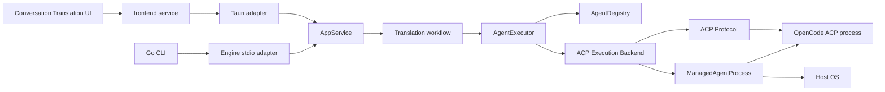

# 架构设计：ACP Agent 执行运行时 (Architecture Design)

| 字段 | 值 |
|---|---|
| 状态 | Implemented |
| 对应需求 | `01-product-requirements.md` |
| 实施计划 | `07-implementation-plan.md` |

## 1. 架构目标

本设计建立一个“业务任务—执行抽象—Agent 定义—协议后端—进程”的单向依赖链：

```text
Business Task
    -> AiExecution
        -> AgentExecutor
            -> AgentRegistry
            -> Runtime Backend
                -> Protocol
                -> Managed Process
                    -> OS
```

核心不变量：

1. Translation 不知道 ACP wire type。
2. Translation 不知道 `opencode acp`。
3. Registry 不执行 prompt。
4. Protocol 不决定业务策略。
5. Process 不解析协议。
6. Tauri/Engine 不复制执行流程。
7. 任意终态必须完成 cleanup 后才对外发布。

## 2. 系统上下文



Conversation ingestion 是旁路域，不进入该图。

## 3. 分层与依赖规则

### 3.1 Business Layer

组件：

- `backend/card_translation.rs`
- `backend/application/card_translation.rs`

负责：

- translation prompt 与业务输入校验；
- 将设置映射为 `AiExecutionRequest`；
- 将 `AiExecutionResult.text` 映射为 `translated_text`；
- 保存翻译结果的 workflow 仍在 Conversation 域。

禁止：

- import `agent_client_protocol::*`；
- 创建 `std::process::Command`；
- 解析 ACP event；
- 按 `opencode` 分支执行协议逻辑。

### 3.2 Application Execution Layer

组件：

- `backend/ai_execution/types.rs`
- `backend/ai_execution/error.rs`
- `backend/ai_execution/executor.rs`
- `backend/ai_execution/task.rs`

负责：

- 统一 request/result/error；
- limits、cancellation、execution id；
- Registry lookup；
- 依据 protocol 路由；
- overall timeout；
- task phase 与终态。

不负责：

- Vendor command 定义；
- ACP frame handling；
- OS-specific kill。

### 3.3 Agent Catalog Layer

组件：

- `backend/agents/types.rs`
- `backend/agents/registry.rs`

负责：

- `AgentDefinition`；
- builtin definitions；
- definition validation；
- executable resolution；
- availability；
- 可选 model discovery command；
- runtime handshake observation 的内存快照。

Phase 1 不负责：

- SQLite persistence；
- 用户编辑；
- marketplace；
- remote installation。

### 3.4 Runtime Backend Layer

组件：

- `backend/ai_execution/backends/acp.rs`
- `backend/ai_execution/backends/acp_aggregator.rs`

负责：

- 一次 execution 的 orchestration；
- create workspace；
- spawn process；
- connect；
- session/new；
- model；
- prompt 与 aggregator；
- cancel/close/cleanup。

路由只允许：

```rust
match definition.protocol {
  AgentProtocol::Acp => ...,
  AgentProtocol::Native => ...,
}
```

不允许：

```rust
match definition.id.as_str() {
  "opencode" => ...,
}
```

### 3.5 Protocol Layer

组件：

- `backend/agents/protocol/acp.rs`

负责：

- typed ACP SDK connection；
- initialize；
- request/notification handler；
- typed session methods；
- connection actor lifecycle；
- 安全的 protocol event 输出。

该层输出内部最小事件：

```rust
pub(crate) enum AcpRuntimeEvent {
  AssistantText { session_id: String, text: String },
  Thinking { session_id: String },
  ToolActivity { session_id: String, tool_call_id: String },
  PermissionRequested { session_id: String, request_id: String },
  Disconnected,
}
```

不得把 SDK 原始类型穿透到 Translation。

### 3.6 Process Layer

组件：

- `backend/agents/process.rs`
- `backend/host_process.rs`

负责：

- async child；
- stdio ownership；
- stderr bounded drain；
- exit watch；
- process tree termination；
- reap；
- safe diagnostic metadata。

平台相关代码只存在于 `host_process.rs` 或 `agents/process.rs` 的 `cfg` 分支。

## 4. 模块结构

```text
src-tauri/src/backend/
├── ai_execution/
│   ├── mod.rs                 # re-export 最小公共面
│   ├── types.rs               # request/result/limits/cancellation
│   ├── error.rs               # stable error taxonomy
│   ├── executor.rs            # registry lookup + protocol route
│   ├── task.rs                # desktop task state machine/registry
│   └── backends/
│       ├── mod.rs
│       ├── acp.rs             # Phase 1 session orchestration
│       └── acp_aggregator.rs  # 最小内部事件聚合与策略
├── agents/
│   ├── mod.rs
│   ├── types.rs               # definition/protocol/capabilities/probe
│   ├── registry.rs            # builtin catalog + lookup/availability
│   ├── process.rs             # long-lived managed process
│   └── protocol/
│       ├── mod.rs
│       └── acp.rs             # typed ACP connection
├── application/
│   └── card_translation.rs
├── card_translation.rs
└── host_process.rs
```

`backend/mod.rs` 只新增 `agents`，并把单文件 `ai_execution.rs` 切换为目录模块。

## 5. 核心类型契约

### 5.1 Agent identity

```rust
#[derive(Clone, Debug, Eq, Hash, PartialEq)]
pub(crate) struct AgentId(String);

impl AgentId {
  pub(crate) fn parse(value: impl Into<String>) -> Result<Self, AgentDefinitionError>;
  pub(crate) fn as_str(&self) -> &str;
}
```

规则：

- trim 后长度 1..=64；
- 只允许 ASCII lowercase、数字、`-`、`_`；
- 不允许用 path 作为 id。

### 5.2 Protocol

```rust
#[derive(Clone, Copy, Debug, Eq, PartialEq)]
pub(crate) enum AgentProtocol {
  Acp,
  Native,
}
```

`Native` Phase 1 是未来 route，不创建无行为空壳 backend。

### 5.3 Definition

```rust
#[derive(Clone, Debug)]
pub(crate) struct AgentDefinition {
  pub(crate) id: AgentId,
  pub(crate) display_name: String,
  pub(crate) protocol: AgentProtocol,
  pub(crate) command: String,
  pub(crate) args: Vec<String>,
  pub(crate) env: Vec<AgentEnvEntry>,
  pub(crate) declared_capabilities: DeclaredAgentCapabilities,
  pub(crate) availability_probe: Option<AgentCommandDefinition>,
  pub(crate) model_discovery: Option<AgentCommandDefinition>,
}
```

OpenCode definition：

```rust
AgentDefinition {
  id: AgentId::from_static("opencode"),
  display_name: "OpenCode".into(),
  protocol: AgentProtocol::Acp,
  command: "opencode".into(),
  args: vec!["acp".into()],
  env: vec![],
  declared_capabilities: DeclaredAgentCapabilities::acp_text(),
  availability_probe: Some(AgentCommandDefinition::new(["--version"])),
  model_discovery: Some(AgentCommandDefinition::new(["models"])),
}
```

注意：`models` 是 discovery command，不是 execution command；业务层不感知它。

### 5.4 Execution request

```rust
pub(crate) struct AiExecutionRequest {
  pub(crate) agent_id: AgentId,
  pub(crate) purpose: AiExecutionPurpose,
  pub(crate) prompt: String,
  pub(crate) model: Option<String>,
  pub(crate) limits: AiExecutionLimits,
  pub(crate) cancellation: AiExecutionCancellation,
}

pub(crate) enum AiExecutionPurpose {
  Translation,
  ConnectionTest,
}
```

`purpose` 只选择 policy/limits/workspace；禁止用它选择 Vendor。

### 5.5 Limits

```rust
pub(crate) struct AiExecutionLimits {
  pub(crate) total_timeout: Duration,
  pub(crate) initialize_timeout: Duration,
  pub(crate) config_rpc_timeout: Duration,
  pub(crate) cancel_grace: Duration,
  pub(crate) close_timeout: Duration,
  pub(crate) text_bytes: usize,
  pub(crate) stderr_bytes: usize,
}
```

Phase 1 defaults：

| Limit | 值 |
|---|---:|
| total | 180 s |
| initialize | 10 s |
| model/config | 5 s |
| cancel grace | 2 s |
| close | 2 s |
| final text | 1 MiB |
| stderr retained | 256 KiB |

### 5.6 Result

```rust
pub(crate) struct AiExecutionResult {
  pub(crate) text: String,
  pub(crate) agent_id: AgentId,
  pub(crate) protocol: AgentProtocol,
  pub(crate) requested_model: Option<String>,
  pub(crate) elapsed_ms: u64,
}
```

不声称 `requested_model` 是 Agent 最终真实 model，除非协议返回确认。字段名禁止写成 `model_used`。

## 6. Registry 设计

### 6.1 内存结构

```rust
pub(crate) struct AgentRegistry {
  definitions: HashMap<AgentId, AgentDefinition>,
  observations: RwLock<HashMap<AgentId, AgentRuntimeObservation>>,
}
```

构造时：

1. 加载 builtin definition list；
2. validate 每一项；
3. 检查重复 ID；
4. 任一 builtin 无效时 fail-fast，不静默跳过。

### 6.2 API

```rust
impl AgentRegistry {
  pub(crate) fn builtin() -> Result<Arc<Self>, AgentRegistryError>;
  pub(crate) fn get(&self, id: &AgentId) -> Option<AgentDefinition>;
  pub(crate) fn require(&self, id: &AgentId) -> Result<AgentDefinition, AiExecutionError>;
  pub(crate) fn check_availability(&self, id: &AgentId) -> AgentAvailability;
  pub(crate) fn record_handshake(&self, id: &AgentId, observation: AgentRuntimeObservation);
}
```

### 6.3 Availability 与 execution 的关系

Availability 是诊断快照，不是唯一真相。执行时仍必须重新解析 command，因为 PATH 可变化：

```text
settings probe -> cached diagnostic
execution      -> resolve again -> spawn
```

不得因缓存显示 available 就跳过 spawn error handling。

## 7. Executor 设计

```rust
pub(crate) struct AgentExecutor {
  registry: Arc<AgentRegistry>,
  acp: Arc<AcpExecutionBackend>,
  permits: Arc<Semaphore>,
}
```

执行顺序：

1. validate request；
2. 在可取消的 `select!` 中 acquire permit；
3. `registry.require`；
4. execution 再解析 command；
5. protocol route；
6. total timeout 包裹 backend execution；
7. backend 保证 cleanup；
8. 返回 result/error。

总 timeout 触发时不能简单 drop future；必须触发 cancellation token，再等待 backend cleanup 收敛。

## 8. 生命周期所有权

### 8.1 Ownership graph

```text
AcpExecutionGuard
  owns TempWorkspace
  owns ManagedAgentProcess
  owns AcpProtocolHandle
  owns session_id
```

推荐使用显式 guard，而不是依赖多个 `Drop` 的偶然顺序：

```rust
struct AcpExecutionGuard {
  workspace: Option<TempWorkspace>,
  process: Option<ManagedAgentProcess>,
  protocol: Option<AcpProtocol>,
  session_id: Option<String>,
  cleaned: bool,
}
```

`cleanup(&mut self, reason)` 负责顺序清理；`Drop` 只作为最后保险，不能执行需要 await 的完整 cleanup。

### 8.2 Terminal state rule

```text
backend result ready
    -> cleanup
        -> cleanup ok
            -> publish succeeded/failed/cancelled
```

如果业务执行成功但 cleanup 失败：

- 对外 task 状态为 `failed`；
- code 为 `cleanup_failed`；
- MAY 在安全 detail 中标记 `result_was_ready = true`；
- 不返回成功结果，避免隐藏 process leak。

## 9. Task 架构

### 9.1 核心与 adapter 分离

- `AgentExecutor` 是共享核心，既可直接 await，也可由 task runner 驱动。
- Desktop task registry 负责后台生命周期、事件和 retention。
- Engine 可在同一 request 中 await executor。

不得因为 Desktop 用 task，就在 Engine 再写一套 ACP 流程。

### 9.2 Task state

```rust
pub(crate) enum AiExecutionTaskState {
  Queued,
  Running,
  Succeeded,
  Failed,
  Cancelled,
}

pub(crate) enum AiExecutionPhase {
  Queued,
  Resolving,
  Spawning,
  Initializing,
  CreatingSession,
  Configuring,
  Prompting,
  Cancelling,
  Closing,
  CleaningUp,
}
```

State 和 phase 分开：state 适合 UI 主状态；phase 给进度与诊断。

### 9.3 Event contract

事件名建议：

```text
ai-execution://task-updated
```

每个 event 携带完整 snapshot，不发送增量 patch，降低 missed-event 恢复复杂度。

## 10. 错误架构

### 10.1 内部错误

```rust
pub(crate) enum AiExecutionError {
  InvalidRequest { field: &'static str, message: String },
  AgentNotFound { agent_id: AgentId },
  AgentUnavailable { agent_id: AgentId, reason: AgentUnavailableReason },
  QueueFull,
  SpawnFailed { safe_message: String },
  HandshakeTimeout,
  Protocol { operation: AcpOperation, safe_message: String },
  SessionCreateFailed { safe_message: String },
  ModelSelectionFailed { model: String, safe_message: String },
  PermissionDenied,
  ToolUseDenied,
  OutputLimit { limit: usize },
  EmptyOutput,
  Timeout { phase: AiExecutionPhase },
  Cancelled,
  AgentExited { status: Option<i32> },
  CleanupFailed { failures: Vec<CleanupFailure> },
}
```

### 10.2 对外错误

```rust
pub(crate) struct AiExecutionErrorView {
  pub(crate) code: String,
  pub(crate) message: String,
  pub(crate) retryable: bool,
  pub(crate) phase: Option<AiExecutionPhase>,
}
```

内部 source chain、stderr tail 不直接序列化。

## 11. 临时 Workspace

目录建议：

```text
<app-cache>/agent-execution/<execution-id>/workspace
```

创建要求：

- 随机 execution id；
- 目录权限遵循 app cache 默认；
- 不复制 Conversation 内容到文件；
- prompt 只经 ACP stdin；
- cleanup 删除整个 execution directory；
- 删除失败进入 cleanup diagnostic。

OpenCode 仍可读取用户级认证和配置，但不会读取当前项目的 `.opencode`、rules 或源码。

## 12. 环境策略

Phase 1 推荐：

1. 继承能够找到运行时和用户认证所需的安全环境；
2. overlay `AgentDefinition.env`；
3. 日志只打印 env key count 和 key name allowlist，不打印 value；
4. 不接受前端 env；
5. 不在本阶段激进 `env_clear`，除非跨平台认证 smoke test 证明安全。

AionCore 的 clean agent env 值得借鉴，但 AssetIWeave 当前 CLI discovery 依赖 login shell；直接照搬可能造成回归，需单独验证。

## 13. 可扩展性判据

Phase 1 完成后，新增第二个标准 ACP Agent 时应满足：

- 新增一条 `AgentDefinition`；
- 增加该 Agent 的 smoke fixture/兼容性测试；
- 不修改 Translation；
- 通常不修改 `AcpExecutionBackend`；
- 若 wire 标准一致，不修改 `AcpProtocol`。

新增 Native Agent 时，新增 Native Backend 并扩展 protocol route；不修改 Translation。

## 14. 明确不采用的架构

### 14.1 不按 Vendor 建 Adapter

```text
OpenCodeAdapter / QwenAdapter / KimiAdapter
```

会复制 ACP 生命周期并造成分叉，禁止。

### 14.2 不建立中间 daemon

Phase 1 不引入独立 AssetIWeave agent daemon。Tauri/Engine 内的 Rust Runtime 足够。

### 14.3 不复制 AionCore SessionBackend

AionCore `SessionBackend` 面向多轮、多 session、事件流、capabilities、rehydrate。Translation 只需要一次 text execution，直接复制会引入无收益复杂度。

### 14.4 不把 task 状态写 SQLite

Phase 1 task 不需要跨 app restart 恢复；持久化会扩大 schema 与清理语义。

## 15. 架构评审检查表

- [ ] 每个模块只有一个主职责。
- [ ] 依赖方向与第 3 节一致。
- [ ] OpenCode ID 只出现在 definition、mapping 和测试。
- [ ] ACP SDK type 未穿透业务层。
- [ ] process kill 未出现在 protocol 层。
- [ ] Engine/Tauri 共享 executor。
- [ ] terminal state 在 cleanup 后发布。
- [ ] Gemini compatibility seam 有删除条件。
