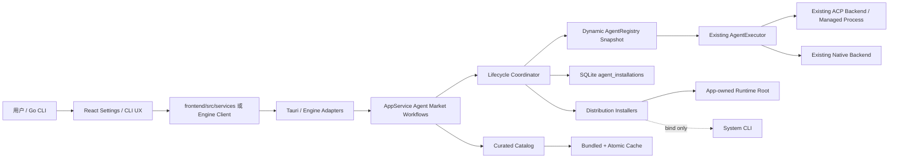
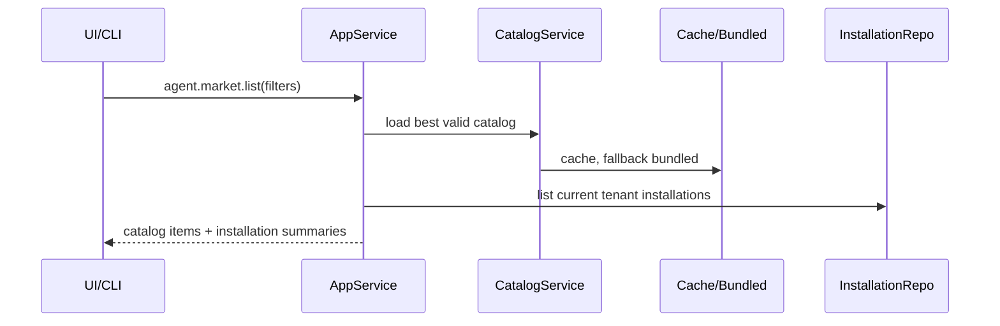
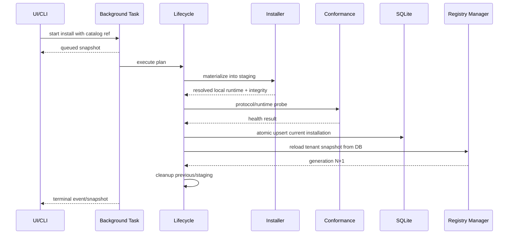
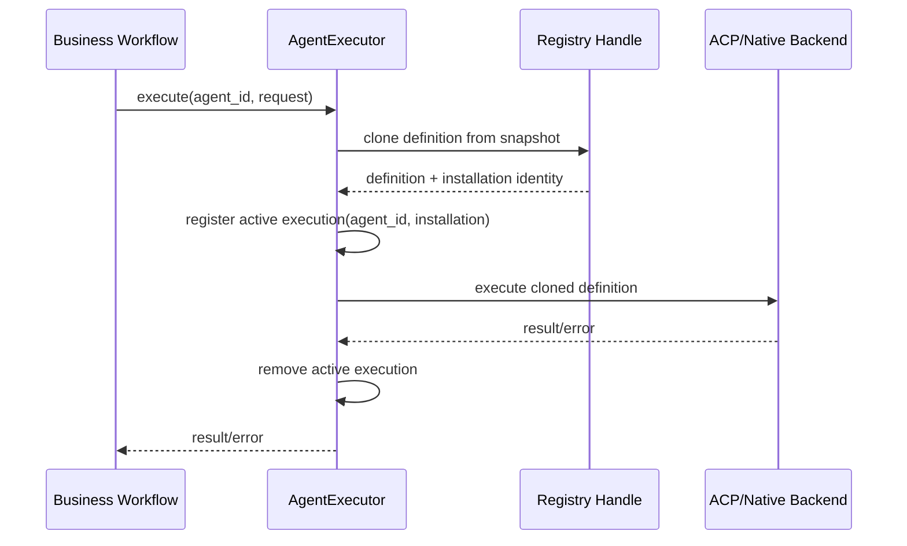

# Architecture Design：Agent Market 与动态 Runtime

| 字段 | 值 |
|---|---|
| 状态 | Proposed |
| 架构风格 | 声明式目录 + 后台安装 + SQLite 当前态 + 不可变 Registry 快照 |
| 关键约束 | 市场不加载任意插件代码；执行核心不感知远程目录 |

## 1. 上下文架构



## 2. 设计原则

1. **目录与运行分离**：Market 描述“可安装什么”；Registry 描述“当前可执行什么”。
2. **安装与健康分离**：文件存在、协议可连接、业务可执行是不同事实。
3. **分发与协议正交**：Npx/Binary/Uvx 是获取方式；ACP/Native 是交互方式。
4. **固定版本、执行离线**：远程不确定性只存在于安装阶段。
5. **单一业务边界**：Desktop、Engine、CLI 调用同一 AppService workflow。
6. **不可变快照**：读路径无锁或短读锁；写路径构建完整新快照后一次 swap。
7. **最小持久化**：只存当前 installation 和必要健康摘要，不复制远程目录历史。
8. **安全策略归核心**：包只能声明受约束的启动元数据，不能关闭核心防护。

## 3. 目标模块边界

### 3.1 新增后端域

建议新增：

```text
src-tauri/src/backend/agent_market/
├── mod.rs                 # 公开域边界与 re-export
├── types.rs               # catalog/install/task/health 领域类型
├── catalog.rs             # bundled/cache load、schema validate、merge
├── distribution.rs        # 分发选择、preflight、resolved plan
├── repository.rs          # agent_installations 的领域 repository
├── runtime.rs             # installation-aware Runtime Manager / Registry publisher
├── conformance.rs         # ACP/Native 安装后最小验证
├── lifecycle/
│   ├── mod.rs             # 生命周期边界与 per-agent lease
│   ├── install.rs
│   ├── update.rs
│   ├── uninstall.rs
│   └── recovery.rs
└── installers/
    ├── mod.rs             # installer trait 和公共 staging 限制
    ├── binary.rs
    ├── npx.rs
    ├── uvx.rs
    └── system.rs
```

职责约束：

- `catalog.rs` 不访问 `AgentExecutor`。
- installer 不写 SQLite、不 swap Registry；只返回 `MaterializedRuntime`。
- `lifecycle/` 是唯一协调 staging、installer、conformance、DB activation、Registry reload 的模块组。
- `repository.rs` 不处理网络或文件下载。
- `runtime.rs` 是 composition owner：读取 repository 后构建 definitions，再发布给纯内存 Registry；`agents/registry.rs` 自身不依赖 SQLite 或 Market catalog。
- `conformance.rs` 复用现有 protocol/process 抽象，不复制 ACP 客户端。

### 3.2 修改现有执行域

```text
src-tauri/src/backend/agents/
├── types.rs       # Resolved AgentDefinition，移除含糊 cli_fallback
├── registry.rs    # snapshot 构建、lookup、health observation
├── process.rs     # 保持既有进程生命周期
└── protocol/      # 保持既有 ACP 协议实现

src-tauri/src/backend/ai_execution/
├── executor.rs    # 动态 Registry handle、active execution identity
└── mod.rs         # 移除全局 OnceLock，改为显式 runtime ownership
```

禁止：

- 在 `executor.rs` 添加 Agent ID/Vendor 分支来选择分发。
- 让执行 Runtime 读取 catalog JSON。
- 让 Registry 在每次 lookup 查询 SQLite。
- 把 installer 放入 ACP backend。

### 3.3 Application 和 Adapter

```text
src-tauri/src/backend/application/agent_market.rs
  # list/refresh/inspect/preview/start/get/cancel/update/uninstall/reinstall

src-tauri/src/backend/application/agent.rs
  # installed/runtime/connection/models 读取与兼容 API

src-tauri/src/adapters/tauri/agent_market.rs
  # Tauri 薄命令、任务 spawn、event emit

src-tauri/src/adapters/engine/registry.rs
  # 同一 AppService 方法的 Engine 注册
```

`AppState` MUST 显式持有：

- tenant/db path；
- `Arc<AgentRuntimeManager>` 或等价的运行时所有者；
- `BackgroundTaskRegistry`；
- 退出保护状态。

不得再通过进程级 `OnceLock` 按“第一次传入的 DB path”构建 Agent Runtime。

`AgentRuntimeManager` 是组合所有者，而不是新的业务大类。它至少组合：

- execution-ready `AgentRegistryHandle`；
- `AgentExecutor`；
- installation repository/resolver；
- runtime/protocol health checker；
- per-agent 短时 mutation gate。

业务执行通过 Executor；installed/connection 检查可从 repository 解码诊断 definition，因此 ACP failed、未进入 execution Registry 的 System binding 仍可被显式复查。

## 4. 数据流

### 4.1 目录读取



目录读取不得触发 executable probe。健康信息来自 installation 摘要；显式 `runtime.check` 才进行进程检查。

### 4.2 安装与激活



System bind 可以没有 staging artifact，但仍走版本解析、definition 校验、health 和 DB/Registry 激活步骤。

### 4.3 执行



执行数据流没有 CatalogService、Installer 或网络调用。

## 5. 核心类型关系

```text
AgentMarketItem
  id, protocol, capabilities, curated_version
  distributions[]
        |
        v selection + preflight
AgentInstallPlan
  catalog identity, chosen distribution, paths, limits
        |
        v materialize
MaterializedRuntime
  ownership, program, args, env refs, integrity evidence
        |
        v validate + persist
AgentInstallation
  tenant_id + agent_id current state
        |
        v build
AgentDefinition
  resolved executable contract used by executor
        |
        v registry snapshot
AgentExecution
```

### 5.1 `AgentDefinition` 目标约束

`AgentDefinition` 是已解析的本地执行契约，至少包含：

- `id: AgentId`
- `installation_id` 或稳定 identity（MVP 可由 tenant/agent/version/distribution 计算）
- `display_name`
- `protocol`
- `program: PathBuf` 或受控 System resolved path
- `args: Vec<String>`
- `env: Vec<ResolvedAgentEnv>`，只允许常量和 secret/config 引用解析结果
- declared capabilities
- availability/version probe
- model discovery definition

它 MUST NOT 包含：

- catalog URL；
- download URL；
- npm/PyPI package spec；
- 用户提交的任意 shell command；
- `cli_fallback: bool`；
- 递归内容 hash/trust 状态。

## 6. Dynamic Registry 设计

### 6.1 结构

目标结构可采用：

```rust
struct AgentRegistrySnapshot {
    generation: u64,
    tenant_id: String,
    definitions: HashMap<AgentId, Arc<AgentDefinition>>,
}

struct AgentRegistryHandle {
    current: RwLock<Arc<AgentRegistrySnapshot>>,
}
```

也可使用经批准的等价原子 swap 实现。必须满足：

1. `snapshot()` 只持有短读锁并返回 `Arc`。
2. `get()` 从 snapshot clone `Arc<AgentDefinition>`。
3. `AgentRuntimeManager` 先在锁外从 DB 构建和完整验证 definitions，再调用 Registry publisher 在短写锁中替换 snapshot；Registry 类型本身不读取 DB。
4. 构建失败时旧 snapshot 不变。
5. generation 单调递增，用于事件、测试和诊断，不作为持久化主键。

### 6.2 加载条件

Registry 加载 installation 时必须同时满足：

- tenant 匹配；
- `enabled = 1`；
- `installation_status = ready`；
- program/args/env definition 可验证；
- managed program 位于该 installation 的 app-owned install directory；
- System program 是安装时已解析的入口，且不含 shell 包装。

`protocol_status=failed` 的 installation 是否进入 Registry：

- **可以进入 Registry 作为可诊断定义，但 Executor MUST 在执行前依据 `execution_ready` 拒绝**；或
- Registry 只加载 execution-ready 定义。

MVP 冻结采用第二种：Registry 仅加载 execution-ready 定义。Installed API 仍从 DB 返回 failed installation。这样执行 lookup 失败统一映射为 `agent_not_ready`，而非误启动已知不可用进程。

### 6.3 DB 与 Registry 一致性

激活顺序冻结为：

1. 保留旧 installation/definition 快照。
2. DB transaction upsert 新 installation。
3. 从 DB 构建并 swap 新 Registry。
4. swap 失败时补偿恢复旧 DB row，并保持旧 Registry。
5. 成功后清理旧 managed directory。

不得先删除旧目录或先 swap 指向未提交 DB 的 definition。

## 7. Runtime Ownership

### 7.1 Desktop

Tauri setup 在已知 `db_path` 后构建一个 `AgentRuntimeManager` 并放入 `AppState`。所有 Tauri Agent 命令和业务任务使用同一实例。

### 7.2 Engine

每个 Engine 进程用其 DB path 构建独立 manager；初始化时从 installation rows 加载 snapshot。不得复用 Desktop 进程级单例。

### 7.3 Tests

测试通过显式依赖注入使用临时 DB、临时 runtime root、fixture catalog 和 fake installers。测试不得依赖全局 `OnceLock` reset。

## 8. Active Execution 与生命周期冲突

现有：

```text
execution_uuid -> cancellation
```

目标：

```text
execution_uuid -> {
  agent_id,
  installation_identity,
  cancellation,
  started_at
}
```

`AgentExecutor` 提供只读冲突查询：

- `active_count(agent_id)`
- `is_installation_active(agent_id, installation_identity)`
- `cancel_all()` 仅用于应用关闭，不供卸载自动调用。

仅做两次 active count 检查仍存在 TOCTOU：检查结束后可能开始新 execution。因此 Runtime Manager MUST 提供 per-agent 短时 mutation gate：

1. 下载、安装和 conformance 期间不设 gate，旧版本可继续执行。
2. 激活、停用或卸载临界区前设置 `mutating(agent_id)=true`。
3. 新 execution 在注册 active entry 前检查 gate；命中时返回稳定 `agent_lifecycle_busy`，不得启动进程。
4. 设置 gate 后重新检查 active count；非零则清 gate 并返回 `agent_in_use`。
5. 仅在 gate 内执行短 DB transaction、Registry swap 和必要补偿；清理大目录在 swap 后、gate 外进行。
6. 所有失败、取消和 panic-safe guard path 都必须清 gate。

锁顺序：

1. lifecycle per-agent lease；
2. 长耗时 I/O/conformance（无 mutation gate）；
3. 设置 per-agent mutation gate；
4. 短暂查询 active map并立即释放；
5. DB transaction；
6. Registry short swap/补偿；
7. 清 mutation gate；
8. 长耗时旧目录 cleanup。

禁止同时持有 active map mutex 和 DB/Registry 锁执行网络或文件 I/O。

## 9. 后台任务架构

### 9.1 复用边界

复用现有 `BackgroundTaskRegistry` 的：

- begin/get/list/cancel/finish 模式；
- snapshot 序列化；
- Tauri event + frontend polling；
- terminal retention；
- app close 检查。

不复用 Conversation package manager 的：

- editable workspace；
- recursive content hash；
- trusted/changed/untrusted；
- local/Git/dev source registration；
- version history/rollback 表；
- 一个大文件包揽目录、安装、信任和更新的实现。

### 9.2 任务粒度

Agent lifecycle task key 为 `(tenant_id, agent_id)`。不同 Agent 可以并发，但总下载/安装并发 SHOULD 受一个小型 semaphore 限制，MVP 默认 2。相同 Agent 的 install/update/reinstall/uninstall 串行。

## 10. Catalog 与安装真相边界

| 数据 | 真相源 | 失效策略 |
|---|---|---|
| 可安装 Agent/版本 | 最新有效 curated catalog cache；无效时 bundled | cache 原子替换，保留最后有效 |
| 当前安装 | SQLite `agent_installations` | 不由 catalog 删除或覆盖 |
| 当前执行定义 | Registry snapshot | 从 SQLite reload；构建失败保留旧 snapshot |
| 当前任务 | BackgroundTaskRegistry | 进程内；重启时由 staging/DB recovery 收敛 |
| capability assignment | app settings | 保存/执行时验证 installation readiness |
| 健康观察 | installation row 摘要 + 显式 probe | 标记 checked_at/stale，不在列表页 probe-all |

## 11. 失败域与补偿

| 失败点 | 必须结果 |
|---|---|
| catalog 网络失败 | 使用最后有效 cache/bundled，返回 refresh error，不影响执行 |
| artifact 下载失败 | task failed，清 staging，不写 installation |
| integrity 失败 | task failed，删除 staging，不执行 artifact |
| conformance 失败 | managed 首装不激活；System bind 可保存 failed health 用于诊断，但不进 Registry |
| DB upsert 失败 | 不 swap Registry；旧安装不变 |
| Registry build/swap 失败 | 补偿 DB 到旧 row；旧 Registry 不变 |
| 旧目录清理失败 | 新安装保持 active，记录 cleanup warning，启动恢复重试；不得回滚可用新版本 |
| event 丢失 | polling 获取终态 |
| 应用退出/崩溃 | active DB row 指向已激活目录；staging 由下次启动清理 |

## 12. Architecture Decision Records

### ADR-101：通用 Agent Market，而非 ACP-only Market

- **状态**：Accepted by specification。
- **原因**：现有 `AgentProtocol` 已包含 Native；Antigravity 是真实例外。
- **替代方案**：只做 ACP Market，把 Native 保留硬编码。
- **拒绝原因**：继续制造两套目录、设置和安装状态。
- **后果**：目录项必须声明 protocol；Native 新增能力不保证纯数据接入。

### ADR-102：精选索引，而非客户端直连官方 latest

- **原因**：官方目录可快速更新；产品需要固定版本、核心兼容与 smoke 证据。
- **替代方案**：客户端直接消费 latest。
- **拒绝原因**：未经门控的版本会即时影响安装和生产执行。
- **后果**：维护者需要 catalog sync/validation/release 流程；客户端仍可离线。

### ADR-103：轻量完整性，不做目录递归哈希

- **原因**：Agent 安装不支持用户编辑；生态包管理器已有 artifact integrity/lock 元数据。
- **替代方案**：沿用 Conversation 插件每次递归 hash 和信任状态。
- **拒绝原因**：增加启动成本、状态复杂度和错误恢复，却不构成代码签名安全边界。
- **后果**：安装后只检查入口和元数据；怀疑损坏时重装。

### ADR-104：单 active installation

- **原因**：当前用户能力映射只需要一个版本；多版本会引入选择、迁移和回滚状态。
- **替代方案**：首版保留历史和回滚 UI。
- **拒绝原因**：不必要的表、清理和一致性复杂度。
- **后果**：更新时仅临时保留旧版本到新版本激活成功，不作为用户可见历史。

### ADR-105：OpenCode 多分发、单执行路由

- **原因**：System 和官方 Binary 都提供同一 `opencode acp` 能力；CLI 版本探测不能替代 ACP。
- **替代方案**：System OpenCode 和 managed OpenCode 两个市场项，或 ACP 失败后 `opencode run`。
- **拒绝原因**：重复逻辑 Agent；执行语义、输出和取消边界不一致。
- **后果**：fallback 被拆为 distribution fallback、probe result 和未来显式 execution route；MVP 无 CLI execution fallback。

## 13. 架构不变量

任何实现和重构后，下列不变量必须成立：

1. 未安装 Agent 不存在于执行 Registry。
2. 远程 catalog 不能直接提供任意 shell/env 给进程。
3. 执行路径不依赖网络或 package manager 安装动作。
4. installation 的 ownership 决定删除权限，且不可由 UI 自由伪造。
5. update 失败不会减少当前可用 Agent 集合。
6. Registry reload 失败不会发布半成品快照。
7. 活跃 execution 使用开始时的 definition snapshot。
8. installed、connected、execution-ready 三者永不互相推导为同义值。
9. 前端和 CLI 不绕过 AppService 直接操作 DB/文件。
10. 市场模块不改变 ACP 进程清理和核心安全策略。
