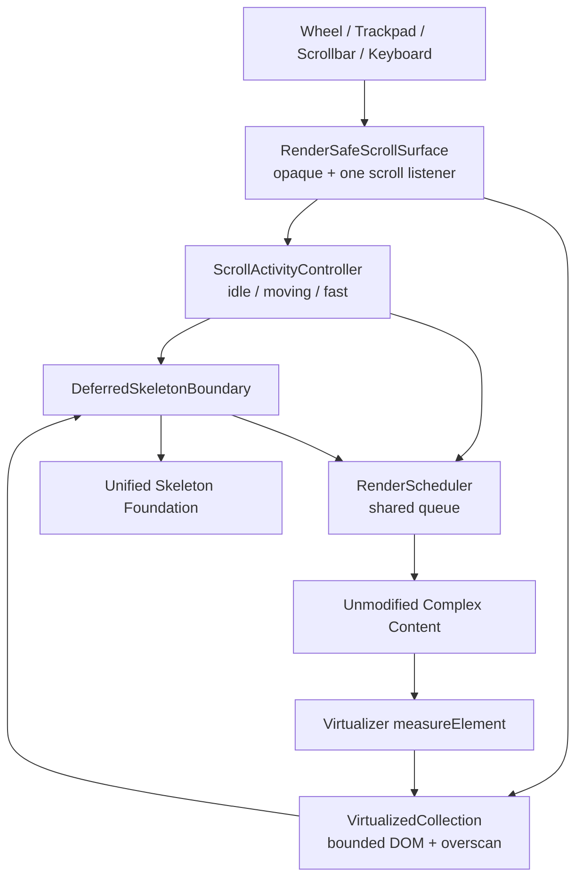
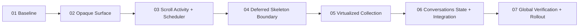

# AssetIWeave 骨架驱动的滚动渲染稳定性架构 SPEC v1

## 0. 文档元数据

| 字段 | 值 |
|---|---|
| 状态 | Implemented；Conversations 首个落点已接入并通过自动化验收 |
| 版本 | v1.0 |
| 日期 | 2026-08-16 |
| 适用范围 | `frontend/src/`，首个落地点为 Conversations 预览 |
| 前置 SPEC | `agent-docs/feature-plans/SPEC_ 前端统一 Skeleton 架构.md` |
| 目标读者 | 前端实现 Agent、测试 Agent、代码审查 Agent |
| 新增依赖 | `@tanstack/react-virtual@^3.14.9`，MIT |

本目录是一组共同构成完整规范的文档。`00` 定义系统契约，其余文档按依赖顺序定义可独立执行的任务。实现模型不得只读取单个任务文件而忽略本总 SPEC 和前置 Skeleton SPEC。

## 1. Objective

通过统一 Skeleton 基础设施、完全不透明滚动表面、滚动活动检测、共享渲染调度器、Overscan 和虚拟化集合，修复复杂内容在高速滚动、滚动条拖动和触控板惯性滚动时出现的背景闪烁、透明空洞和未及时渲染区域。

目标行为：

1. 滚动容器永远存在完全不透明的绘制底层。
2. 未准备完成的内容区域显示统一 Skeleton，不显示透明或空白区域。
3. 高速滚动期间暂停新的复杂 React 子树提交，并停止 Skeleton shimmer。
4. 已经在当前 viewport 中完成渲染的内容不因滚动开始而主动退回 Skeleton。
5. 滚动停止后，距离 viewport 最近的 Skeleton 优先恢复真实内容。
6. 长集合通过虚拟化控制挂载数量，并使用 Overscan 提前准备即将进入 viewport 的区域。
7. 不为 Markdown、Code、Tool、Image、Diff、Mermaid 分别实现降级渲染逻辑。
8. Conversations 作为首个落地点，验证后再推广到其他长复杂内容集合。

## 2. Problem definition

### 2.1 Visible symptoms

当前问题可能表现为：

- 高速滚动 Conversations 预览时短暂露出窗口背景。
- 内容卡片之间出现透明条带或空白区域。
- 半透明 Card 和 `backdrop-filter` 在 WebKit 合成过程中出现 bleed-through。
- 大量 Markdown、Diff、代码块和工具结果同时进入 viewport 时产生长帧。
- Skeleton 本身持续 shimmer，使高速滚动合成负担进一步增加。

### 2.2 “拖动”定义

本 SPEC 中的多内容拖动包括：

- 鼠标滚轮滚动。
- 触控板滚动和惯性滚动。
- 拖动原生滚动条 thumb。
- 键盘 PageUp、PageDown、Home、End 导致的大跨度滚动。
- `scrollTo` 或 `scrollIntoView` 导致的非平滑定位。

不包括：

- 业务对象的 drag-and-drop 排序。
- 窗口尺寸拖动。
- ResizableColumns 横向 splitter 拖动；但 splitter 改变宽度后必须允许虚拟化集合重新测量。

### 2.3 Current contributing factors

已知当前实现中存在：

- `.conversation-surface` 和多个 Card Surface 使用透明背景。
- 多处使用 `backdrop-filter` / `-webkit-backdrop-filter`。
- `QuestionPreview` 直接渲染全部 Turn 和内部复杂内容。
- Conversation 内容包括 Markdown、代码、Diff、工具结果、Mermaid、KaTeX 等异构子树。
- 当前 Skeleton 只承担加载态，不承担滚动期间的通用占位和提交节流。

本 SPEC 不假设单一根因。实现必须通过基线数据和分阶段验证分别证明 Layer 0、Render Boundary 和 Virtualization 的效果。

## 3. 规范用语与需求定义 (Normative Language & Requirements)

本文中的“必须/禁止/应当/可以”分别对应 MUST/MUST NOT/SHOULD/MAY。

| ID | 规范性要求 |
|---|---|
| RF-FR-001 | 每个受保护滚动区域必须拥有完全不透明的根表面。 |
| RF-FR-002 | 尚未允许提交的复杂内容必须显示 Skeleton fallback。 |
| RF-FR-003 | 高速滚动期间必须暂停新复杂内容提交。 |
| RF-FR-004 | 已提交且仍挂载的 viewport 内容禁止主动降级回 Skeleton。 |
| RF-FR-005 | 滚动停止后必须按接近 viewport 的优先级恢复真实内容。 |
| RF-FR-006 | 长集合必须通过统一 VirtualizedCollection 控制挂载范围。 |
| RF-FR-007 | VirtualizedCollection 必须使用稳定业务 ID，而不是数组 index 作为 key。 |
| RF-FR-008 | Overscan 中尚未 ready 的条目必须使用统一 Skeleton。 |
| RF-FR-009 | Conversations 必须以 Turn 作为 v1 虚拟化单元。 |
| RF-FR-010 | 影响卸载正确性的交互状态必须在虚拟化前移出 Turn 子树。 |
| RF-NFR-001 | 业务渲染器不得感知滚动速度或实现自己的降级分支。 |
| RF-NFR-002 | 高速滚动期间 Skeleton shimmer 必须停止。 |
| RF-NFR-003 | v1 不要求持久化精确高度缓存。 |
| RF-NFR-004 | v1 使用粗粒度尺寸估算和 Virtualizer 内部测量。 |
| RF-NFR-005 | 一个滚动容器只允许一个滚动监听和一个调度器。 |
| RF-NFR-006 | 所有新增 API 必须通过 TypeScript strict、Vitest 和生产构建。 |
| RF-NFR-007 | Tauri WebKit 是最终视觉验收环境，浏览器预览不能替代它。 |

## 4. Scope

### 4.1 In scope

- 复现工具和性能基线。
- 完全不透明滚动表面。
- 滚动速度和 phase 检测。
- 每个滚动容器一个共享 Render Scheduler。
- `DeferredSkeletonBoundary`。
- Skeleton coarse size bucket。
- `VirtualizedCollection<T>`。
- Overscan 策略。
- Conversations Turn 级虚拟化。
- Conversations 卸载敏感状态外置。
- CSS `content-visibility` 作为非虚拟化或已提交内容的辅助优化。
- 自动化测试和 Tauri WebKit 手工验收。

### 4.2 Out of scope

- 不实现针对 Markdown/Code/Image 等内容类型的分别降级。
- 不在 v1 虚拟化单个 Turn 内部的 Card。
- 不实现跨应用、跨启动持久化 Size Cache。
- 不要求 Skeleton 与真实内容高度一致。
- 不要求零 Layout Shift；只要求滚动保持可用且不暴露背景。
- 不修改 Conversation 后端 DTO、SQLite 或 Engine 合约。
- 不虚拟化所有短列表。
- 不替换现有统一 Skeleton SPEC 的公共组件。
- 不使用 Canvas 截图、DOM 位图缓存或 WebGL 代替 React 内容。

## 5. Dependency decision

v1 使用：

```json
{
  "@tanstack/react-virtual": "^3.14.9"
}
```

理由：

- 提供 React `useVirtualizer`。
- 提供 `estimateSize`、`measureElement`、`overscan`、`getItemKey`。
- 提供 `isScrolling`、`scrollDirection` 和 `onChange(..., sync)`。
- 支持动态尺寸和内部测量缓存。
- 当前 npm 包为 MIT，unpacked size 约 56 KB；最终 bundle 影响必须由生产构建报告确认。

禁止自行实现完整 Virtualizer。滚动 range、动态测量、scroll anchoring 和浏览器差异不属于本产品应重复维护的基础算法。

## 6. System architecture



### 6.1 Layer responsibilities

| Layer | Responsibility | Must not do |
|---|---|---|
| RenderSafeScrollSurface | 不透明底层、scroll ref、唯一活动控制器 | 不渲染业务内容类型分支 |
| ScrollActivityController | 采样 offset、计算速度、发布 phase | 不直接 mount/unmount 内容 |
| VirtualizedCollection | 计算挂载范围、Overscan、测量和定位 | 不决定 Markdown 等渲染质量 |
| DeferredSkeletonBoundary | Skeleton/queued/ready 状态机 | 不读取业务类型 |
| RenderScheduler | 排队和帧预算 | 不拥有 React 业务状态 |
| Unified Skeleton | 通用占位视觉 | 不监听 scroll |
| Feature integration | 提供 item key、estimate、真实 children | 不创建第二套调度器 |

## 7. Rendering state model

### 7.1 Scroll phase

```ts
export type ScrollPhase = "idle" | "moving" | "fast";
```

默认常量：

```ts
export const FAST_SCROLL_ENTER_PX_PER_MS = 1.25;
export const FAST_SCROLL_EXIT_PX_PER_MS = 0.6;
export const SCROLL_IDLE_DELAY_MS = 140;
```

规则：

- 使用 `requestAnimationFrame` 采样同一滚动元素的 `scrollTop`。
- 瞬时速度为 `abs(deltaOffset) / max(deltaTime, 1)`。
- 速度使用 `0.7 * previous + 0.3 * instant` 平滑。
- 达到 enter threshold 进入 `fast`。
- 低于 exit threshold 后可进入 `moving`，避免临界值抖动。
- 最后一次 scroll 后 140ms 进入 `idle`。
- ResizableColumns 只改变尺寸而不滚动时，不进入 `fast`。

### 7.2 Boundary state

```ts
export type DeferredRenderState =
  | "skeleton"
  | "queued"
  | "ready";
```

状态转换：

```text
skeleton --near viewport + not fast--> queued
queued   --scheduler commit---------> ready
queued   --leave overscan-----------> skeleton
queued   --phase becomes fast-------> queued, but do not commit
ready    --scroll starts------------> ready
ready    --virtualizer unmounts-----> component unmounted
```

关键不变量：

- 同一次挂载生命周期中，`ready` 禁止退回 `skeleton`。
- Virtualizer 卸载后再次挂载可以从 `skeleton` 开始。
- 业务交互状态不得依赖 Boundary 挂载生命周期。

## 8. Skeleton size strategy

用户不要求精确高度，因此 v1 只提供粗粒度尺寸：

```ts
export type SkeletonBlockSize = "compact" | "regular" | "tall";
```

默认估算：

| Size | Estimated block size |
|---|---:|
| compact | 96px |
| regular | 224px |
| tall | 420px |

规则：

- Feature integration 选择最接近的大体尺寸。
- 可以传入明确 `estimateSize: number` 覆盖 bucket。
- 真实内容 ready 后由 Virtualizer `measureElement` 测量。
- v1 不在 localStorage、SQLite 或全局 Map 中持久化高度。
- 不根据 Markdown 字符数、代码行数或图片尺寸编写类型专属估算器。
- Skeleton 与真实内容高度差异导致的调整交给 Virtualizer；不得为了追求精确高度重新引入复杂业务估算。

## 9. Overscan 与调度策略 (Overscan and Scheduling Policy)

### 9.1 Overscan

默认 item overscan：

| Phase | Overscan items |
|---|---:|
| idle | 3 |
| moving | 5 |
| fast | 8 |

高速滚动增加的 Overscan 只允许先挂载轻量 Boundary 和 Skeleton，不允许立即提交全部真实内容。

### 9.2 Scheduler frame budget

| Phase | New real-content commits |
|---|---|
| fast | 0 |
| moving | 每个 animation frame 最多 1 个 |
| idle | 每帧最多 4ms，且最多 4 个 |

优先级：

1. viewport 内 Skeleton。
2. 滚动方向前方 Overscan。
3. 滚动方向后方 Overscan。

不得为每个 Boundary 创建独立 scroll listener、timer 或 `requestAnimationFrame` 循环。

## 10. CSS containment policy

允许辅助使用：

```css
.render-safe-content {
  content-visibility: auto;
  contain-intrinsic-size: auto var(--render-estimated-block-size);
}
```

规则：

- `content-visibility` 是辅助优化，不是 Skeleton fallback 的替代。
- Virtualizer 已卸载的项目不存在 DOM，不需要 `content-visibility`。
- 非虚拟化的小集合可以使用该类减少离屏绘制，同时保留组件状态。
- 如果 Tauri 当前 WebKit 对具体组合出现回归，必须通过 feature flag 关闭，而不能删除 Skeleton/opaque surface 主路径。

## 11. Conversations integration decision

### 11.1 v1 virtualization unit

v1 以 `question.turns` 中的单个 Turn 为虚拟化单位。

每个 Turn 包含：

- 用户 Prompt。
- Parts 标题。
- 该 Turn 的 `ConversationContentCards`。

原因：

- Turn 是已有稳定语义边界。
- 不需要在 v1 重写 Markdown、Card renderer 或 execution grouping。
- 比直接虚拟化全部内部 Block 风险低。

限制：

- 单个超大 Turn 内部仍可能包含大量 Card；该场景在 v1 通过 Deferred Boundary 和 CSS containment 缓解。
- Card 级虚拟化必须在数据证明 Turn 级方案不足后另立任务，不得混入 v1。

### 11.2 State correctness

Turn 被 Virtualizer 卸载前，以下状态必须移到 `QuestionPreview` 或专用 Controller：

- 展开的 Result/Diff Card ID。
- 已保存或任务返回的翻译文本。
- translation error。
- translation task ID。
- 正在进行且需要重新关联的 translation 状态。

以下临时状态可以在卸载后丢失：

- Copy 成功的短暂提示。
- 非持久 hover/focus visual state。

虚拟化不得中止后台翻译任务，也不得因重新挂载重复发起翻译。

## 12. 功能开关与分阶段推广 (Feature Flags & Rollout)

新增前端设置或模块常量：

```ts
export interface RenderingFeatureFlags {
  deferredSkeletonRendering: boolean;
  conversationTurnVirtualization: boolean;
  contentVisibilityContainment: boolean;
}
```

v1 默认：

```ts
{
  deferredSkeletonRendering: true,
  conversationTurnVirtualization: true,
  contentVisibilityContainment: true,
}
```

要求：

- Flags 仅用于安全回滚，不允许长期维护两套产品逻辑。
- Flag 关闭时仍保留 Layer 0 不透明表面。
- 验证两个版本周期后删除临时 flags；删除工作进入后续清理任务。
- 若项目已有持久化设置系统且产品要求用户可配置，再将其接入设置；v1 可以先使用内部常量，不增加用户设置 UI。

## 13. Task dependency graph



任务文档：

1. `01-TASK_基线复现与性能指标.md`
2. `02-TASK_不透明滚动表面.md`
3. `03-TASK_滚动活动检测与共享调度器.md`
4. `04-TASK_Skeleton渲染边界.md`
5. `05-TASK_虚拟化集合与尺寸策略.md`
6. `06-TASK_Conversations状态外置与接入.md`
7. `07-TASK_全局验收与推广.md`

每个任务必须单独提交并保持应用可构建。Commit 使用中文 Conventional Commit。

## 14. Global success criteria

全部满足才算完成：

1. Conversations 预览滚动容器具有完全不透明底层。
2. 高速滚动期间未 ready 内容显示 Skeleton，不出现透明或空白条带。
3. 高速滚动期间 Scheduler 不提交新的复杂内容。
4. 已 ready 且仍挂载的内容不会主动退回 Skeleton。
5. 停止滚动后 viewport 内 Skeleton 在下一帧开始恢复，全部可见项应在 300ms 内进入 ready 或已排队状态。
6. 长 Conversation 只挂载 viewport 和 Overscan 对应 Turn。
7. Virtualizer 使用稳定 Turn ID 和动态测量。
8. Conversations 卸载敏感状态已外置，翻译任务不会因虚拟化丢失或重复。
9. 高速滚动期间 shimmer 停止。
10. 连续 10 次从顶部到底部再返回的快速滚动中，不观察到窗口背景穿透。
11. 浏览器控制台无新增 error、ResizeObserver loop warning 或 React key warning。
12. `pnpm typecheck && pnpm test && pnpm build` 通过。
13. Tauri WebKit 手工验收通过。
14. Feature flags 可以分别关闭 deferred rendering 和 virtualization，关闭后页面仍可用。

## 15. Source references

- [TanStack Virtual Virtualizer API](https://tanstack.com/virtual/latest/docs/api/virtualizer)
- [TanStack Virtual React documentation](https://tanstack.com/virtual/latest/docs/framework/react)
- [MDN content-visibility](https://developer.mozilla.org/en-US/docs/Web/CSS/Reference/Properties/content-visibility)
- [MDN contain-intrinsic-size](https://developer.mozilla.org/en-US/docs/Web/CSS/Reference/Properties/contain-intrinsic-size)
- [WebKit backdrop-filter rendering notes](https://webkit.org/blog/3632/introducing-backdrop-filters/)

以上资料用于选择通用基础能力；实现仍必须以本 SPEC、项目现有设计系统和 Tauri WebKit 实测结果为准。
