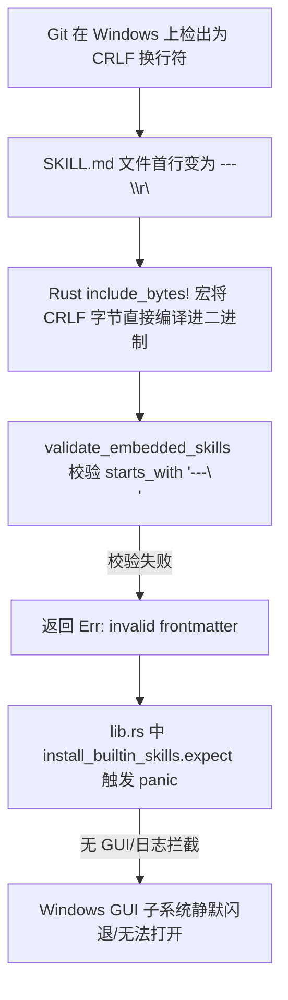

# Windows 平台启动闪退/无法打开问题分析与复现报告

本文档记录并分析了 AssetIWeave 在 Windows 平台启动时出现的“应用无法打开 / 瞬间闪退”故障的完整复现流程、根因定位、修复方案以及长效防御机制。

---

## 1. 问题概述

### 1.1 故障现象
- **现象表现**：在 Windows 环境（Windows 10 / 11）下运行编译后的 `assetiweave.exe`（或通过桌面快捷方式、开发环境 `pnpm tauri:dev` 启动）时，客户端无法打开，进程在启动后数毫秒内瞬间退出（闪退）。
- **用户感知**：双击图标后毫无界面响应，无 Tauri GUI 窗口弹出，无系统错误弹窗，任务管理器中进程一闪而过。
- **排查阻碍**：由于故障发生在 Tauri 应用初始化与常规日志系统建立之前，默认 Windows GUI 子系统（`windows_subsystem = "windows"`）下标准输出与标准错误流被系统丢弃，未留下常规运行日志，给故障定位带来极大困难。

### 1.2 涉及模块与文件
- [`src-tauri/src/lib.rs`](file:///e:/code-space/assetiweave/src-tauri/src/lib.rs)：桌面应用主入口与生命周期管理。
- [`src-tauri/src/backend/builtin_skills.rs`](file:///e:/code-space/assetiweave/src-tauri/src/backend/builtin_skills.rs)：系统内置 Skill 嵌入、元数据校验与自动安装逻辑。
- [`src-tauri/src/backend/logs.rs`](file:///e:/code-space/assetiweave/src-tauri/src/backend/logs.rs)：应用操作日志与致命崩溃记录器。
- [`.gitattributes`](file:///e:/code-space/assetiweave/.gitattributes)：仓库跨平台换行符（EOL）约束策略文件。

---

## 2. 故障复现环境与步骤

### 2.1 复现环境要求
- **操作系统**：Windows 10 / Windows 11
- **Git 配置**：全局或局部启用了 Git 默认的换行符转换机制（即 `core.autocrlf = true` 或 `core.autocrlf = input`），或者文件在 Windows 编辑器下被保存为 Windows 换行符（CRLF, `\r\n`）。
- **源码状态**：`builtin-assets/skills/*/SKILL.md` 的换行符为 CRLF（`\r\n`）。

### 2.2 复现步骤

1. **检出代码**：
   在 Windows 系统中使用 Git 克隆或拉取仓库代码。在没有 `.gitattributes` 强制 `eol=lf` 的情况下，Git 会将文本文件中的 LF 换行符自动转为 CRLF。
2. **构建可执行文件**：
   在仓库根目录执行构建命令：
   ```powershell
   cargo build --manifest-path src-tauri/Cargo.toml
   # 或者执行 Tauri 开发/构建
   pnpm tauri:dev
   ```
3. **启动客户端**：
   直接运行编译生成的桌面客户端可执行文件：
   ```powershell
   .\src-tauri\target\debug\assetiweave.exe
   ```

### 2.3 预期行为 vs 实际行为
- **预期行为**：应用正常启动，校验并安装系统内置 Skill，连接 SQLite 数据库，展示主界面窗口。
- **实际行为**：应用在首行代码处触发 Rust Panic 并立即退出，终端无错误捕获时表现为静默退出，窗口完全未渲染。

---

## 3. 根因深度分析 (Root Cause Analysis)

经过对启动链路与源码的追踪，导致该故障的原因由以下三个层面的问题叠加产生：



### 3.1 核心根因一：嵌入式资源（`include_bytes!`）与严格换行符校验冲突
在 `src-tauri/src/backend/builtin_skills.rs` 中，系统内置 Skill 资源通过 `include_bytes!` 宏在编译期静态打包进二进制可执行文件：

```rust
// 内置资源定义
const SYSTEM_SKILL_CONVERSATION: &[u8] = include_bytes!("../../../builtin-assets/skills/conversation-organize/SKILL.md");
```

在启动阶段，`validate_embedded_skills()` 会对嵌入的 Skill 前置元数据（Frontmatter）进行有效性校验：
```rust
// 修复前的校验逻辑
if !skill.starts_with("---\n")
    || !skill.contains(&format!("name: {}", embedded.name))
    || !skill.contains("description:")
{
    return Err(format!(
        "embedded Skill {} has invalid frontmatter",
        embedded.directory
    ));
}
```
**问题点**：
- 当代码在 Windows 环境下检出为 CRLF 换行时，`SKILL.md` 的第一行实际是以 `"---\r\n"` 结尾。
- `skill.starts_with("---\n")` 字符串前缀匹配失败（因为 `\r` 存在），导致 `validate_embedded_skills()` 判定该 Skill 为非法元数据并返回 `Err`。

### 3.2 核心根因二：主入口裸 `expect()` 引发未捕获 Panic 导致静默崩溃
在 `src-tauri/src/lib.rs` 的入口函数 `run()` 中：
```rust
// 修复前的主入口代码
#[cfg_attr(mobile, tauri::mobile_entry_point)]
pub fn run() {
    backend::builtin_skills::install_builtin_skills()
        .expect("failed to install AssetIWeave system Skills");
    let db_path = app_db_path().expect("failed to resolve AssetIWeave database path");
    ...
}
```
**问题点**：
- `install_builtin_skills()` 是启动第一步，一旦校验返回 `Err`，`.expect(...)` 会立即引发 Rust 线程 `panic!`。
- 此时 Tauri 窗口尚未建立、前端 Webview 尚未加载、后端的日志持久化模块也未初始化。
- 在 Windows 子系统模式下，Panic 信息仅输出到 `stderr`，但在直接双击打开可执行文件时不会显示控制台窗口，导致用户感知为“完全打不开/无响应”。

### 3.3 核心根因三：仓库缺少统一的换行符规范配置（`.gitattributes`）
仓库此前未配置 `.gitattributes` 文件，导致：
- 不同开发者或 CI/CD 构建机器在拉取跨平台代码时，Git 依据本地操作系统配置（如 `core.autocrlf`）任意更改了文本换行符。
- 作为二进制嵌入源（`include_bytes!`）的 Markdown 与 JSON 文件受到了操作系统换行符污染，破坏了字节一致性假设。

---

## 4. 修复与长效防护方案

针对上述根因，系统已在 Commit [`94ae8f3`](file:///e:/code-space/assetiweave/src-tauri/src/lib.rs) 中实施了多层防护与修复：

### 4.1 方案一：Frontmatter 解析增加换行符归一化容错
在 [`src-tauri/src/backend/builtin_skills.rs`](file:///e:/code-space/assetiweave/src-tauri/src/backend/builtin_skills.rs) 中提取并实现了 `validate_embedded_skill_frontmatter` 函数：
在做任何逻辑判断前，先将 `\r\n` 归一化为 `\n`，彻底消除跨平台换行符对解析的影响：

```rust
fn validate_embedded_skill_frontmatter(
    skill: &str,
    expected_name: &str,
    directory: &str,
) -> AppResult<()> {
    let normalized = skill.replace("\r\n", "\n");
    if !normalized.starts_with("---\n")
        || !normalized.contains(&format!("name: {expected_name}"))
        || !normalized.contains("description:")
    {
        return Err(format!(
            "embedded Skill {directory} has invalid frontmatter"
        ));
    }
    Ok(())
}
```

### 4.2 方案二：全局 Panic Hook 拦截与崩溃日志落盘机制
在 [`src-tauri/src/lib.rs`](file:///e:/code-space/assetiweave/src-tauri/src/lib.rs) 与 [`src-tauri/src/backend/logs.rs`](file:///e:/code-space/assetiweave/src-tauri/src/backend/logs.rs) 中增加了未捕获 Panic 的截获与独立文件持久化机制：

1. **设置 Panic 钩子**：
   在 `run()` 最前端调用 `setup_panic_hook()`，捕获所有发生 Panic 时的代码位置、调用栈与 Payload。
   ```rust
   fn setup_panic_hook() {
       let default_hook = std::panic::take_hook();
       std::panic::set_hook(Box::new(move |info| {
           let payload = if let Some(s) = info.payload().downcast_ref::<&str>() {
               (*s).to_string()
           } else if let Some(s) = info.payload().downcast_ref::<String>() {
               s.clone()
           } else {
               "Unknown panic payload".to_string()
           };
           let location = info
               .location()
               .map(|loc| format!("{}:{}:{}", loc.file(), loc.line(), loc.column()))
               .unwrap_or_else(|| "unknown location".to_string());
           let panic_message = format!("Panic occurred at {location}: {payload}");
           eprintln!("{panic_message}");
           crate::backend::logs::record_fatal_panic(&panic_message);
           default_hook(info);
       }));
   }
   ```
2. **崩溃日志持久化 (`panic.log`)**：
   当应用发生任何致命 Panic 时，即使应用退出，也会在应用日志目录写入带时间戳的 `panic.log` 文件：
   ```rust
   pub(crate) fn record_fatal_panic(message: &str) {
       if let Ok(log_dir) = get_log_dir() {
           let panic_path = log_dir.join("panic.log");
           if let Ok(mut file) = OpenOptions::new()
               .create(true)
               .append(true)
               .open(panic_path)
           {
               let timestamp = Local::now().to_rfc3339();
               let _ = writeln!(file, "[{timestamp}] FATAL: {message}");
           }
       }
   }
   ```

### 4.3 方案三：启动阶段错误显式打点
在 `run()` 中替换裸 `expect()`，在触发 Panic 退出前调用 `log_error(...)` 记录结构化日志，保证错误可被监控与审计跟踪：
```rust
if let Err(error) = backend::builtin_skills::install_builtin_skills() {
    log_error(
        "app.startup.skills",
        "failed to install AssetIWeave system Skills",
        &error,
        &[],
    );
    panic!("failed to install AssetIWeave system Skills: {error}");
}
```

### 4.4 方案四：仓库级 `.gitattributes` 换行符强制规范
在仓库根目录添加 [`.gitattributes`](file:///e:/code-space/assetiweave/.gitattributes)，强制规范所有源码、配置、Markdown 以及嵌入资产使用 `LF` 换行符，避免 Windows Git 自动转码污染：
```gitattributes
# Auto-detect text files and normalize line endings to LF across all platforms
* text=auto eol=lf

# Explicit LF for source files, configurations, scripts, and embedded assets
*.md text eol=lf
*.json text eol=lf
*.rs text eol=lf
*.go text eol=lf
*.ts text eol=lf
*.tsx text eol=lf
```

### 4.5 方案五：自动化回归测试防护
在 `src-tauri/src/backend/builtin_skills.rs` 中增加了覆盖 CRLF 与 LF 混合输入的单元测试用例：
```rust
#[test]
fn validates_embedded_skill_frontmatter_with_crlf_and_lf() {
    let lf_skill = "---\nname: sample-skill\ndescription: A sample skill.\n---\n# Sample Skill";
    let crlf_skill =
        "---\r\nname: sample-skill\r\ndescription: A sample skill.\r\n---\r\n# Sample Skill";
    let invalid_skill = "name: sample-skill\ndescription: A sample skill.";

    assert!(validate_embedded_skill_frontmatter(lf_skill, "sample-skill", "sample-dir").is_ok());
    assert!(validate_embedded_skill_frontmatter(crlf_skill, "sample-skill", "sample-dir").is_ok());
    assert!(validate_embedded_skill_frontmatter(invalid_skill, "sample-skill", "sample-dir").is_err());
    assert!(validate_embedded_skill_frontmatter(lf_skill, "wrong-name", "sample-dir").is_err());
}
```

---

## 5. 故障排查与验证指南

### 5.1 开发者验证命令
在修改或检出代码后，可通过以下命令验证换行符兼容性与启动健康度：

```powershell
# 1. 运行 Rust 单元测试（验证 CRLF 与 LF 解析测试）
cargo test --manifest-path src-tauri/Cargo.toml -- validates_embedded_skill_frontmatter_with_crlf_and_lf

# 2. 运行完整后端测试套件
cargo test --workspace

# 3. 运行前端与端到端验证
pnpm typecheck
pnpm test
```

### 5.2 遇到类似启动异常时的排查路径
如果用户在 Windows 机器上报告“客户端打不开 / 闪退”：
1. **查看崩溃日志**：
   前往应用数据目录下的日志文件夹，查看是否存在 `panic.log`：
   - 路径：`%APPDATA%\AssetIWeave\logs\panic.log` 或用户主目录 `~/.assetiweave/logs/panic.log`。
2. **控制台启动调试**：
   在 PowerShell 或 Windows Terminal 中直接运行二进制文件查看输出：
   ```powershell
   & "C:\Program Files\AssetIWeave\assetiweave.exe"
   ```
3. **检查文件行尾换行符**：
   若处于源码二次开发环境，确认 Git 换行符状态并重新检出文本文件：
   ```powershell
   git checkout-index --force --all
   ```
