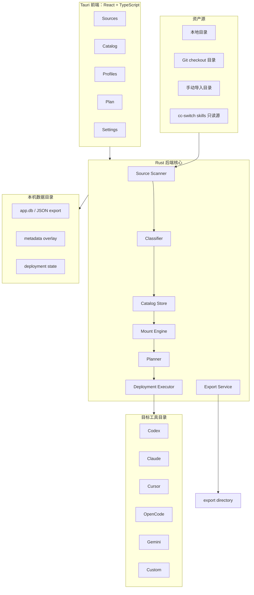
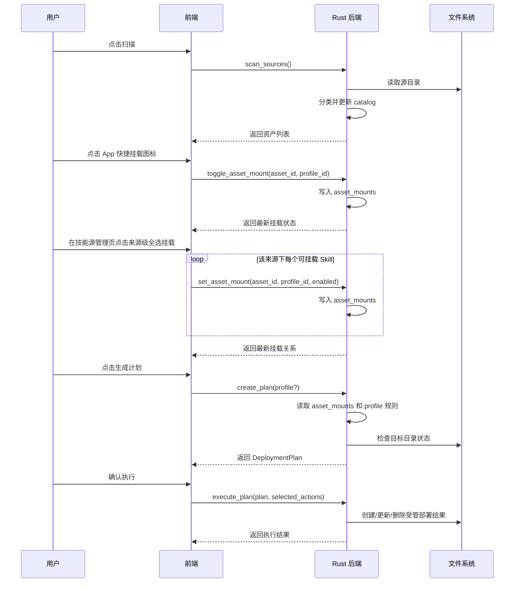

# 设计文档：AssetIWeave

## 1. 概览

AssetIWeave 是一个独立的 Tauri 桌面应用，用于管理本机 AI 文件资产的发现、编目、挂载、部署和导出。它不把 skill 当成唯一对象，而是把 prompt、rules、memory、skills、MCP 配置、agent 定义、command、workflow 等都抽象为 `Asset`。

当前产品已经进入具体开发阶段。核心定位是**资产挂载管理器**：源仓库保持只读；AssetIWeave 负责扫描索引、分类、记录挂载关系、生成部署计划，并把源仓库中的真实资产通过软链接直接挂载到多个目标 App。资产集中整理不作为默认存储路径，而作为后续 `Export Assets` 功能，把用户选择的真实文件复制到指定目录。

系统采用“源目录只读 + SQLite Catalog + 挂载关系 + Profile 投影 + 部署计划 + 可选导出”的架构。默认不复制源资产，不创建中间集中池，也不采用两跳软链接；目标 App 目录中的部署结果直接指向源仓库中的真实资产。

## 2. 架构原则

1. **独立实现**：不依赖现有 Python 脚本、launchd 任务或 cc-switch 运行时。
2. **本地优先**：核心数据存储在本机，离线可用。
3. **源文件只读**：默认不修改来源目录里的资产。
4. **目标可重建**：目标目录里的部署结果可以由配置重新生成。
5. **决策可解释**：每个部署或跳过都能说明原因。
6. **类型可扩展**：新资产形态通过分类器和 adapter 扩展。
7. **工具可扩展**：新 CLI/App 通过 Profile 模板或自定义 Profile 扩展。
8. **直接挂载优先**：默认部署策略是目标 App 目录直接 symlink 到源资产，不通过中间 symlink 池。
9. **集中复制是显式导出**：只有用户触发导出时，才把真实资产复制到指定目录，并生成 manifest。

## 3. 总体架构

### 3.1 技术选型

- 桌面壳：Tauri 2。
- 前端运行时：React + TypeScript + Vite。
- 前端样式：Tailwind CSS，设计 token 统一放在 `tailwind.config.ts`，页面组件优先使用 Tailwind utility classes，`src/styles.css` 仅保留 Tailwind layers、全局背景和少量工具类。
- 图标：`lucide-react`。
- 后端核心：Rust workspace，`src-tauri` 作为桌面 App 壳，`crates/assetiweave-core` 承载领域模型、扫描、分类、计划生成等可测试核心逻辑。
- 本地存储：SQLite 主存储，后续提供 JSON 导出/导入。
- 包管理与构建：pnpm、Cargo。

### 3.2 Tauri 后端模块边界

`src-tauri` 不把所有职责堆在 `lib.rs`。入口文件只负责装配 Tauri builder、插件、状态和命令注册；业务按以下边界拆分：

- `commands.rs`：Tauri command 层，类似 Controller，只做参数接收、状态锁定和调用下层服务。
- `store/`：SQLite repository 模块目录。`mod.rs` 只导出门面；`schema.rs` 负责建表和 seed；`sql.rs` 集中 SQL 常量；`source_repo.rs`、`asset_repo.rs`、`profile_repo.rs`、`deployment_repo.rs` 分别承载对应聚合的读写；`codec.rs` 负责 JSON/enum 编解码和 SQLite 错误转换。
- `scanner/`：资产扫描与分类模块目录，负责 Source 目录遍历、include/exclude glob、`SKILL.md` 目录识别和资产描述提取。后续按规模继续拆分为 walker、classifier、extractor。
- `planner/`：部署计划生成模块目录，负责 create/skip/conflict 决策和解释文本。后续按 Profile 匹配、目标路径解析、冲突判断继续拆分。
- `executor/`：部署执行模块目录，负责 `symlink_to_source`、`copy_to_target`、安全边界、非托管文件冲突和 deployment state 记录。后续按 filesystem、strategy、state recorder 继续拆分。
- `defaults.rs`：默认 Source/Profile 模板。
- `path_utils.rs`：路径展开、相对路径归一化、hash 等跨模块工具。
- `platform.rs`：平台集成，例如在文件管理器中显示路径。
- `types.rs`：Tauri 层 DTO 和共享 AppState。

### 3.3 当前开发状态

当前已经完成的产品开发基础：

- Tauri 2 + React + TypeScript + Vite + Tailwind CSS + shadcn/ui  应用框架。
- Rust workspace 与 `assetiweave-core` 领域模型 crate。
- 前端采用组件化思想，页面元素首先考虑组件化。
- SQLite 主存储，包含 Source、Asset、Profile、DeploymentState、Navigation、App Shortcut 等基础表。
- Source seed、Profile seed、Navigation seed、App Shortcut seed 和 `asset_mounts` 持久化。
- 真实目录扫描、`SKILL.md` 目录识别、基础资产分类、描述提取。
- Catalog 页面：搜索、指标、部署计划预览、资产行默认展示路径/描述/来源。
- Catalog 页面当前支持列表视图和卡片视图；卡片视图用于资产总览，不表达文件树或来源层级。
- 资产行右侧可配置 App 快捷挂载图标，配置来自 SQLite。
- 展开态 Mount Targets 面板和可选中挂载卡片 UI。
- 快捷挂载图标和 Mount Target 卡片已写入同一份 `asset_mounts` 关系。
- Sources/技能源管理页面当前支持列表视图和分栏视图；分栏视图按来源、Skill 列表、源级批量挂载区域组织。
- 技能源管理页面支持把某个来源下全部 Skill 批量挂载到指定 App/Profile，底层复用 `asset_mounts`。
- 统一数据 Toolbar 组件已抽取，页面只传入自己合法的视图选项。
- 技能源导入弹窗和目录选择入口已接入前端。
- App 快捷入口支持真实应用图标 token 和自定义 SVG path 资源；快捷图标配置已持久化到 SQLite。
- NavigationModel 支持中英文本地化 label 覆盖；设置页可以按当前语言编辑菜单文案。
- Tauri 后端契约已扩展：资产可按 kind 查询/扫描，支持取消真实挂载并返回最新挂载状态，目录选择使用 Tauri dialog plugin。
- 路径展示 home 缩写，点击路径在文件管理器中显示。
- 部署计划生成和执行基础链路，计划输入已收敛到启用的挂载关系。
- 部署执行默认将目标 App 目录直接 symlink 到源资产真实路径。
- 通知消息渲染出口。
- 中英文 i18n 基础。
- 前端目录架构已收敛：保留 `services` 和 `pages` 作为项目约定，新增/明确 `layouts`、`router`、`mock`、`store`、`styles`、`types` 等顶层边界。
- 当前验证基线：`pnpm typecheck`、`pnpm test`、`cargo test`、`pnpm build` 通过；Vite 单 chunk 超过 500 kB 的提示保留为后续性能优化项。

下一阶段重点不是继续搭框架，而是补齐挂载闭环的验证和产品边界：更多存储/扫描测试、Profile 规则细化、执行确认与结果展示、导出复制。

### 3.4 前端目录边界

当前前端采用以下顶层目录约定：

- `app/`：React 应用入口、Provider 装配和顶层 App。
- `components/`：可复用 UI 和业务组件；页面级布局壳不放在这里。
- `config/`：静态配置，例如 App 快捷图标资源。
- `hooks/`：React 业务状态与控制器 hooks。
- `i18n/`：运行时国际化 Provider、消息表和领域翻译函数。
- `layouts/`：应用布局壳、侧栏、顶部导航、子导航等长期布局结构。
- `mock/`：Tauri 后端不可用时的演示/兜底数据。
- `pages/`：页面级组件，保留 React 项目常用命名。
- `router/`：页面选择、路由解析、菜单模型、导航图标和导航类型。
- `schemas/`：前后端边界数据校验 schema。
- `services/`：前端调用 Tauri/Rust command 的接口层，保留当前项目命名。
- `store/`：前端全局状态 Provider。
- `styles/`：全局样式入口和设计 token 相关样式。
- `types/`：前端共享领域类型。
- `utils/`：纯工具函数。



## 4. 应用信息架构

### 4.1 Sources

用于管理资产来源。

主要能力：

- 添加本地目录源。
- 通过导入源弹窗选择本地目录源。
- 配置 include/exclude glob。
- 启用/禁用源。
- 扫描源并显示发现统计。
- 查看源内资产列表。
- 在列表视图中查看来源摘要、规则和来源下 Skill。
- 在分栏视图中按来源浏览 Skill，并对该来源下全部 Skill 执行 Profile 级批量挂载。

### 4.2 Catalog

用于管理统一资产目录。

主要能力：

- 列表或卡片展示所有资产。
- 搜索和筛选 kind、source、tag、group、enabled。
- 批量设置标签和分组。
- 资产行默认展示名称、类型 badge、源路径、Description、Source。
- 卡片视图默认展示名称、类型、来源、描述、路径和 App 快捷挂载入口。
- 资产行右侧展示用户配置的 App 快捷挂载图标，支持排序和启停。
- 展开资产行后展示 Mount Targets，一行四个 Profile 卡片，用于选择挂载目标。
- 查看原始路径和解析出的 frontmatter/description。

### 4.2.1 Skill Groups

用于在已有 Skills > Groups 标签页下管理 Skill 场景分组。

主要能力：

- 创建、编辑、删除 Skill 场景分组。
- 通过手动成员和实时规则匹配共同解析分组成员。
- 第一版规则支持 Source、relative path glob、名称包含。
- 在分组页按 App Shortcut/Profile 批量挂载或卸载当前分组。
- 批量动作只影响当前分组成员，不替换同一 Profile 中其他已挂载 Skill。
- 批量动作复用即时挂载/卸载链路，成功后回写 `asset_mounts` 和物理挂载状态。

### 4.3 Profiles

用于管理目标 CLI/App。

主要能力：

- 创建内置模板或自定义 Profile。
- 配置目标路径。
- 配置支持的资产类型。
- 配置 include/exclude 规则。
- 查看该 Profile 的 effective asset 列表。

### 4.4 Plan

用于预览和执行部署计划。

主要能力：

- 生成全量或单 Profile 计划。
- 展示 create、update、remove、skip、conflict。
- 显示每个动作的原因。
- 执行选中的动作。
- 查看执行结果。

### 4.4.1 Mount Management

挂载管理是当前阶段的后端核心功能。用户在 Catalog 行右侧快捷图标或展开卡片中选择某个 App/Profile，本质上是创建或更新 `asset_mounts` 记录。

默认挂载语义：

```text
source repo asset
  -> target app directory symlink
```

不采用：

```text
source repo asset
  -> AssetIWeave intermediate symlink pool
  -> target app directory symlink
```

原因：

- 单跳 symlink 更容易排查断链。
- 目标 App 的 realpath、文件监听和目录扫描行为更稳定。
- Windows/macOS/Linux 的兼容复杂度更低。
- SQLite Catalog 已经提供集中视图，不需要通过中间目录表达“集中管理”。

`asset_mounts` 是部署计划的主要输入。计划生成不再默认尝试所有 Profile，而是只对已启用的挂载关系生成 create/update/remove/skip/conflict 动作。

### 4.5 Settings

用于管理 App 级设置。

主要能力：

- 数据目录位置。
- 导入/导出配置。
- 安全策略，例如是否允许自动删除。
- 后台同步设置。
- cc-switch 迁移入口。

### 4.5.1 Export Assets

集中整理资产作为显式导出功能提供，不参与默认挂载路径。

导出能力：

- 导出全部资产。
- 按资产类型、Source、Profile、挂载状态筛选导出。
- 复制真实文件或目录到用户指定目录。
- 可选择保持源目录结构或按 AssetKind 分组。
- 生成 `manifest.json`，记录 asset_id、source_id、原始路径、hash、kind、format、description、导出时间。

导出不会改变源目录，也不会改变目标 App 的挂载目录。

### 4.5.2 Data Toolbar 和视图模式

当前前端抽取了统一 `DataToolbar` 组件族，目标是统一工具栏的结构、按钮尺寸、搜索框、图标按钮、分隔线、指标块和视图切换控件。统一的是组件语言和交互形态，不是强制所有页面拥有同一组视图模式。

当前页面视图约束：

- 资产总览目录：`list`、`grid`。这里的 `grid` 是卡片视图，用于资产工作台式浏览。
- 技能源管理：`list`、`columns`。这里的 `columns` 是 Finder-like 分栏，用于按来源逐级浏览 Skill 和批量挂载。

设计原因：

- 资产总览目录不是文件树或来源层级视图，使用分栏会制造错误的信息结构。
- 技能源管理天然有 Source -> Skill -> Mount Targets 的层级关系，分栏能减少展开/折叠成本。
- Toolbar 保持组件统一，但视图选项由页面按业务语义声明。

### 4.6 Menu Management

菜单管理是独立模块，而不是页面里的静态 JSX。AssetIWeave 的核心目标之一是支持更多 AI App、更多资产形态和更多 Profile，因此导航体系必须可以扩展、排序、启停和配置。

早期先采用前端静态 `NavigationModel`：

- `railItems`：侧边主导航，按 `primary`、`secondary` 分组，承载 Catalog、Profiles、App 管理、Settings 等入口。
- `headerTabs`：页面上方的资产类型导航，映射 Skill、MCP、Prompt、Rule、Profile 等资产域。
- `subNavItems`：二级导航，按当前上方 Tab 提供该资产域内部的子功能。
- `NavigationIcon`：使用字符串标识图标，不把 React 组件写入配置，便于后续从 SQLite 或 JSON 读取。

当前实现已经把 `NavigationModel` 接入 SQLite。菜单不再只存在于前端静态配置；启动时后端会创建并 seed 以下表：

- `navigation_state`：当前默认激活的侧边菜单、顶部 Tab 和二级导航。
- `rail_menu_items`：侧边导航菜单项，包含 scope、position、enabled 和排序。
- `header_tab_items`：顶部资产域 Tab，包含对应资产类型和排序。
- `sub_nav_items`：按顶部 Tab 分组的二级导航。

前端通过 Tauri command `get_navigation_model` 读取菜单模型；浏览器预览模式仍保留静态 fallback，便于不启动 Tauri 时开发 UI。

后续迭代继续完善菜单管理：

- 支持内置菜单 seed。
- 支持用户启用/隐藏菜单。
- 支持 App/Profile 安装后自动注册菜单入口。
- 支持按资产类型、目标 App、Profile 能力动态生成子菜单。
- 支持菜单迁移版本，避免升级时覆盖用户配置。

## 5. 核心数据模型

### 5.1 Source

```text
Source
- id: string
- name: string
- kind: local | git_checkout | import | custom
- root_path: string
- include_globs: string[]
- exclude_globs: string[]
- default_kind?: AssetKind
- enabled: boolean
- priority: number
- last_scanned_at?: datetime
- last_scan_status?: ok | warning | error
```

说明：

- 当前实现先支持 `local` 和 `git_checkout` 作为本地目录扫描。
- `git_checkout` 不负责 clone/pull，只表示这是一个 Git 工作区目录。

### 5.2 Asset

```text
Asset
- id: string
- source_id: string
- name: string
- kind: AssetKind
- format: AssetFormat
- relative_path: string
- absolute_path: string
- entry_file?: string
- description?: string
- content_hash?: string
- discovered_at: datetime
- updated_at: datetime
```

`id` 生成规则：

```text
asset_id = hash(source_id + ":" + relative_path)
```

### 5.3 MetadataOverlay

```text
MetadataOverlay
- asset_id: string
- display_name?: string
- kind_override?: AssetKind
- tags: string[]
- groups: string[]
- enabled: boolean
- notes?: string
- explicit_profiles_include: string[]
- explicit_profiles_exclude: string[]
```

说明：

- 覆盖层优先于自动分类结果。
- 覆盖层存储在 App 数据目录，不写入源目录。

### 5.4 TargetProfile

```text
TargetProfile
- id: string
- name: string
- app_kind: codex | claude | cursor | opencode | gemini | openclaw | antigravity | custom
- target_paths: string[]
- supported_kinds: AssetKind[]
- deployment_strategy: symlink_to_source | copy_to_target | render | append | config_merge
- enabled: boolean
- include:
  - kinds: AssetKind[]
  - tags: string[]
  - groups: string[]
  - sources: string[]
  - path_patterns: string[]
- exclude:
  - kinds: AssetKind[]
  - tags: string[]
  - groups: string[]
  - sources: string[]
  - path_patterns: string[]
- safety:
  - allow_remove: boolean
  - allow_overwrite: boolean
```

当前默认策略收敛为 `symlink_to_source`：目标 App 目录直接软链接到源仓库中的真实资产。`copy_to_target` 保留为兼容策略，`render`、`append`、`config_merge` 用于后续复杂资产。

### 5.5 DeploymentPlan

```text
DeploymentPlan
- id: string
- created_at: datetime
- profile_id?: string
- actions: DeploymentAction[]
- summary:
  - create_count: number
  - update_count: number
  - remove_count: number
  - skip_count: number
  - conflict_count: number
```

### 5.6 DeploymentAction

```text
DeploymentAction
- id: string
- type: create | update | remove | skip | conflict
- asset_id?: string
- profile_id: string
- source_path?: string
- target_path: string
- strategy: symlink_to_source | copy_to_target | render | append | config_merge
- reason: string
- risk: low | medium | high
- selectable: boolean
```

### 5.7 DeploymentState

```text
DeploymentState
- profile_id: string
- asset_id: string
- target_path: string
- strategy: string
- source_hash: string
- deployed_at: datetime
- managed_by: assetiweave
```

该表用于判断哪些目标文件是本应用管理的，避免误删用户文件。

### 5.8 AssetMount

```text
AssetMount
- asset_id: string
- profile_id: string
- enabled: boolean
- strategy: symlink_to_source | copy_to_target
- created_at: datetime
- updated_at: datetime
```

说明：

- 表达“某个资产是否挂载到某个 App/Profile”。
- Catalog 右侧快捷图标和展开卡片都读写这张表。
- `create_plan` 以启用的 `asset_mounts` 为主输入。
- 删除或禁用挂载关系不删除源资产，只影响后续部署计划。

### 5.9 AssetGroup

```text
AssetGroup
- id: string
- name: string
- description?: string
- color: string
- asset_kind: skill
- enabled: boolean
- sort_order: number
- rules:
  - source_ids: string[]
  - relative_path_globs: string[]
  - name_contains?: string
- created_at: datetime
- updated_at: datetime

AssetGroupMember
- group_id: string
- asset_id: string
- created_at: datetime

AssetGroupResolvedMember
- asset_id: string
- origin: manual | rule | manual_and_rule
```

说明：

- 第一版只支持 Skill 场景分组。
- 固定成员写入 `asset_group_members`，规则成员每次基于当前扫描资产实时解析。
- 空规则不会匹配全部 Skill。
- 批量挂载/卸载使用分组解析后的成员集合，并复用 `asset_mounts` 作为唯一挂载意图存储。

### 5.10 AppShortcut

```text
AppShortcut
- profile_id: string
- display_icon: string
- accent_color: string
- enabled: boolean
- sort_order: number
```

说明：

- 控制资产行右侧默认展示哪些 App 快捷挂载按钮。
- 用户后续可以在设置中自定义启用/隐藏和排序。
- 当前已接入 SQLite 的 `app_shortcut_items` 表。

## 6. 资产分类策略

分类顺序：

1. 用户手动覆盖。
2. Source 的 `default_kind`。
3. Source include glob 对应的 kind 提示。
4. 目录特征。
5. 文件名和扩展名。
6. 内容特征。
7. 无法识别时归为 `custom` 或 `unclassified`。

示例：

```text
包含 SKILL.md 的目录 -> skill
.cursor/rules 下的 .mdc/.md -> rule
prompts/ 下的 .md/.txt -> prompt
mcp.json / mcpServers 字段 -> mcp
AGENTS.md / CLAUDE.md / codex instructions -> memory 或 rule
```

当前阶段已支持并继续完善：

- 包含 `SKILL.md` 的目录。
- Markdown prompt/rule 文件。
- 未识别 custom 文件。

## 7. 决策和解释模型

部署决策优先级：

1. `asset_mounts` 未启用该 asset/profile：跳过。
2. Profile 未启用：跳过。
3. Asset 未启用：跳过。
4. Profile 不支持该 kind：跳过。
5. Profile exclude 命中：跳过。
6. 目标目录已有非 AssetIWeave 管理文件：conflict。
7. 目标路径缺失或 stale：create/update。
8. 默认策略：跳过。

每次评估生成 `EvaluationResult`：

```text
EvaluationResult
- asset_id
- profile_id
- decision: deploy | skip
- reasons: string[]
- matched_rules: string[]
```

UI 必须展示 reasons，便于用户理解结果。

## 8. 同步流程



## 9. Tauri 后端命令

当前命令与目标命令：

```text
list_sources() -> Source[]
list_skill_sources() -> Source[]
create_source(input) -> Source
update_source(source) -> Source
delete_source(id) -> void
scan_sources(kind?) -> Asset[]
scan_skill_sources() -> Asset[]

list_assets(kind?) -> Asset[]
update_asset_metadata(asset_id, patch) -> MetadataOverlay
bulk_update_assets(asset_ids, patch) -> BulkResult

list_profiles() -> TargetProfile[]
create_profile(input) -> TargetProfile
update_profile(id, input) -> TargetProfile
delete_profile(id) -> void

get_navigation_model() -> NavigationModel
update_navigation_model(model) -> NavigationModel
list_app_shortcuts() -> AppShortcut[]
list_app_shortcut_settings() -> AppShortcut[]
update_app_shortcuts(shortcuts) -> AppShortcut[]

list_asset_mounts(asset_id?) -> AssetMount[]
list_asset_mount_statuses(asset_id?) -> AssetMountStatus[]
toggle_asset_mount(asset_id, profile_id) -> AssetMount
set_asset_mount(asset_id, profile_id, enabled, strategy?) -> AssetMount
unmount_asset_mount(asset_id, profile_id) -> AssetMountUpdateResult

create_plan(profile_id?) -> DeploymentPlan
execute_plan(plan, action_ids?) -> ExecutionResult
explain_asset(asset_id, profile_id) -> EvaluationResult

adopt_app_local_skill(asset_id) -> Asset
reveal_path(path) -> void

export_assets(input) -> ExportResult
export_config(path) -> void
import_config(path) -> ImportResult
```

后续命令：

```text
watch_sources()
read_recent_logs()
import_cc_switch()
manage_login_item()
```

## 10. 存储设计

当前使用 SQLite 作为主存储，原因是：

- 桌面 App 查询和过滤更方便。
- 部署状态需要可靠记录。
- 后续迁移和统计更自然。

同时提供 JSON 导出，保证可审计和可迁移。

数据目录：

```text
macOS: ~/Library/Application Support/com.util6.assetiweave/
Linux: ~/.local/share/assetiweave/
Windows: %APPDATA%/AssetIWeave/
```

主要文件：

```text
app.db
exports/
logs/
backups/
```

当前/规划核心表：

```text
sources
assets
profiles
deployment_state
navigation_state
rail_menu_items
header_tab_items
sub_nav_items
app_shortcut_items
asset_mounts
export_jobs
operation_logs
```

## 11. 部署安全策略

- 默认不覆盖真实文件。
- 默认不删除非本应用管理的文件。
- symlink 目标必须直接指向已登记的源资产。
- 默认不创建中间 symlink 池，不做两跳软链接。
- 删除动作必须匹配 `DeploymentState`。
- 高风险动作在 UI 中明确标记。
- 失败动作不应导致后续高风险动作继续执行。
- 导出功能只复制文件到用户指定目录，不改变源目录或目标 App 目录。

## 12. UI 设计方向

产品是本地资产工作台，界面应偏工具型、密度适中、可扫描，不做 landing page。

布局建议：

- 左侧导航：Sources、Catalog、Profiles、Plan、Settings。
- 顶部状态栏：资产数量、启用 Profile 数量、待同步动作数、最近扫描时间。
- 主区域以表格和分栏为主。
- 右侧详情抽屉用于编辑资产和 Profile。

视觉方向：

- 安静、专业、偏工程工具。
- 避免大面积装饰和营销式 hero。
- 用清晰状态色表达 create/update/remove/conflict。

## 13. 迁移和兼容

cc-switch：

- 当前只把 `~/.cc-switch/skills` 当作普通本地源模板。
- 后续可只读解析 `~/.cc-switch/cc-switch.db`，生成一次性迁移建议。

现有脚本：

- 不作为运行依赖。
- 可以作为需求背景，但不复用代码。

未来资产形态：

- 新 kind 通过枚举扩展。
- 新文件结构通过 classifier 扩展。
- 新工具通过 TargetProfile 模板扩展。

## 14. 测试策略

当前阶段测试重点：

- 数据模型序列化和校验。
- 源扫描和分类。
- 元数据覆盖层合并。
- Profile 决策解释。
- 部署计划生成。
- symlink_to_source/copy_to_target 执行和安全边界。
- asset_mounts 持久化、计划生成和执行闭环。
- 导出复制不污染源目录和目标目录。

暂不强制：

- property based testing。
- 大规模 benchmark。
- 完整端到端 UI 自动化。
