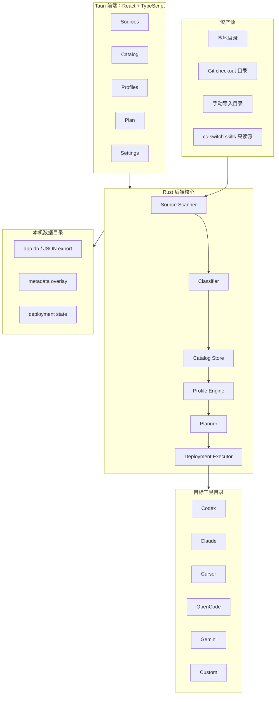
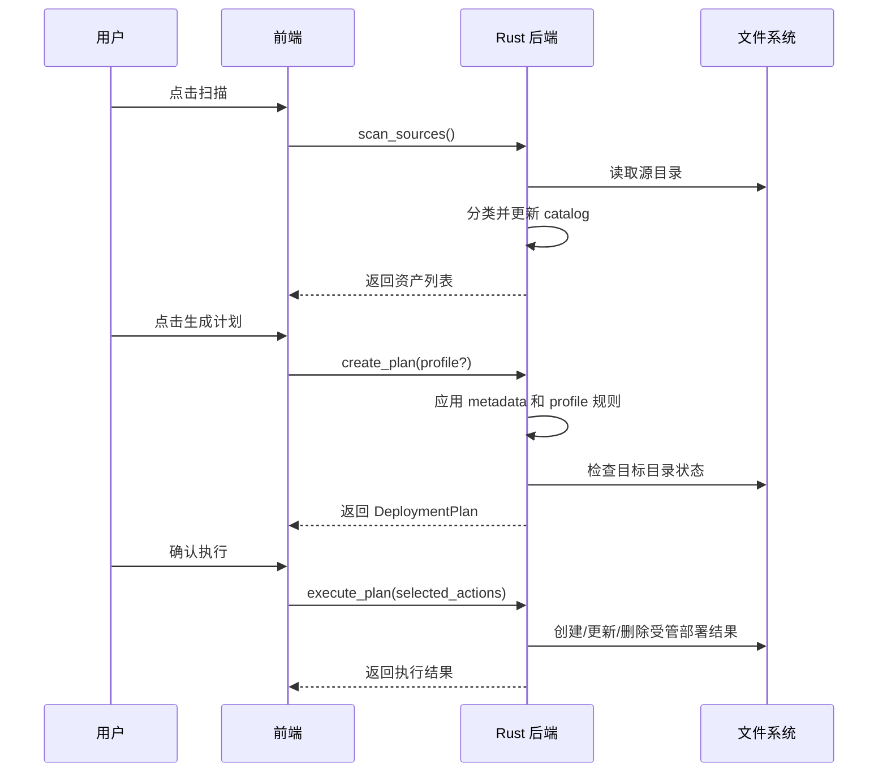

# 设计文档：AssetIWeave

## 1. 概览

AssetIWeave 是一个独立的 Tauri 桌面应用，用于集中管理本机 AI 文件资产。它不把 skill 当成唯一对象，而是把 prompt、rules、memory、skills、MCP 配置、agent 定义、command、workflow 等都抽象为 `Asset`。

系统采用“源目录只读 + 元数据覆盖层 + Profile 投影 + 部署计划”的架构。源资产保持原样；用户对资产的分类、标签、分组、启用策略保存在 App 数据目录；不同 AI 工具的目标目录只是根据 Profile 生成的 materialized view。

## 2. 架构原则

1. **独立实现**：不依赖现有 Python 脚本、launchd 任务或 cc-switch 运行时。
2. **本地优先**：核心数据存储在本机，离线可用。
3. **源文件只读**：默认不修改来源目录里的资产。
4. **目标可重建**：目标目录里的部署结果可以由配置重新生成。
5. **决策可解释**：每个部署或跳过都能说明原因。
6. **类型可扩展**：新资产形态通过分类器和 adapter 扩展。
7. **工具可扩展**：新 CLI/App 通过 Profile 模板或自定义 Profile 扩展。

## 3. 总体架构

### 3.1 技术选型

- 桌面壳：Tauri 2。
- 前端运行时：React + TypeScript + Vite。
- 前端样式：Tailwind CSS，设计 token 统一放在 `tailwind.config.ts`，页面组件优先使用 Tailwind utility classes，`src/styles.css` 仅保留 Tailwind layers、全局背景和少量工具类。
- 图标：`lucide-react`。
- 后端核心：Rust workspace，`src-tauri` 作为桌面 App 壳，`crates/assetiweave-core` 承载领域模型、扫描、分类、计划生成等可测试核心逻辑。
- 本地存储：SQLite 主存储，后续提供 JSON 导出/导入。
- 包管理与构建：pnpm、Cargo。

### 3.2 Tauri 后端模块边界

`src-tauri` 不把所有职责堆在 `lib.rs`。入口文件只负责装配 Tauri builder、插件、状态和命令注册；业务按以下边界拆分：

- `commands.rs`：Tauri command 层，类似 Controller，只做参数接收、状态锁定和调用下层服务。
- `store/`：SQLite repository 模块目录。`mod.rs` 只导出门面；`schema.rs` 负责建表和 seed；`sql.rs` 集中 SQL 常量；`source_repo.rs`、`asset_repo.rs`、`profile_repo.rs`、`deployment_repo.rs` 分别承载对应聚合的读写；`codec.rs` 负责 JSON/enum 编解码和 SQLite 错误转换。
- `scanner/`：资产扫描与分类模块目录，负责 Source 目录遍历、include/exclude glob、`SKILL.md` 目录识别和资产描述提取。后续按规模继续拆分为 walker、classifier、extractor。
- `planner/`：部署计划生成模块目录，负责 create/skip/conflict 决策和解释文本。后续按 Profile 匹配、目标路径解析、冲突判断继续拆分。
- `executor/`：部署执行模块目录，负责 symlink/copy、安全边界、非托管文件冲突和 deployment state 记录。后续按 filesystem、strategy、state recorder 继续拆分。
- `defaults.rs`：默认 Source/Profile 模板。
- `path_utils.rs`：路径展开、相对路径归一化、hash 等跨模块工具。
- `platform.rs`：平台集成，例如在文件管理器中显示路径。
- `types.rs`：Tauri 层 DTO 和共享 AppState。



## 4. 应用信息架构

### 4.1 Sources

用于管理资产来源。

主要能力：

- 添加本地目录源。
- 配置 include/exclude glob。
- 启用/禁用源。
- 扫描源并显示发现统计。
- 查看源内资产列表。

### 4.2 Catalog

用于管理统一资产目录。

主要能力：

- 表格展示所有资产。
- 搜索和筛选 kind、source、tag、group、enabled。
- 批量设置标签和分组。
- 单个资产详情面板。
- 查看原始路径和解析出的 frontmatter/description。

### 4.3 Profiles

用于管理目标 CLI/App。

主要能力：

- 创建内置模板或自定义 Profile。
- 配置目标路径。
- 配置支持的资产类型。
- 配置 include/exclude 规则。
- 查看该 Profile 的 effective asset 列表。

### 4.4 Plan

用于预览和执行部署计划。

主要能力：

- 生成全量或单 Profile 计划。
- 展示 create、update、remove、skip、conflict。
- 显示每个动作的原因。
- 执行选中的动作。
- 查看执行结果。

### 4.5 Settings

用于管理 App 级设置。

主要能力：

- 数据目录位置。
- 导入/导出配置。
- 安全策略，例如是否允许自动删除。
- 后台同步设置。
- cc-switch 迁移入口。

## 5. 核心数据模型

### 5.1 Source

```text
Source
- id: string
- name: string
- kind: local | git_checkout | import | custom
- root_path: string
- include_globs: string[]
- exclude_globs: string[]
- default_kind?: AssetKind
- enabled: boolean
- priority: number
- last_scanned_at?: datetime
- last_scan_status?: ok | warning | error
```

说明：

- MVP 只实现 `local` 和 `git_checkout` 作为本地目录扫描。
- `git_checkout` 不负责 clone/pull，只表示这是一个 Git 工作区目录。

### 5.2 Asset

```text
Asset
- id: string
- source_id: string
- name: string
- kind: AssetKind
- format: AssetFormat
- relative_path: string
- absolute_path: string
- entry_file?: string
- description?: string
- content_hash?: string
- discovered_at: datetime
- updated_at: datetime
```

`id` 生成规则：

```text
asset_id = hash(source_id + ":" + relative_path)
```

### 5.3 MetadataOverlay

```text
MetadataOverlay
- asset_id: string
- display_name?: string
- kind_override?: AssetKind
- tags: string[]
- groups: string[]
- enabled: boolean
- notes?: string
- explicit_profiles_include: string[]
- explicit_profiles_exclude: string[]
```

说明：

- 覆盖层优先于自动分类结果。
- 覆盖层存储在 App 数据目录，不写入源目录。

### 5.4 TargetProfile

```text
TargetProfile
- id: string
- name: string
- app_kind: codex | claude | cursor | opencode | gemini | openclaw | antigravity | custom
- target_paths: string[]
- supported_kinds: AssetKind[]
- deployment_strategy: symlink | copy | render | append | config_merge
- enabled: boolean
- include:
  - kinds: AssetKind[]
  - tags: string[]
  - groups: string[]
  - sources: string[]
  - path_patterns: string[]
- exclude:
  - kinds: AssetKind[]
  - tags: string[]
  - groups: string[]
  - sources: string[]
  - path_patterns: string[]
- safety:
  - allow_remove: boolean
  - allow_overwrite: boolean
```

MVP 只实现 `symlink` 和 `copy`。

### 5.5 DeploymentPlan

```text
DeploymentPlan
- id: string
- created_at: datetime
- profile_id?: string
- actions: DeploymentAction[]
- summary:
  - create_count: number
  - update_count: number
  - remove_count: number
  - skip_count: number
  - conflict_count: number
```

### 5.6 DeploymentAction

```text
DeploymentAction
- id: string
- type: create | update | remove | skip | conflict
- asset_id?: string
- profile_id: string
- source_path?: string
- target_path: string
- strategy: symlink | copy | render | append | config_merge
- reason: string
- risk: low | medium | high
- selectable: boolean
```

### 5.7 DeploymentState

```text
DeploymentState
- profile_id: string
- asset_id: string
- target_path: string
- strategy: string
- source_hash: string
- deployed_at: datetime
- managed_by: assetiweave
```

该表用于判断哪些目标文件是本应用管理的，避免误删用户文件。

## 6. 资产分类策略

分类顺序：

1. 用户手动覆盖。
2. Source 的 `default_kind`。
3. Source include glob 对应的 kind 提示。
4. 目录特征。
5. 文件名和扩展名。
6. 内容特征。
7. 无法识别时归为 `custom` 或 `unclassified`。

示例：

```text
包含 SKILL.md 的目录 -> skill
.cursor/rules 下的 .mdc/.md -> rule
prompts/ 下的 .md/.txt -> prompt
mcp.json / mcpServers 字段 -> mcp
AGENTS.md / CLAUDE.md / codex instructions -> memory 或 rule
```

MVP 只需要可靠支持：

- 包含 `SKILL.md` 的目录。
- Markdown prompt/rule 文件。
- 未识别 custom 文件。

## 7. 决策和解释模型

部署决策优先级：

1. Profile 未启用：跳过。
2. Asset 未启用：跳过。
3. Asset 显式排除某 Profile：跳过。
4. Asset 显式包含某 Profile：部署。
5. Profile 不支持该 kind：跳过。
6. Profile exclude 命中：跳过。
7. Profile include 命中：部署。
8. 默认策略：跳过。

每次评估生成 `EvaluationResult`：

```text
EvaluationResult
- asset_id
- profile_id
- decision: deploy | skip
- reasons: string[]
- matched_rules: string[]
```

UI 必须展示 reasons，便于用户理解结果。

## 8. 同步流程



## 9. Tauri 后端命令

MVP 命令：

```text
list_sources() -> Source[]
create_source(input) -> Source
update_source(id, input) -> Source
delete_source(id) -> void
scan_sources() -> ScanResult

list_assets(filter) -> AssetWithMetadata[]
update_asset_metadata(asset_id, patch) -> MetadataOverlay
bulk_update_assets(asset_ids, patch) -> BulkResult

list_profiles() -> TargetProfile[]
create_profile(input) -> TargetProfile
update_profile(id, input) -> TargetProfile
delete_profile(id) -> void

create_plan(profile_id?) -> DeploymentPlan
execute_plan(action_ids) -> ExecutionResult
explain_asset(asset_id, profile_id) -> EvaluationResult

export_config(path) -> void
import_config(path) -> ImportResult
```

后续命令：

```text
watch_sources()
read_recent_logs()
import_cc_switch()
manage_login_item()
```

## 10. 存储设计

MVP 推荐使用 SQLite 作为主存储，原因是：

- 桌面 App 查询和过滤更方便。
- 部署状态需要可靠记录。
- 后续迁移和统计更自然。

同时提供 JSON 导出，保证可审计和可迁移。

数据目录：

```text
macOS: ~/Library/Application Support/com.util6.assetiweave/
Linux: ~/.local/share/assetiweave/
Windows: %APPDATA%/AssetIWeave/
```

主要文件：

```text
app.db
exports/
logs/
backups/
```

## 11. 部署安全策略

- 默认不覆盖真实文件。
- 默认不删除非本应用管理的文件。
- symlink 目标必须指向已登记的源资产。
- 删除动作必须匹配 `DeploymentState`。
- 高风险动作在 UI 中明确标记。
- 失败动作不应导致后续高风险动作继续执行。

## 12. UI 设计方向

产品是本地资产工作台，界面应偏工具型、密度适中、可扫描，不做 landing page。

布局建议：

- 左侧导航：Sources、Catalog、Profiles、Plan、Settings。
- 顶部状态栏：资产数量、启用 Profile 数量、待同步动作数、最近扫描时间。
- 主区域以表格和分栏为主。
- 右侧详情抽屉用于编辑资产和 Profile。

视觉方向：

- 安静、专业、偏工程工具。
- 避免大面积装饰和营销式 hero。
- 用清晰状态色表达 create/update/remove/conflict。

## 13. 迁移和兼容

cc-switch：

- MVP 只把 `~/.cc-switch/skills` 当作普通本地源模板。
- 后续可只读解析 `~/.cc-switch/cc-switch.db`，生成一次性迁移建议。

现有脚本：

- 不作为运行依赖。
- 可以作为需求背景，但不复用代码。

未来资产形态：

- 新 kind 通过枚举扩展。
- 新文件结构通过 classifier 扩展。
- 新工具通过 TargetProfile 模板扩展。

## 14. 测试策略

MVP 测试重点：

- 数据模型序列化和校验。
- 源扫描和分类。
- 元数据覆盖层合并。
- Profile 决策解释。
- 部署计划生成。
- symlink/copy 执行和安全边界。

不在 MVP 强制：

- property based testing。
- 大规模 benchmark。
- 完整端到端 UI 自动化。
