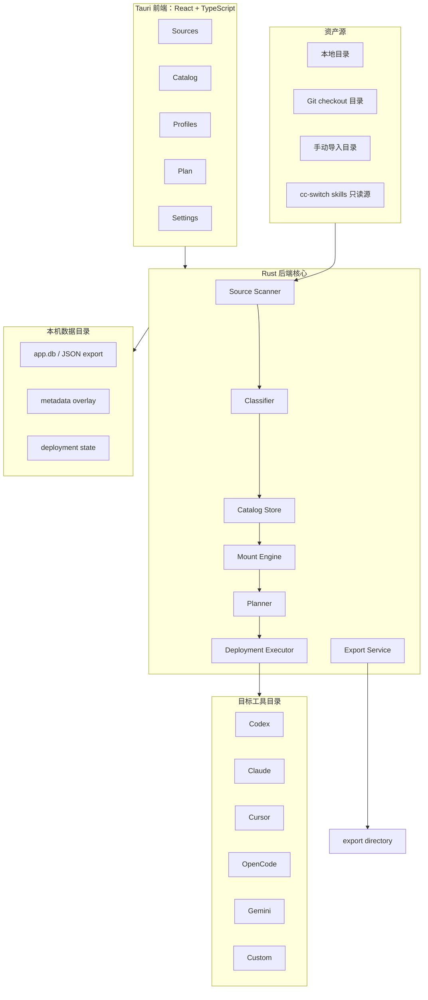
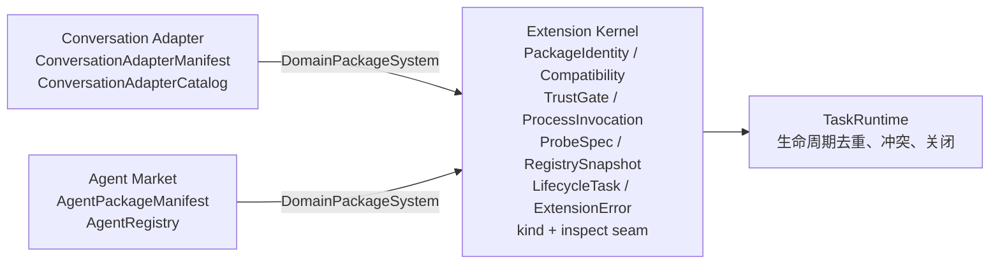
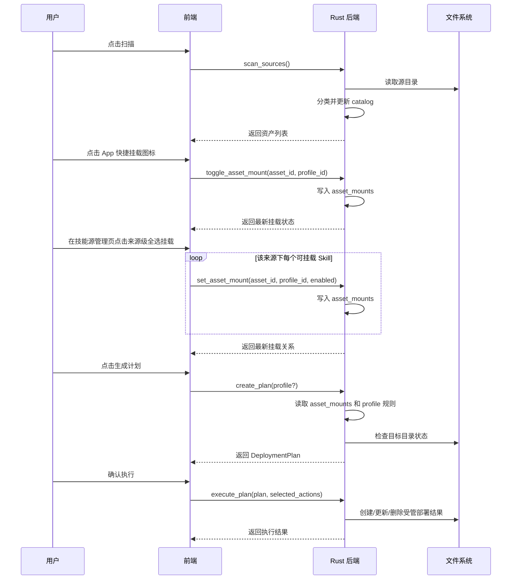

# 设计文档：AssetIWeave

## 1. 概览

AssetIWeave 是一个独立的 Tauri 桌面应用，用于管理本机 AI 文件资产的发现、编目、挂载、部署和导出。它不把 skill 当成唯一对象，而是把 prompt、rules、memory、skills、MCP 配置、agent 定义、command、workflow 等都抽象为 `Asset`。

当前产品已经进入具体开发阶段。核心定位是**资产挂载管理器**：源仓库保持只读；AssetIWeave 负责扫描索引、分类、记录挂载关系、生成部署计划，并把源仓库中的真实资产通过软链接直接挂载到多个目标 App。资产集中整理不作为默认存储路径，而作为后续 `Export Assets` 功能，把用户选择的真实文件复制到指定目录。

系统采用“源目录只读 + SQLite Catalog + 挂载关系 + Profile 投影 + 部署计划 + 可选导出”的架构。默认不复制源资产，不创建中间集中池，也不采用两跳软链接；目标 App 目录中的部署结果直接指向源仓库中的真实资产。

## 2. 架构原则

1. **独立实现**：不依赖现有 Python 脚本、launchd 任务或 cc-switch 运行时。
2. **本地优先**：核心数据存储在本机，离线可用。
3. **源文件只读**：默认不修改来源目录里的资产。
4. **目标可重建**：目标目录里的部署结果可以由配置重新生成。
5. **决策可解释**：每个部署或跳过都能说明原因。
6. **类型可扩展**：新资产形态通过分类器和 adapter 扩展。
7. **工具可扩展**：新 CLI/App 通过 Profile 模板或自定义 Profile 扩展。
8. **直接挂载优先**：默认部署策略是目标 App 目录直接 symlink 到源资产，不通过中间 symlink 池。
9. **集中复制是显式导出**：只有用户触发导出时，才把真实资产复制到指定目录，并生成 manifest。

## 3. 总体架构

### 3.1 技术选型

- 桌面壳：Tauri 2。
- 前端运行时：React 19 + TypeScript 5 + Vite 6。
- 前端样式：Tailwind CSS 3 + 语义主题 token。全局 Tailwind layers 和少量工具类放在 `frontend/src/styles/index.css`；主题 schema、CSS 变量、配色校验和 recipe 放在 `frontend/src/theme/`。
- 前端组件基础：Radix UI、class-variance-authority、tailwind-merge 和项目内 `components/ui` / `components/foundation` 分层。
- 后端核心：单一 Rust package `src-tauri`，桌面 App 和 stdio Engine 共享 `assetiweave_lib`。接口适配放在 `src-tauri/src/adapters/`，业务核心放在 `src-tauri/src/backend/`。
- Rust 异步与本地能力：Tauri plugins、Tokio、SQLx、rusqlite、globset、walkdir、sha2、serde、schemars、ureq。
- 本地存储：SQLx-managed SQLite 主存储，schema 通过 `src-tauri/migrations/` 演进；备份、导出和导入能力围绕 app-owned 数据目录实现。
- CLI：Go 1.24 + Cobra。CLI 只负责命令体验、策略、插件、自更新和外部采集编排，所有业务写入通过 Rust Engine。
- 契约：Rust Engine command registry 暴露方法、schema、风险等级、dry-run 和确认要求；`pnpm cli:contract` 生成 `cli/internal/schema/contract.json`。
- 包管理与构建：pnpm 10、Cargo、Go toolchain。

### 3.2 Tauri 后端模块边界

`src-tauri` 不把职责堆在入口文件。`lib.rs` 只装配 Tauri builder、插件、状态、关闭前同步/备份和 command handler；业务通过 adapters 和 backend 分层。

当前真实模块边界：

- `adapters/tauri/`：Tauri command handler、command 函数和 background task registry。它是桌面 UI 的接口层，只做参数接收、状态访问、后台任务编排和调用 `AppService`。
- `adapters/engine/`：stdio JSON protocol、command registry/runtime、风险策略和 transport。它是 Go CLI 的接口层，负责 protocol/contract，而不是业务规则。
- `adapters/app_state.rs`、`adapters/platform.rs`、`adapters/cli_tools.rs`：Tauri 状态、平台集成和本地 CLI 工具辅助。
- `backend/application/`：`AppService` 及其按领域拆分的工作流入口。Tauri 与 Engine 都应通过这里进入业务逻辑。
- `backend/capabilities/`：可被多个工作流复用的能力模块，例如 catalog、sources、profiles、groups、mounts 和 filesystem utils。
- `backend/models/`：后端共享模型，当前包含 asset、conversation、tenant 等领域结构和纯辅助函数。
- `backend/dto/`：跨接口输出的 DTO 类型，避免把存储内部结构直接泄漏给前端或 CLI。
- `backend/store/`：SQLx-backed SQLite repository 模块目录。`database.rs` 负责数据库打开、migration 和默认 seed；`sql.rs` 集中 SQL；各领域 repo 承载 Source、Asset、Profile、Deployment、Mount、Group、Conversation、Tenant、Backup、Remote Skill 等读写；`codec.rs` 负责 JSON/enum 编解码。
- `backend/scanner/`：资产扫描与分类，包含 dispatcher、glob、mixed scanner、skill scanner、asset builder、classifier、Git/source metadata 和目录 hash。
- `backend/planner/`：部署计划生成，基于 `asset_mounts`、Profile 能力、目标状态和安全规则输出可解释动作。
- `backend/executor/`：部署执行，负责 `symlink_to_source`、`copy_to_target`、目标路径安全、非托管文件保护和 deployment state 写入。
- `backend/targeting.rs`：目标路径解析、App/Profile 挂载目录、实际挂载状态和断链/冲突判断。
- `backend/host_paths.rs`、`app_paths.rs`：可移植存储路径、宿主路径解析、展示路径和各 App 默认目录。
- `backend/host_filesystem.rs`：Windows/macOS/Linux 文件系统差异，包括路径比较、目录边界、软链接创建/删除和目录遍历错误。
- `backend/conversations/`：对话记录适配器、官方/外部来源读取、NDJSON try-run、harvester 接入和标准化 Session/Turn/Part 处理。
- `backend/application/memory*.rs`、`backend/models/memory.rs`、`backend/store/memory_repo.rs`：Memory 领域的正式条目、证据快照、Dream、提取、合并、freshness 和运行状态；所有接口适配层必须通过 AppService 进入这些工作流。
- `backend/app_settings.rs`、`data_backup.rs`、`logs.rs`、`operation_log.rs`、`card_translation.rs`：设置、备份、日志、操作记录和卡片翻译等独立基础能力。
- `backend/defaults.rs`、`path_utils.rs`：内置模板、路径展开、Git 路径和 hash 等共享工具。

Extension Kernel 与领域扩展边界：

```text
Extension Kernel（backend/extension_kernel）
├── PackageIdentity / Compatibility / TrustGate
├── ProcessInvocation / ProbeSpec / ProbeResult
├── RegistrySnapshot<T> / LifecycleOp / ExtensionError
└── DomainPackageSystem seam
        ├── Conversation Adapter manifest、card contract、来源同步
        └── Agent Market manifest、ACP 能力、模型发现
```

Kernel 只提供共享机制，不理解领域 manifest，也不实现进程内热重载。
`DomainPackageSystem` 只声明 `PackageKind` 并执行目录 inspection；安装、升级、卸载和
运行时重载由 Agent Market/Conversation 各自的 workflow 与 registry 负责，不再通过空的
生命周期 hook 转发。新增市场型模块必须新增 `PackageKind`、领域 `DomainPackageSystem`
和能力 seam，禁止再建一套垂直注册表/安装流程；部署安全不变量仍属于 Core。

架构约束：

- 不再描述或新建独立 core crate；当前后端是单一 `src-tauri` package。
- 不再使用旧式顶层 `commands.rs` / `service.rs` 作为新功能落点；新入口应进入 `adapters/*` 或 `backend/application/*`。
- 前端和 Go CLI 不能直接写 SQLite、不能自行判断挂载安全、不能复制扫描/计划/执行规则。
- Engine contract、CLI schema 和 Tauri command DTO 需要随公共能力同步演进。

#### Capabilities Architectural Contract

`backend/capabilities/` 是跨多个 repository 或 infrastructure operation 的稳定领域能力层，不是所有业务函数的必经中转层。

- 需要跨多个 store、文件系统或外部边界协调，并且会被多个 Application workflow 复用的事务性行为进入 capability。
- 单表 CRUD、单一查询和纯持久化映射保留在 `backend/store/`。
- 跨领域 workflow 编排、权限/确认策略和 transport DTO 组装保留在 `backend/application/`。
- Capability 只能依赖稳定的 domain model、store contract 和 infrastructure boundary；不得反向依赖 Tauri/Engine adapter。
- 新增 capability 必须说明输入不变量、输出不变量、错误边界和事务/副作用范围；无需为了形式统一给简单 CRUD 增加 capability 包装。

因此推荐的数据流是：

```text
Transport -> AppService workflow -> Capability (when cross-boundary) -> Store / Host boundary
Transport -> AppService workflow -> Store (when simple CRUD)
```

### 3.3 当前开发状态

当前 Git 历史已经进入 `0.5.0` 后的具体功能扩展阶段。近期提交显示重点集中在版本同步、Engine/CLI contract、批量 catalog/mount 刷新、harvester register probe、source display assets、Conversation 搜索筛选和翻译 provider/CLI/model/prompt 模式。

当前已经完成或基本打通的产品开发基础：

- Tauri 2 + React 19 + TypeScript + Vite + Tailwind CSS 应用框架。
- 单一 `src-tauri` Rust 后端包，以及其内部共享模型模块。
- 前端组件化分层，包含 `components/ui`、`foundation`、`common` 和领域组件目录。
- SQLx-managed SQLite 主存储，包含 Tenant、Source、Asset、Profile、DeploymentState、Navigation、App Shortcut、AssetMount、AssetGroup、Conversation、Settings、Backup、OperationLog、Remote Skill 等基础表。
- Source seed、Profile seed、Navigation seed、App Shortcut seed 和 `asset_mounts` 持久化。
- 真实目录扫描、`SKILL.md` 目录识别、基础资产分类、描述提取、Git 仓库 root/scan root 推断、目录资产 hash。
- Catalog 页面：搜索、指标、部署计划预览、资产行默认展示路径/描述/来源。
- Catalog 页面当前支持列表视图和卡片视图；卡片视图用于资产总览，不表达文件树或来源层级。
- 资产行右侧可配置 App 快捷挂载图标，配置来自 SQLite。
- 展开态 Mount Targets 面板和可选中挂载卡片 UI。
- 快捷挂载图标和 Mount Target 卡片已写入同一份 `asset_mounts` 关系。
- Sources/技能源管理页面当前支持列表视图和分栏视图；分栏视图按来源、Skill 列表、源级批量挂载区域组织。
- 技能源管理页面支持把某个来源下全部 Skill 批量挂载到指定 App/Profile，底层复用 `asset_mounts`。
- 统一数据 Toolbar 组件已抽取，页面只传入自己合法的视图选项。
- 技能源导入弹窗和目录选择入口已接入前端。
- App 快捷入口支持真实应用图标 token 和自定义 SVG path 资源；快捷图标配置已持久化到 SQLite。
- NavigationModel 支持中英文本地化 label 覆盖；设置页可以按当前语言编辑菜单文案。
- Tauri 后端契约已扩展：资产可按 kind 查询/扫描，支持取消真实挂载并返回最新挂载状态，目录选择使用 Tauri dialog plugin。
- 配置路径持久化使用 `~`、`@config`、`@local-data`、`@data`、`@cache` 等可移植锚点；绝对路径只在 I/O 边界解析。
- 普通 UI 使用后端 DTO 的 `display_*` 路径；绝对运行时路径仅用于 Reveal、执行和当前宿主观测。
- 部署计划生成和执行基础链路，计划输入已收敛到启用的挂载关系。
- 部署执行默认将目标 App 目录直接 symlink 到源资产真实路径。
- 启动和关闭路径会刷新已记录资产/挂载观测；关闭前执行数据库备份，并在后台任务运行时提示用户确认退出。
- 通知消息渲染出口。
- 中英文 i18n 基础。
- 前端目录架构已收敛：保留 `services` 和 `pages` 作为项目约定，新增/明确 `layouts`、`router`、`mock`、`store`、`styles`、`types` 等顶层边界。
- 当前验证基线：`pnpm typecheck`、`pnpm test`、`cargo test`、`pnpm build` 通过；Vite 单 chunk 超过 500 kB 的提示保留为后续性能优化项。
- Conversation v1 已接入独立领域模型、SQLite 表、Engine/Go CLI 方法、Tauri commands、Session-first 前端页面、Markdown Session 导出和双向导航入口。
- Conversation Adapter 的用户第一存储现场固定为 `~/.assetiweave/conversation-adapters/<cli-name>`，已有文件不会被内置 seed 覆盖。注册升级先复制为 prepared 快照并执行 probe，成功后提升到 `packages/<package_id>/versions/<semver>-<content-hash>`，最后在数据库事务中激活；workspace 来源只保留最新可用的不可变运行副本。市场 artifact 仍使用 install/update/uninstall 和正式 SemVer 历史。
- Conversation Adapter Catalog v2 使用 `builtin-assets/index.json` 与 `history/<package_id>.json`，缓存版本、Core 兼容范围、artifact 大小与 SHA-256、changelog、breaking-change 和 ETag；远端缓存超过 24 小时才自动刷新，默认只提示更新。
- 对话插件页面提供已接入、更新、发现三个视图和详情/版本历史；市场下载与安装在 UI 中表达为“注册”，并提供显式检查更新。注册、更新、卸载 runtime 通过共享后台任务 registry 执行，页面只禁用冲突的生命周期操作。
- Go CLI 的 `conversation adapter` 暴露 `list`、`inspect` 和 `upgrade`。`aiwc c ad upgrade` 扫描默认第一现场，`aiwc c ad upgrade -d` 使用当前仓库的 `builtin-assets/adapters`，传入目录时只提升指定 workspace；三种形式都通过 Engine 完成快照、probe 和激活。
- CLI 已形成分层：手写快捷命令、生成式 App 命令、Raw Engine API、稳定错误分类、命令策略、hook、插件平台、harvester/webharvester 和自更新。
- Skill 互联网发现/导入已覆盖 GitHub 搜索、候选评分/解释、dry-run、确认导入、备份库导入、remote source 记录、drift 检测和前端入口。
- 产品内置 Conversation Recall Skill 以 `conversation search` 为入口，先读取命中摘要，再按记录类型读取 Question、Session 或 Web Record；回答保留 Session/Question/Block 证据标识，形成后续 Memory 的只读检索基础。
- 网页 Conversation Harvester 提供本地 `doctor -> repair -> auth-check/auth-detect -> run -> conversation sync -> web-record verify` 恢复链路。Doctor 不发起网络请求；Repair 只恢复官方模板静态文件和执行权限，保留认证状态与历史输出，Runtime 或网站协议问题必须按诊断提示单独处理。

下一阶段重点不是继续搭框架，而是继续补齐产品边界和可靠性：在已交付的独立 Memory 与双层记忆纵切之上，推进 Profile 规则细化、执行确认与结果展示、导出复制、批量流程测试、性能拆包和更完整的跨端契约验证。

### 3.4 前端目录边界

当前前端采用以下顶层目录约定：

- `app/`：React 应用入口、Provider 装配和顶层 App。
- `components/`：可复用 UI 和业务组件；页面级布局壳不放在这里。
- `config/`：静态配置，例如 App 快捷图标资源。
- `hooks/`：React 业务状态与控制器 hooks。
- `i18n/`：运行时国际化 Provider、消息表和领域翻译函数。
- `layouts/`：应用布局壳、侧栏、顶部导航、子导航等长期布局结构。
- `mock/`：Tauri 后端不可用时的演示/兜底数据。
- `pages/`：页面级组件，保留 React 项目常用命名。
- `router/`：页面选择、路由解析、菜单模型、导航图标和导航类型。
- `schemas/`：前后端边界数据校验 schema。
- `services/`：前端调用 Tauri/Rust command 的接口层，保留当前项目命名。
- `store/`：前端全局状态 Provider。
- `styles/`：全局样式入口和设计 token 相关样式。
- `types/`：前端共享领域类型。
- `utils/`：纯工具函数。

### 3.5 Conversation 领域架构

Conversation 不属于文件资产 Catalog。它拥有独立的数据流：

```text
第三方 Session 存储
  -> Adapter 标准化
  -> conversation_sessions / turns / parts
  -> conversation_questions / question_turns
  -> 搜索、合并拆分、Markdown Session 导出
```

核心模型：

- `ConversationSession`：第三方 App 的一个 Session，保留来源、外部 ID、标题、项目路径和 source locator。
- `ConversationTurn`：以真实用户消息为边界的源对齐记录。
- `ConversationPart`：Turn 内有序内容，支持 text、code_block、command、tool、file_change、subagent；可选 `source_execution_id` 原样保留来源工具调用身份。
- `ConversationQuestion`：用户可见的问题分组，可包含同一 Session 内相邻多个 Turn。

内容标准化边界：

- 外部 Adapter 负责理解来源 JSON：识别 Command/Result、解开来源 envelope、解析完整 JSON 字符串或结构化文本片段、规范换行、移除 ANSI/控制字符与来源执行器头部；这些规则随 Adapter package 独立发布。
- Core 不识别 `Output:`、`Wall time`、字面量 `\\n` 等来源协议细节，只校验 Adapter 输出、持久化 Part/Card，并按受控 renderer 投影展示数据。
- 前端按 renderer 做通用的预格式化、滚动和折叠，不建立来源特定的清理规则。新增来源格式只改 Adapter；只有新增 Core renderer 时才改前端/Core。

Execution 展示投影：

- Codex、Claude Code、OpenCode Adapter 从来源 JSON 复制可靠的 call ID；Antigravity 暂不推断，保持 `source_execution_id = null`。
- Core 只按精确的 `(turn_id, source_execution_id)` 将有关联 Result 的 `command` / `result` Card 投影为 Execution 父子节点，不按顺序、文本或时间做语义重匹配；没有 Result 子项的 Command 直接投影为普通 Card。
- Question Detail 同时返回扁平 `cards` 和有序 `content_nodes`；Execution 节点仅保存同一响应内的 Card 数组索引，避免复制正文。
- 前端直接消费 `content_nodes`，不创建配对 Map；旧 Engine 返回的 command-only 或仅含空 Result 的 Execution 在展示前退化为普通 Command Card。
- `source_execution_id` 是内部关联身份，不作为用户可见标签；Execution 是可重建的读取模型，不单独建立实体表或关系表。完整决策见 `docs/decisions/ADR-006-source-execution-grouping.md` 与 `docs/decisions/ADR-007-delete-command-only-execution-shells.md`。

身份与展示约定：

- 第三方 Session/Turn 身份原样保存在 `external_id`；其唯一范围由 tenant、source 或所属 Session 共同限定，不加工为产品主键。
- `conversation_sessions.id` 及 Turn、Part、Question 的完整 `id` 是 AssetIWeave 的规范内部身份。数据库关联、React key、导航定位、Memory 证据和所有精确读写操作均使用完整 ID。
- 页面从完整 ID 的第一个 64 位十六进制哈希段派生 8 位小写展示片段；兼容旧数据中的较短哈希段，无哈希数据或测试夹具退化为原值前 8 位。展示片段不持久化、不保证唯一，也不称为 Public ID。
- 只有严格 8 位十六进制输入或完整领域 ID 才进入 ID 搜索分支。发现型搜索返回全部匹配项并允许碰撞；合并、拆分、删除、导出等精确操作继续要求完整 ID 或无歧义的既有前缀解析。
- fingerprint、content hash 和 scope fingerprint 仅表达内容或版本状态，不属于实体身份。

同步原则：

- 导入内容按 source/session/turn 外部 ID 和 fingerprint 幂等更新。
- Question Group 是分组覆盖层；人工 merge/split 不会被后续同步覆盖。
- 简单中英文确认/继续回复只在严格 allowlist 命中时自动并入上一 Question。
- Conversation SQLite 是本地历史归档，不是第三方来源的可删除镜像；原始来源消失时保留已导入记录并继续允许浏览、搜索和导出。
- 来源观测状态与内容保留状态分离；只有用户显式删除本地记录时才清除 Conversation 内容。
- 默认同步先完整分页发现轻量 Session 元数据，再按稳定 external ID 和来源版本只读取新建或变化的 active Session。
- active 表示新建、版本变化、读取失败待重试或读取期间继续变化，不使用固定时间窗口判断，因此旧 Session 重新打开后仍能补充新内容。
- Adapter 必须标明元数据快照是否完整；不完整快照不得把未返回记录标记为缺失或删除，也不得推进成功版本。
- 旧 Adapter 的全量返回继续兼容，但 Store 采用保留式 upsert，不根据省略项删除历史。
- `ConversationSyncParams.mode` 使用 `incremental | full` 显式区分同步意图，缺省为 `incremental`；Conversation 页面和既有调用不传 mode 时继续执行安全增量同步。
- `full` 模式复用同一 AppService、后台任务 registry 与保留式 Store，但不向 Adapter 提供已成功 hydration version，使当前发现的所有 Session 都进入读取；网页 Harvester 同时通过进程环境标记绕过详情缓存。
- 全局设置是 `full` 模式的人工入口并要求二次确认；全量重解析只覆盖仍可发现的来源内容，不能清除来源已不再返回的本地历史。
- Conversation 同步后台任务快照持久携带 `phase`、`completed_source_count`、`total_source_count` 和 `current_source_name`；AppService 在来源边界回调进度，Tauri 事件实时推送，前端 Provider 继续以轮询作为丢失事件时的恢复路径。

外部适配器协议：

- Adapter manifest 使用 schema version 1，声明 id、name、version、protocol version、command、capabilities、input kinds。
- 运行时通过 stdin 发送 JSON request，通过 stdout 接收 NDJSON。
- stdout 行类型包括 `item`、`warning`、`complete`、`error`。
- `item` 必须输出标准化 Session/Turn/Part；AssetIWeave 不接受外部脚本直接输出最终 Question Group。
- `list_sessions` 用于分页发现 `external_id`、`updated_at`、`source_locator` 和 `version_token`；Core 比较版本后只通过 `read_session(session_id)` 获取 active Session 完整内容。
- 启动外部脚本时使用 executable + args，不经过 Shell；注册时保存 manifest/executable hash。
- try-run 与 register/unregister 属于高风险 CLI 操作，必须显式确认。

Conversation Adapter Package 生命周期：

- `conversation_adapters` 保持协议身份和 Source 绑定边界；`conversation_adapter_packages` 记录 active runtime、origin、catalog、更新策略和最新版本；`conversation_adapter_package_versions` 记录本地版本目录与 hash；`conversation_adapter_catalog_releases` 缓存远端发布历史。
- 用户可编辑 workspace 与运行副本分离：顶层 `<cli-name>` 目录允许直接修改，运行时只读取已成功激活的 `packages` 副本。workspace 升级失败不修改 active runtime；升级成功后清理此前的 workspace 运行副本，只保留最新可用版本。
- 外部 package 注册只记录路径、manifest、runtime、hash 和 Git 元数据，不复制或删除外部文件；注销只解除运行注册并保留 Source 与对话记录。
- 市场安装先下载到 staging，限制 ZIP 条目数量和展开体积，拒绝路径穿越与 symlink，校验 HTTPS、artifact SHA-256、package/content hash、SemVer 和 Core 兼容性后再写入托管版本目录。
- 新版本激活在一个数据库事务内更新 package、version 和 adapter runtime；失败时旧 active runtime 保持可用。同一正式 `package_id + version` 不允许 hash 变化。
- 卸载 preflight 列出受影响 Source 和托管目录；执行时仅删除 runtime 注册、禁用关联 Source，并把 package 标记为已卸载，托管版本目录和历史 Conversation 数据保持不变。
- 托管 Conversation Adapter 可在本机已安装版本间离线切换、一键回退并删除单个非运行版本；删除路径必须精确位于应用托管的 `packages/<package>/versions/<semver>`。最后运行版本只有在先卸载 runtime 后才能删除，删除最后一个版本时同步清理 package 注册记录，但保留 Conversation records 与 Source 配置。更新策略支持 `manual`、`follow_stable`、`follow_beta`、`pin_exact`，但不静默注册远端代码，也不提供真正的服务端 push。

### 3.6 Memory 领域架构

Memory 是 Conversation 之上的独立派生领域，不属于文件资产 Catalog，也不改变 Conversation 的事实源职责：

```text
Conversation Cards in SQLite
  -> delta selector -> gated lightweight Dream -> Dream Note
  -> search / scoped enumeration -> evidence hydration
       -> persisted Phase 1 extractions
       -> scope-locked Phase 2 consolidation
       -> cited answer + reviewable Memory candidates
  -> explicit user acceptance -> formal Memory + revision
```

领域边界：

- `memory_dream_notes` 是近期工作路由线索，不是确认事实；事实问题必须回查原始 session/web Card。
- `memory_extractions` 保存有界批次的中间产物，使 Phase 2 失败、取消或崩溃后不必重放全部外部模型调用。
- `memory_items` 只保存用户手工创建或明确接受的正式内容；`memory_item_revisions` 记录编辑、状态和 supersedes 历史。
- `memory_evidence_snapshots` 保存稳定定位、受限 excerpt 和原始内容 hash；来源不可用时仍可解释派生内容，但必须标记 freshness 状态。
- Dream 按持久化 cursor 选择已稳定的 Conversation 增量。成功写入 note 与 evidence 后才推进 cursor，失败、取消和输出校验失败均可安全重试。
- Recall 精准模式复用 Conversation Card 搜索并按 Card -> Question -> Session 渐进展开；完整整理按用户显式 scope 从 SQLite 分页枚举，不把搜索排名冒充全量覆盖。
- 所有 AI 内容在离开 Context Builder 前确定性脱敏，模型输出在写库前再次扫描并校验 evidence ID、enum、预算和结构。
- Auto-Dream 默认关闭。Overview、preview、evidence-only Recall 和 Library CRUD 必须在没有外部 AI runtime 时正常工作。
- Tauri 长任务立即返回 snapshot，后台使用独立 AppService/数据库连接；Engine/CLI 单请求模式前台完成并返回持久化报告，不暴露进程退出后失效的内存 task ID。

该架构决策见 `docs/decisions/ADR-004-dual-layer-memory.md`。Memory v1 不包含向量数据库、独立 daemon、自动写入第三方 App、无审核 supersedes 或 Memory Git 仓库。


```mermaid
flowchart TB
    subgraph UI["Tauri 前端：React + TypeScript"]
        UI1["Sources"]
        UI2["Catalog"]
        UI3["Profiles"]
        UI4["Plan"]
        UI5["Settings"]
    end

    subgraph Core["Rust 后端核心"]
        C1["Source Scanner"]
        C2["Classifier"]
        C3["Catalog Store"]
        C4["Mount Engine"]
        C5["Planner"]
        C6["Deployment Executor"]
        C7["Export Service"]
    end

    subgraph Data["本机数据目录"]
        D1["app.db / JSON export"]
        D2["metadata overlay"]
        D3["deployment state"]
    end

    subgraph Sources["资产源"]
        S1["本地目录"]
        S2["Git checkout 目录"]
        S3["手动导入目录"]
        S4["cc-switch skills 只读源"]
    end

    subgraph Targets["目标工具目录"]
        T1["Codex"]
        T2["Claude"]
        T3["Cursor"]
        T4["OpenCode"]
        T5["Gemini"]
        T6["Custom"]
    end

    UI --> Core
    Core --> Data
    Sources --> C1
    C1 --> C2
    C2 --> C3
    C3 --> C4
    C4 --> C5
    C5 --> C6
    C6 --> Targets
    C7 --> D4["export directory"]
```

### 3.1 Extension Kernel 与领域扩展

Conversation Adapter 与 Agent Market 共用 `backend/extension_kernel/`，领域
manifest、数据库状态、生命周期 workflow 和 registry 仍由各自模块持有：


```mermaid
flowchart LR
    Kernel["Extension Kernel\nPackageIdentity / Compatibility\nTrustGate / ProcessInvocation\nProbeSpec / RegistrySnapshot\nLifecycleTask / ExtensionError\nkind + inspect seam"]
    Conversation["Conversation Adapter\nConversationAdapterManifest\nConversationAdapterCatalog"]
    Agent["Agent Market\nAgentPackageManifest\nAgentRegistry"]
    Runtime["TaskRuntime\n生命周期去重、冲突、关闭"]

    Conversation -->|DomainPackageSystem| Kernel
    Agent -->|DomainPackageSystem| Kernel
    Kernel --> Runtime
```

`PackageKind` 是封闭枚举。新增市场型扩展必须新增对应的
`DomainPackageSystem`、领域 manifest 和架构决策，不得另起一套注册表、安装
流程或万能 manifest；本轮不实现新的 package kind，也不引入进程内热重载。Kernel
不承载安装/移除 hook，领域 workflow 在数据库激活前后自行处理副作用和回滚。

## 4. 应用信息架构

### 4.1 Sources

用于管理资产来源。

主要能力：

- 添加本地目录源。
- 通过导入源弹窗选择本地目录源。
- 配置 include/exclude glob。
- 启用/禁用源。
- 扫描源并显示发现统计。
- 查看源内资产列表。
- 在列表视图中查看来源摘要、规则和来源下 Skill。
- 在分栏视图中按来源浏览 Skill，并对该来源下全部 Skill 执行 Profile 级批量挂载。

### 4.2 Catalog

用于管理统一资产目录。

主要能力：

- 列表或卡片展示所有资产。
- 搜索和筛选 kind、source、tag、group、enabled。
- 批量设置标签和分组。
- 资产行默认展示名称、类型 badge、源路径、Description、Source。
- 卡片视图默认展示名称、类型、来源、描述、路径和 App 快捷挂载入口。
- 资产行右侧展示用户配置的 App 快捷挂载图标，支持排序和启停。
- 展开资产行后展示 Mount Targets，一行四个 Profile 卡片，用于选择挂载目标。
- 查看原始路径和解析出的 frontmatter/description。

### 4.2.1 Skill Groups

用于在已有 Skills > Groups 标签页下管理 Skill 场景分组。

主要能力：

- 创建、编辑、删除 Skill 场景分组。
- 通过手动成员和实时规则匹配共同解析分组成员。
- 第一版规则支持 Source、relative path glob、名称包含。
- 在分组页按 App Shortcut/Profile 批量挂载或卸载当前分组。
- 批量动作只影响当前分组成员，不替换同一 Profile 中其他已挂载 Skill。
- 批量动作复用即时挂载/卸载链路，成功后回写 `asset_mounts` 和物理挂载状态。

### 4.3 Profiles

用于管理目标 CLI/App。

主要能力：

- 创建内置模板或自定义 Profile。
- 配置目标路径。
- 配置支持的资产类型。
- 配置 include/exclude 规则。
- 查看该 Profile 的 effective asset 列表。

### 4.4 Plan

用于预览和执行部署计划。

主要能力：

- 生成全量或单 Profile 计划。
- 展示 create、update、remove、skip、conflict。
- 显示每个动作的原因。
- 执行选中的动作。
- 查看执行结果。

### 4.4.1 Mount Management

挂载管理是当前阶段的后端核心功能。用户在 Catalog 行右侧快捷图标或展开卡片中选择某个 App/Profile，本质上是创建或更新 `asset_mounts` 记录。

默认挂载语义：

```text
source repo asset
  -> target app directory symlink
```

不采用：

```text
source repo asset
  -> AssetIWeave intermediate symlink pool
  -> target app directory symlink
```

原因：

- 单跳 symlink 更容易排查断链。
- 目标 App 的 realpath、文件监听和目录扫描行为更稳定。
- Windows/macOS/Linux 的兼容复杂度更低。
- SQLite Catalog 已经提供集中视图，不需要通过中间目录表达“集中管理”。

`asset_mounts` 是部署计划的主要输入。计划生成不再默认尝试所有 Profile，而是只对已启用的挂载关系生成 create/update/remove/skip/conflict 动作。

### 4.4.2 Conversation Records

对话记录页面挂在顶层 `Conversations` tab 下，采用 Session-first 信息架构：

- `Sessions`：先搜索/选择 Session，再浏览该 Session 中的 Question Group。
- `Sources`：查看 Codex、OpenCode 和通过外部插件注册的来源，并触发同步。
- `Adapters`：查看 Codex/OpenCode 兜底适配器、外部适配器、信任状态和 CLI 开发工作流。

Session 芯片和用户问题、Answer、Tool、Command、Code、Result 卡片标题栏常显 8 位等宽 ID 片段。Session/Web Record 列表搜索支持片段、完整内部 ID、原始外部 ID及既有文本字段；Card 搜索为 Session、Question、Turn、Part、Block 片段建立多值索引，并在 Tantivy 不兼容或不可用时保持 SQL fallback 的同等匹配语义。ID 命中只用于发现，结果导航仍携带完整 Session、Question 和 Block ID。

页面不嵌入 AI API。需要 AI 辅助整理时，UI 提供 CLI 指令，引导外部 Agent/Skill 调用 `assetiweave-cli conversation ...` 完成同步、检查、merge/split 和导出。

### 4.5 Settings

用于管理 App 级设置。

主要能力：

- 数据目录位置。
- 导入/导出配置。
- 安全策略，例如是否允许自动删除。
- 后台同步设置。
- cc-switch 迁移入口。

### 4.5.1 Export Assets

集中整理资产作为显式导出功能提供，不参与默认挂载路径。

导出能力：

- 导出全部资产。
- 按资产类型、Source、Profile、挂载状态筛选导出。
- 复制真实文件或目录到用户指定目录。
- 可选择保持源目录结构或按 AssetKind 分组。
- 生成 `manifest.json`，记录 asset_id、source_id、原始路径、hash、kind、format、description、导出时间。

导出不会改变源目录，也不会改变目标 App 的挂载目录。

### 4.5.2 Data Toolbar 和视图模式

当前前端抽取了统一 `DataToolbar` 组件族，目标是统一工具栏的结构、按钮尺寸、搜索框、图标按钮、分隔线、指标块和视图切换控件。统一的是组件语言和交互形态，不是强制所有页面拥有同一组视图模式。

当前页面视图约束：

- 资产总览目录：`list`、`grid`。这里的 `grid` 是卡片视图，用于资产工作台式浏览。
- 技能源管理：`list`、`columns`。这里的 `columns` 是 Finder-like 分栏，用于按来源逐级浏览 Skill 和批量挂载。

设计原因：

- 资产总览目录不是文件树或来源层级视图，使用分栏会制造错误的信息结构。
- 技能源管理天然有 Source -> Skill -> Mount Targets 的层级关系，分栏能减少展开/折叠成本。
- Toolbar 保持组件统一，但视图选项由页面按业务语义声明。

### 4.6 Menu Management

菜单管理是独立模块，而不是页面里的静态 JSX。AssetIWeave 的核心目标之一是支持更多 AI App、更多资产形态和更多 Profile，因此导航体系必须可以扩展、排序、启停和配置。

早期先采用前端静态 `NavigationModel`：

- `railItems`：侧边主导航，按 `primary`、`secondary` 分组，承载 Catalog、Profiles、App 管理、Settings 等入口。
- `headerTabs`：页面上方的资产类型导航，映射 Skill、MCP、Prompt、Rule、Profile 等资产域。
- `subNavItems`：二级导航，按当前上方 Tab 提供该资产域内部的子功能。
- `NavigationIcon`：使用字符串标识图标，不把 React 组件写入配置，便于后续从 SQLite 或 JSON 读取。

当前实现已经把 `NavigationModel` 接入 SQLite。菜单不再只存在于前端静态配置；启动时后端会创建并 seed 以下表：

- `navigation_state`：当前默认激活的侧边菜单、顶部 Tab 和二级导航。
- `rail_menu_items`：侧边导航菜单项，包含 scope、position、enabled 和排序。
- `header_tab_items`：顶部资产域 Tab，包含对应资产类型和排序。
- `sub_nav_items`：按顶部 Tab 分组的二级导航。

前端通过 Tauri command `get_navigation_model` 读取菜单模型；浏览器预览模式仍保留静态 fallback，便于不启动 Tauri 时开发 UI。

后续迭代继续完善菜单管理：

- 支持内置菜单 seed。
- 支持用户启用/隐藏菜单。
- 支持 App/Profile 安装后自动注册菜单入口。
- 支持按资产类型、目标 App、Profile 能力动态生成子菜单。
- 支持菜单迁移版本，避免升级时覆盖用户配置。

## 5. 核心数据模型

### 5.1 Source

```text
Source
- id: string
- name: string
- kind: local | git_checkout | import | custom
- root_path: string
- include_globs: string[]
- exclude_globs: string[]
- default_kind?: AssetKind
- enabled: boolean
- priority: number
- last_scanned_at?: datetime
- last_scan_status?: ok | warning | error
```

说明：

- 当前实现先支持 `local` 和 `git_checkout` 作为本地目录扫描。
- `git_checkout` 不负责 clone/pull，只表示这是一个 Git 工作区目录。

### 5.2 Asset

```text
Asset
- id: string
- source_id: string
- name: string
- kind: AssetKind
- format: AssetFormat
- relative_path: string
- absolute_path: string
- entry_file?: string
- description?: string
- content_hash?: string
- discovered_at: datetime
- updated_at: datetime
```

`id` 生成规则：

```text
asset_id = hash(source_id + ":" + relative_path)
```

### 5.3 MetadataOverlay

```text
MetadataOverlay
- asset_id: string
- display_name?: string
- kind_override?: AssetKind
- tags: string[]
- groups: string[]
- enabled: boolean
- notes?: string
- explicit_profiles_include: string[]
- explicit_profiles_exclude: string[]
```

说明：

- 覆盖层优先于自动分类结果。
- 覆盖层存储在 App 数据目录，不写入源目录。

### 5.4 TargetProfile

```text
TargetProfile
- id: string
- name: string
- app_kind: codex | claude | cursor | opencode | gemini | openclaw | antigravity | custom
- target_paths: string[]
- supported_kinds: AssetKind[]
- deployment_strategy: symlink_to_source | copy_to_target | render | append | config_merge
- enabled: boolean
- include:
  - kinds: AssetKind[]
  - tags: string[]
  - groups: string[]
  - sources: string[]
  - path_patterns: string[]
- exclude:
  - kinds: AssetKind[]
  - tags: string[]
  - groups: string[]
  - sources: string[]
  - path_patterns: string[]
- safety:
  - allow_remove: boolean
  - allow_overwrite: boolean
```

当前默认策略收敛为 `symlink_to_source`：目标 App 目录直接软链接到源仓库中的真实资产。`copy_to_target` 保留为兼容策略，`render`、`append`、`config_merge` 用于后续复杂资产。

### 5.5 DeploymentPlan

```text
DeploymentPlan
- id: string
- created_at: datetime
- profile_id?: string
- actions: DeploymentAction[]
- summary:
  - create_count: number
  - update_count: number
  - remove_count: number
  - skip_count: number
  - conflict_count: number
```

### 5.6 DeploymentAction

```text
DeploymentAction
- id: string
- type: create | update | remove | skip | conflict
- asset_id?: string
- profile_id: string
- source_path?: string
- target_path: string
- strategy: symlink_to_source | copy_to_target | render | append | config_merge
- reason: string
- risk: low | medium | high
- selectable: boolean
```

### 5.7 DeploymentState

```text
DeploymentState
- profile_id: string
- asset_id: string
- target_path: string
- strategy: string
- source_hash: string
- deployed_at: datetime
- managed_by: assetiweave
```

该表用于判断哪些目标文件是本应用管理的，避免误删用户文件。

### 5.8 AssetMount

```text
AssetMount
- asset_id: string
- profile_id: string
- enabled: boolean
- strategy: symlink_to_source | copy_to_target
- created_at: datetime
- updated_at: datetime
```

说明：

- 表达“某个资产是否挂载到某个 App/Profile”。
- Catalog 右侧快捷图标和展开卡片都读写这张表。
- `create_plan` 以启用的 `asset_mounts` 为主输入。
- 删除或禁用挂载关系不删除源资产，只影响后续部署计划。

### 5.9 AssetGroup

```text
AssetGroup
- id: string
- name: string
- description?: string
- color: string
- asset_kind: skill
- enabled: boolean
- sort_order: number
- rules:
  - source_ids: string[]
  - relative_path_globs: string[]
  - name_contains?: string
- created_at: datetime
- updated_at: datetime

AssetGroupMember
- group_id: string
- asset_id: string
- created_at: datetime

AssetGroupResolvedMember
- asset_id: string
- origin: manual | rule | manual_and_rule
```

说明：

- 第一版只支持 Skill 场景分组。
- 固定成员写入 `asset_group_members`，规则成员每次基于当前扫描资产实时解析。
- 空规则不会匹配全部 Skill。
- 批量挂载/卸载使用分组解析后的成员集合，并复用 `asset_mounts` 作为唯一挂载意图存储。

### 5.10 AppShortcut

```text
AppShortcut
- profile_id: string
- display_icon: string
- accent_color: string
- enabled: boolean
- sort_order: number
```

说明：

- 控制资产行右侧默认展示哪些 App 快捷挂载按钮。
- 用户后续可以在设置中自定义启用/隐藏和排序。
- 当前已接入 SQLite 的 `app_shortcut_items` 表。

## 6. 资产分类策略

分类顺序：

1. 用户手动覆盖。
2. Source 的 `default_kind`。
3. Source include glob 对应的 kind 提示。
4. 目录特征。
5. 文件名和扩展名。
6. 内容特征。
7. 无法识别时归为 `custom` 或 `unclassified`。

示例：

```text
包含 SKILL.md 的目录 -> skill
.cursor/rules 下的 .mdc/.md -> rule
prompts/ 下的 .md/.txt -> prompt
mcp.json / mcpServers 字段 -> mcp
AGENTS.md / CLAUDE.md / codex instructions -> memory 或 rule
```

当前阶段已支持并继续完善：

- 包含 `SKILL.md` 的目录。
- Markdown prompt/rule 文件。
- 未识别 custom 文件。

## 7. 决策和解释模型

部署决策优先级：

1. `asset_mounts` 未启用该 asset/profile：跳过。
2. Profile 未启用：跳过。
3. Asset 未启用：跳过。
4. Profile 不支持该 kind：跳过。
5. Profile exclude 命中：跳过。
6. 目标目录已有非 AssetIWeave 管理文件：conflict。
7. 目标路径缺失或 stale：create/update。
8. 默认策略：跳过。

每次评估生成 `EvaluationResult`：

```text
EvaluationResult
- asset_id
- profile_id
- decision: deploy | skip
- reasons: string[]
- matched_rules: string[]
```

UI 必须展示 reasons，便于用户理解结果。

## 8. 同步流程


```mermaid
sequenceDiagram
    participant U as 用户
    participant UI as 前端
    participant Core as Rust 后端
    participant FS as 文件系统

    U->>UI: 点击扫描
    UI->>Core: scan_sources()
    Core->>FS: 读取源目录
    Core->>Core: 分类并更新 catalog
    Core-->>UI: 返回资产列表

    U->>UI: 点击 App 快捷挂载图标
    UI->>Core: toggle_asset_mount(asset_id, profile_id)
    Core->>Core: 写入 asset_mounts
    Core-->>UI: 返回最新挂载状态

    U->>UI: 在技能源管理页点击来源级全选挂载
    loop 该来源下每个可挂载 Skill
        UI->>Core: set_asset_mount(asset_id, profile_id, enabled)
        Core->>Core: 写入 asset_mounts
    end
    Core-->>UI: 返回最新挂载关系

    U->>UI: 点击生成计划
    UI->>Core: create_plan(profile?)
    Core->>Core: 读取 asset_mounts 和 profile 规则
    Core->>FS: 检查目标目录状态
    Core-->>UI: 返回 DeploymentPlan

    U->>UI: 确认执行
    UI->>Core: execute_plan(plan, selected_actions)
    Core->>FS: 创建/更新/删除受管部署结果
    Core-->>UI: 返回执行结果
```

## 9. Tauri 后端命令

当前命令与目标命令：

```text
list_sources() -> Source[]
list_skill_sources() -> Source[]
create_source(input) -> Source
update_source(source) -> Source
delete_source(id) -> void
scan_sources(kind?) -> Asset[]
scan_skill_sources() -> Asset[]

list_assets(kind?) -> Asset[]
update_asset_metadata(asset_id, patch) -> MetadataOverlay
bulk_update_assets(asset_ids, patch) -> BulkResult

list_profiles() -> TargetProfile[]
create_profile(input) -> TargetProfile
update_profile(id, input) -> TargetProfile
delete_profile(id) -> void

get_navigation_model() -> NavigationModel
update_navigation_model(model) -> NavigationModel
list_app_shortcuts() -> AppShortcut[]
list_app_shortcut_settings() -> AppShortcut[]
update_app_shortcuts(shortcuts) -> AppShortcut[]

list_asset_mounts(asset_id?) -> AssetMount[]
list_asset_mount_statuses(asset_id?) -> AssetMountStatus[]
toggle_asset_mount(asset_id, profile_id) -> AssetMount
set_asset_mount(asset_id, profile_id, enabled, strategy?) -> AssetMount
unmount_asset_mount(asset_id, profile_id) -> AssetMountUpdateResult

create_plan(profile_id?) -> DeploymentPlan
execute_plan(plan, action_ids?) -> ExecutionResult
explain_asset(asset_id, profile_id) -> EvaluationResult

backup_skill(asset_id) -> Asset
reveal_path(path) -> void

export_assets(input) -> ExportResult
export_config(path) -> void
import_config(path) -> ImportResult
```

后续命令：

```text
watch_sources()
read_recent_logs()
import_cc_switch()
manage_login_item()
```

## 10. 存储设计

当前使用 SQLx-managed SQLite 作为主存储，原因是：

- 桌面 App 查询和过滤更方便。
- 部署状态需要可靠记录。
- 后续迁移和统计更自然。

同时提供 JSON 导出，保证可审计和可迁移。

数据目录：

```text
macOS: ~/Library/Application Support/com.util6.assetiweave/
Linux: ~/.local/share/assetiweave/
Windows: %APPDATA%/AssetIWeave/
```

主要文件：

```text
app.db
exports/
logs/
backups/
```

当前/规划核心表：

```text
sources
assets
profiles
deployment_state
navigation_state
rail_menu_items
header_tab_items
sub_nav_items
app_shortcut_items
asset_mounts
export_jobs
operation_logs
```

## 11. 部署安全策略

- 默认不覆盖真实文件。
- 默认不删除非本应用管理的文件。
- symlink 目标必须直接指向已登记的源资产。
- 默认不创建中间 symlink 池，不做两跳软链接。
- 删除动作必须匹配 `DeploymentState`。
- 高风险动作在 UI 中明确标记。
- 失败动作不应导致后续高风险动作继续执行。
- 导出功能只复制文件到用户指定目录，不改变源目录或目标 App 目录。

## 12. UI 设计方向

产品是本地资产工作台，界面应偏工具型、密度适中、可扫描，不做 landing page。

布局建议：

- 左侧导航：Sources、Catalog、Profiles、Plan、Settings。
- 顶部状态栏：资产数量、启用 Profile 数量、待同步动作数、最近扫描时间。
- 主区域以表格和分栏为主。
- 右侧详情抽屉用于编辑资产和 Profile。

视觉方向：

- 安静、专业、偏工程工具。
- 避免大面积装饰和营销式 hero。
- 用清晰状态色表达 create/update/remove/conflict。

## 13. 迁移和兼容

cc-switch：

- 当前只把 `~/.cc-switch/skills` 当作普通本地源模板。
- 后续可只读解析 `~/.cc-switch/cc-switch.db`，生成一次性迁移建议。

现有脚本：

- 不作为运行依赖。
- 可以作为需求背景，但不复用代码。

未来资产形态：

- 新 kind 通过枚举扩展。
- 新文件结构通过 classifier 扩展。
- 新工具通过 TargetProfile 模板扩展。

## 14. 测试策略

当前阶段测试重点：

- 数据模型序列化和校验。
- 源扫描和分类。
- 元数据覆盖层合并。
- Profile 决策解释。
- 部署计划生成。
- symlink_to_source/copy_to_target 执行和安全边界。
- asset_mounts 持久化、计划生成和执行闭环。
- 导出复制不污染源目录和目标目录。

暂不强制：

- property based testing。
- 大规模 benchmark。
- 完整端到端 UI 自动化。
