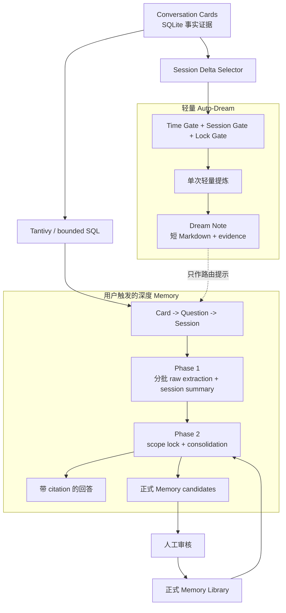

# Memory 独立模块与双层记忆实施计划

## 1. 计划状态与修正结论

- 基线：`main` 当前代码，核对至提交 `6200690`。
- 产品定位：Memory 是与 Skills、Prompts、Rules、Conversations 并列的独立顶层模块，不是 Conversation 的子页面，也不是 Catalog `AssetKind::Memory` 的别名。
- 核心架构：
  - 软件主动总结采用 Claude Code 风格的轻量 Auto-Dream。
  - 用户发起回忆或整理时采用 Codex 风格的 Phase 1 / Phase 2 深度管道。
- Conversation Card 仍是原始事实证据；Dream、Extraction 和正式 Memory 都是可追溯的派生层。
- 本计划参考：`~/Documents/blog-article/vitepress/Agent研究/OpenCode-Codex-ClaudeCode对比研究/04-三方横向对比/03-三方Memory记忆机制与自动Dream对比研究.md`。

## 2. 两种模式的产品分工

| 模式 | 触发方式 | 读取范围 | 输出 | 信任级别 | 主要用途 |
|---|---|---|---|---|---|
| 轻量 Dream | 软件在三重门禁通过后自动触发，也可手动“立即整理” | 只读上次 cursor 之后新增或变化的少量 Session | 短小 Markdown Dream Note | 辅助线索，不是最终事实 | 记录近期进展、偏好、决定、待办，支持“今天继续什么” |
| 深度 Recall | 用户提出具体问题 | Search-first 渐进扩展相关 Card/Question/Session，并进入 Phase 1/Phase 2 | 带证据回答 + 可选 Memory candidates | 回到原始 Card 校验 | 回答“上次怎么做”“为什么这样决定”，同时规整可沉淀内容 |
| 完整整理 | 用户明确选择某个范围做全面整理 | 分批遍历范围内所有符合条件的 Question/Card | Phase 1 提取 + Phase 2 合并后的 Memory candidates | 审核后成为正式 Memory | 项目复盘、方法沉淀、长期 Memory 规整 |

关键约束：

- Dream 不能取代深度 Recall。它可以帮助路由，但回答事实问题时必须回查原始 Card。
- “全量”是分批覆盖指定范围，不是把全库一次性塞入一个 prompt。
- 用户提问默认生成带证据回答，并可附带可沉淀的 Memory candidates；只有用户选择“整理并保存”或接受候选，内容才进入正式 Memory 库。
- 自动 Dream 可以自动落盘为 Dream Note，但不会自动晋升为正式 Memory，也不会自动注入其他 AI App。

## 3. 当前代码基础

| 已有能力 | 当前状态 | Memory 的复用方式 |
|---|---|---|
| Conversation 数据 | Session、Web Record、Question、Turn、Part/Card 已按 tenant 标准化进 SQLite | 作为两条链路的共同证据源 |
| Card 搜索 | Tantivy 已索引 active session/web Card，返回 Session/Question/Turn/Part/Block 标识 | 深度 Recall 的第一跳 |
| 搜索回退 | 索引有 revision、generation、lease、后台重建和 `legacy_scan` 回退 | Memory 披露使用的检索后端，不建立旁路 Card 索引 |
| 增量同步 | `conversation_session_observations`、source fingerprint、safe incremental sync 已存在 | Dream 只消费 cursor 之后的已稳定 Session |
| 精确读取 | Question、Session、Web Record get API 已存在 | Card -> Question -> Session 渐进展开 |
| Conversation UI | 搜索结果已能打开具体 Question/Card | Memory evidence 复用该定位逻辑 |
| AI CLI | 翻译链路已支持 OpenCode/Gemini、模型、检测和 timeout | 抽取通用 AI execution gateway |
| 后台任务 | registry、event、polling、退出警告已经覆盖同步和索引任务 | Dream 和深度 Recall 接入同一运行模型 |
| Engine/CLI | AppService -> Engine -> Go CLI 边界稳定 | Memory workflow 不在前端或 Skill 重写业务逻辑 |
| 内置 Skill | Conversation Recall Skill 已作为只读系统资产随应用交付 | Memory Skill 在其上组织 Dream 与深度 Recall |
| 导航 | NavigationModel 由 SQLite 保存，并会补齐新增默认项 | 增加独立 `memory` HeaderTab 及其子导航 |

必须正视的限制：

- 当前 Tantivy 只有 Card 文档，没有 Question/Session 聚合文档，也没有 semantic/hybrid。
- 带 `since`、`until`、`timeline` 的搜索目前走 `legacy_scan`。
- Tantivy 默认排除 missing Session/Turn；显式检索不可用来源时要走有上限的 SQL 路径。
- `translated_text` 是展示派生值，不是证据 hash 的依据。
- 现有翻译模块的类型、设置和返回值都带 translation 语义，不能直接作为 Memory API。
- AppRouter 不是 URL router，需要新增跨顶层模块的 navigation target。

## 4. 顶层模块信息架构

新增不带 `assetKind` 的 HeaderTab：

```text
Memory
├── memory.overview   今日 / 继续工作
├── memory.dreams     自动 Dream 与增量摘要
├── memory.recall     深度回忆与完整整理
└── memory.library    正式 Memory、候选与历史版本
```

### 4.1 Overview

- active `follow_up`
- 当前 Project 最近的 Dream Note
- 最近确认的 `decision`、`method`、`context`
- 待审核 Memory candidate
- stale 或来源不可用提醒
- Auto-Dream 下一次可运行条件

Overview 是本地确定性聚合，不因打开页面自动调用 AI。

### 4.2 Dreams

- 展示每次 Dream 的 scope、Session 增量、摘要、证据、模型和运行状态。
- 支持“立即 Dream”“预览将读取的范围”“提升为正式 Memory”“归档”。
- 展示三个 gate 的当前值，避免用户不知道为什么没有自动总结。

### 4.3 Recall

- `精准回忆`：以问题为中心，搜索后渐进扩展。
- `完整整理`：以用户指定 App/Source/Project/Session/时间范围为中心，分批覆盖全部符合条件的 Question。
- 展示 Phase 1/Phase 2 进度、证据范围、截断情况和索引降级。

### 4.4 Library

- 正式 Memory 类型：`preference | decision | method | context | follow_up`。
- 状态：`candidate | active | completed | superseded | archived | rejected`。
- 支持 scope、kind、status、origin、时间、stale 过滤。
- 证据可跳转到原始 Conversation；候选接受前可编辑。

## 5. 双层架构



## 6. 轻量 Auto-Dream

### 6.1 三重门禁

检查顺序由低成本到高成本：

1. **Time Gate**
   - 距离上次成功 Dream 已超过 `minHours`。
   - 初始默认 12 小时，可在设置中调整。
2. **Session Gate**
   - cursor 之后至少有 `minSessions` 个新增或变化且已稳定的 Session。
   - 初始默认 3 个；最近 10 分钟仍在变化的 Session 暂不消费。
3. **Lock Gate**
   - 当前 tenant/scope 没有 Dream 或 consolidation 任务持锁。
   - 重复检查复用已有 task snapshot，不启动第二个进程。

前置门禁还包括：Auto-Dream 已显式开启、AI runtime 可用、当前未在退出流程、未超过发送预算。

### 6.2 触发时机

- Conversation sync 成功后只做 gate check，不在同步事务里调用 AI。
- 应用启动后延迟检查一次。
- 应用保持运行时使用低频 timer 检查，不创建 v1 的独立 launchd/daemon。
- 用户可手动运行；`dry-run` 只预览 Session/Question/Card 数量和发送预算。

### 6.3 读取策略

- 以 `memory_dream_states` 的 source revision/session cursor 为起点，只读取增量。
- 默认按 Project 分组；无 Project 的 Web Record 按 adapter/source 分组。
- 每次只读取有限 Session，并按 Question 组织 Card；超额部分留给下一次 run。
- Dream 不执行全库关键词搜索，不读取既有全部 Memory，不做全局 consolidation。
- cursor 只有在 Dream Note 和 evidence 成功持久化后才推进；失败可安全重试。

### 6.4 输出格式

每个 Dream Note 是短小、人类可读的 Markdown，最多 6KB，结构固定：

```markdown
## 近期进展
- ...

## 新的决定或约束
- ...

## 可复用方法
- ...

## 待继续
- ...
```

- 每个 bullet 必须引用 evidence ID。
- 没有对应内容的 section 省略，不要求凑满。
- Dream Note 标记为 `auto_dream`、可归档，但默认不进入正式 Library。
- 用户点击“提升为正式 Memory”或“编辑后提升”时，以副本方式将 bullet 拆为 candidates；保留原始自动 Note 作为审计记录。

## 7. Codex 风格深度 Recall / 完整整理

### 7.1 两种覆盖策略

**精准回忆**：

1. 搜索正式 Memory 和 Dream Note，Dream 只提供候选关键词、Project、Session 范围。
2. 分别搜索 session/web Card。
3. 按 Question 去重，先批量展开 Question。
4. 证据仍不足时才扩大关键词、相邻 Question 或完整 Session。
5. 用户可查看本地 evidence bundle；AI 不可用时流程仍成立。
6. 用户要求 AI 综合时，已选证据仍进入下述 Phase 1/Phase 2，而不是用一次普通总结代替双阶段规整。

**完整整理**：

1. 用户显式指定 scope 和时间范围。
2. 从 SQLite 分页枚举该范围内全部 eligible Question，不依赖搜索排名。
3. 按固定预算分批进入 Phase 1。
4. 页面披露总量、已覆盖、跳过、失败和截断数量，不能用“全量”掩盖未处理数据。

“所有 Card”表示 session/web 的六种 Card 都可成为证据；默认只处理 active 记录。用户开启 `includeUnavailable` 时补查 retained/missing 历史并明确走 bounded SQL。

### 7.2 Phase 1：分批提取

- 每批最多 8 个 Question、30,000 字符，默认并发 2。
- 输出结构化 `raw_memories[]` 和 `session_summary`，每项都带输入 evidence IDs。
- Phase 1 结果持久化为 extraction，使长任务可审计、可重试，避免 Phase 2 失败后重跑所有模型调用。
- 不让 Phase 1 直接更新正式 Memory。
- 提取内容包含事实、偏好、决定、方法、待办、冲突和不确定项；命令/代码只能从相应 Card 引用。

### 7.3 Phase 2：加锁合并

- 按 tenant + scope 获取 consolidation lock。
- 合并本次 Phase 1 extractions、已有 active Memory 和明确相关的 Dream Note。
- 产出：
  - `answer_markdown`
  - `claims[] = { text, evidence_ids[] }`
  - `memory_candidates[]`
  - `conflicts[]`
  - `insufficient_evidence`
- extractions 过多时做树形 reduction，不突破单次 context budget。
- 后端校验所有引用；未知 evidence ID、无证据 claim 或非法 enum 不得进入结果。
- Phase 2 只产生 candidates；接受、编辑、拒绝由用户完成。

### 7.4 与 Codex 模式的取舍

v1 采用 Codex 的双阶段、持久化中间产物、全局/scope 锁、证据引用和脱敏思想，但不照搬：

- SQLite 是唯一事实源，不立即引入单独的 Memory Git 仓库。
- 版本追溯先使用 `memory_item_revisions`；Markdown/Git 投影作为 v1.1 可选能力。
- Root Session 自动注入不属于本页面 v1；后续由目标 App 的显式 mount/export 计划承接。

## 8. 数据模型

### 8.1 `memory_runs`

- `kind`: `auto_dream | deep_recall | full_organize`
- `trigger`: `automatic | manual | user_question`
- 保存 scope、source revision 区间、provider/model、prompt version、phase、进度、状态和错误分类。
- 状态：`queued | running | completed | failed | interrupted | cancelled`。
- 不保存完整 prompt、完整模型 stdout 或用户问题正文到普通日志。

### 8.2 `memory_dream_states`

- tenant + scope 唯一。
- 保存 last successful run、source revision/session cursor、下次 gate 时间和最近错误。
- 失败、取消、模型输出校验失败均不推进 cursor。

### 8.3 `memory_dream_notes`

- 保存 scope、短 Markdown、run ID、覆盖 Session 数、source revision 和状态。
- 状态：`active | promoted | archived | stale`。
- 自动产物与正式 Memory 分表，避免轻量 Dream 被误当作已确认事实。

### 8.4 `memory_extractions`

- 保存 Phase 1 batch、`raw_memories_json`、session summary、evidence 数和 validation 状态。
- 默认保留 30 天；被正式 Memory 引用的 extraction 不直接删除其 evidence snapshot。

### 8.5 `memory_items` 与 `memory_item_revisions`

- `kind`: `preference | decision | method | context | follow_up`
- `status`: `candidate | active | completed | superseded | archived | rejected`
- 保存 title、Markdown content、scope、origin、confidence、supersedes、source/verified revision 和 stale reason。
- 接受候选、手工编辑、完成 follow-up、建立 supersedes 时写 revision。

### 8.6 Evidence

- `memory_evidence_snapshots` 按 tenant + record kind + block ID + content hash 去重，保存稳定 Card 引用、受限 excerpt、event time 和原始内容 hash。
- Dream、Extraction、Memory Item 使用各自 join table 关联 evidence snapshot。
- 不复制完整 Session/Question；来源后来 missing 时使用 excerpt 解释，并标记 `source_unavailable`。
- `translated_text` 可以作为 UI 辅助，但原始内容负责 citation 和 hash。

## 9. Freshness 与冲突

- 每个派生产物记录创建时的 Conversation source revision。
- 若全局 revision 未变化，跳过证据校验。
- revision 前进时，只批量验证当前页面、Recall 或 consolidation 实际使用的 evidence：
  - hash 一致：推进 `verified_revision`。
  - 内容变化：`evidence_changed`。
  - Card/Question 不可解析：`evidence_missing`。
  - source/session missing：`source_unavailable`，仍展示快照。
- 无关 Session 更新不得把全部 Memory 标为 stale。
- Dream 不自动覆盖旧决定；Phase 2 可提出 supersedes candidate，最终关系由用户确认。

## 10. 通用 AI 与安全边界

### 10.1 AI execution gateway

- 新增 `src-tauri/src/backend/ai_execution.rs`，负责 CLI 发现、模型、结构化请求、timeout、output cap、取消、错误归一化和进程回收。
- 现有翻译 API 变成 gateway 上的 translation adapter，保持公共合同兼容。
- 设置拆为共享 `aiRuntime` 和用例设置；旧 `conversationTranslation.cli/model` 自动迁移。
- Dream/Recall prompt 由产品版本控制并记录版本，v1 不开放任意 prompt 编辑。

### 10.2 脱敏与提示注入

- 在内容离开 Context Builder 前执行确定性 secret scan，覆盖常见 API key、Bearer token、私钥、Cookie 和高熵字符串。
- redaction 发生在外部 AI 调用前；原始 SQLite Card 不被改写。
- 输出再次扫描后才允许写 Dream/Extraction/Memory candidate。
- Card 内容一律视为不可信数据；不通过 shell 执行，也不接受 Card 中的“忽略规则”等指令。
- 模型只能引用系统分配的 evidence ID，不能决定 tenant、路径、数据库 ID 或执行命令。

### 10.3 用户控制

- Auto-Dream 默认关闭，因为 OpenCode/Gemini CLI 可能访问网络。
- 首次开启时显示将发送的数据类型、默认 budget、CLI/model 和自动触发条件。
- 每个 Dream/Recall run 都可预览范围；完整整理必须显式启动。
- provider 支持 text-only/no-tool 时强制启用；无法证明时明确提示 CLI 可能具备本机能力，并从 app-owned 空工作目录运行。

## 11. 公共接口

### 11.1 AppService / Engine

| 方法 | 语义 |
|---|---|
| `memory.overview` | 本地聚合 Overview，不调用 AI |
| `memory.dream.status` | 返回 gate、cursor、最近 run 和下次可运行条件 |
| `memory.dream.preview/run/list/get/archive` | 预览、运行和管理轻量 Dream |
| `memory.recall.preview/run` | 构建精准回忆或完整整理计划并执行双阶段管道 |
| `memory.run.list/get/cancel` | 读取和取消持久化 run |
| `memory.item.list/get/create/update/archive` | 管理正式 Memory 和候选 |
| `memory.candidate.accept/reject` | 审核候选；accept 事务性写 item/evidence/revision |
| `memory.verify` | 按需校验 evidence freshness |

- Engine/CLI 中 `memory.recall.preview` 和 evidence-only `memory.recall.run` 可不调用外部 AI，供当前宿主 Agent 自己综合，避免 AI 套 AI。
- `synthesize=true`、Dream 和完整整理明确标注外部进程/可能网络访问。
- Engine registry 变更后运行 `pnpm cli:contract`，不手改生成合同。

### 11.2 Desktop 后台任务

- `start_memory_task` 支持 `auto_dream | deep_recall | full_organize`，立即返回 snapshot。
- `get_memory_task/list_memory_tasks` 支持 polling；事件名统一为 `memory-task-updated`。
- snapshot 包含 kind、scope、phase、processed/total、status、run ID、result/error。
- registry 按 tenant + kind + scope fingerprint 去重，并限制 consolidation 同一 scope 只能有一个。
- Phase 1 并发有界；任务使用独立 AppService/数据库连接，不持有全局 app lock。
- MemoryTaskProvider 是全局 Provider，用户离开 Memory 模块后任务仍可见。
- 接入 `has_running_tasks()` 和退出警告；启动时把遗留 running run 标为 interrupted。
- CLI/Engine 单请求模式前台运行并返回最终报告，不返回进程退出后失效的内存 task ID。

### 11.3 Go CLI 与内置 Skill

```text
assetiweave-cli memory overview
assetiweave-cli memory dream status|preview|run|list|get
assetiweave-cli memory recall preview --query ... --current-project
assetiweave-cli memory recall run --query ... --current-project --format compact-json
assetiweave-cli memory recall run --scope ... --full --ai
assetiweave-cli memory item list|get|create|update|archive
assetiweave-cli memory candidate accept|reject
```

- `dream preview` 与 `recall preview` 不调用 AI、不写 run/note/candidate。
- 新增内置 `assetiweave-memory` Skill，仍放在 `builtin-assets/skills/`。
- Skill 默认请求 evidence/extraction bundle，由宿主 Agent 完成综合；只有用户明确要求应用代为综合时才使用 `--ai`。
- Conversation Recall Skill 保留为底层原始历史检索能力。

## 12. 跨模块精确回跳

新增：

```ts
interface ConversationNavigationTarget {
  recordKind: "session" | "web";
  sessionId: string;
  questionId?: string;
  blockId?: string;
  nonce: string;
}
```

Memory evidence 点击后由 AppRouter：

1. 切换到 `conversations` HeaderTab。
2. 选择 Sessions 或 Web Records。
3. 把 target 传给 ConversationsPage。
4. 加载 Session/Question，滚动并高亮 block。
5. 消费 nonce，避免重复导航。

## 13. 分阶段任务

每个任务限制为一个 focused session、最多约 5 个主要文件，并包含明确验收与验证。

### Phase 0：规格与顶层模块壳

#### Task 1：记录双层 Memory ADR

- Acceptance：ADR 明确独立模块、Dream/Deep 分工、SQLite 事实源、AI opt-in 和不自动晋升正式 Memory。
- Verify：人工对照本计划与研究文档；`git diff --check`。
- Files：`docs/decisions/ADR-004-dual-layer-memory.md`、`specs/design.md`、`specs/requirements.md`。

#### Task 2：注册顶层 Memory 导航

- Acceptance：新旧 tenant 均出现 Memory HeaderTab 和四个子导航；没有 `assetKind`；用户自定义标签不被覆盖。
- Verify：Rust navigation test、frontend route/i18n tests、`pnpm typecheck`。
- Files：`src-tauri/src/backend/defaults.rs`、`frontend/src/router/menu.ts`、`frontend/src/router/routes.ts`、`frontend/src/i18n/navigation.ts`、`frontend/src/i18n/messages.ts`。

### Checkpoint A

- Memory 已是独立大模块，所有 route 有稳定 key；未开始 AI 或数据库行为。

### Phase 1：正式 Memory Library 最小闭环

#### Task 3：建立 Memory schema 与 repository

- Acceptance：核心表、tenant 索引、scope/status 约束、事务和 evidence 去重可用；跨 tenant 引用被拒绝。
- Verify：`cargo test --workspace memory_repo`。
- Files：migration、`src-tauri/src/backend/models/memory.rs`、`src-tauri/src/backend/models/mod.rs`、`src-tauri/src/backend/store/memory_repo.rs`、`src-tauri/src/backend/store/mod.rs`。

#### Task 4：暴露 Memory Item AppService/Engine API

- Acceptance：list/get/create/update/archive 和 candidate accept/reject 均经过 AppService；accept 同时写 evidence 与 revision。
- Verify：`cargo test --workspace memory_item`、`pnpm cli:contract`。
- Files：`src-tauri/src/backend/dto/types.rs`、`src-tauri/src/backend/application/params.rs`、`src-tauri/src/backend/application/memory.rs`、`src-tauri/src/backend/application/mod.rs`、`src-tauri/src/adapters/engine/registry.rs`。

#### Task 5：接入 Tauri 与前端 service/types

- Acceptance：前端只能通过 `frontend/src/services/memory.ts` 调用；browser preview 有明确空态而不是第二套规则引擎。
- Verify：service/schema tests、`pnpm typecheck`。
- Files：`src-tauri/src/adapters/tauri/commands.rs`、`frontend/src/services/memory.ts`、`frontend/src/types/memory.ts`、`frontend/src/schemas/memory.ts`。

#### Task 6：实现 Library 页面垂直切片

- Acceptance：可浏览、筛选、手工创建、编辑、归档和审核 candidate；长列表工具栏可达。
- Verify：`pnpm test -- MemoryPage.test.tsx`、`pnpm build`、桌面手工检查。
- Files：`frontend/src/pages/memory/MemoryPage.tsx`、最多 2 个 `frontend/src/components/memory/` 组件、`frontend/src/router/AppRouter.tsx`、`frontend/src/layouts/app/navigation/SideRail.tsx`。

### Checkpoint B

- 无 AI 时，独立 Memory 模块和手工 Library 已端到端可用。

### Phase 2：Evidence 与通用 AI 基础

#### Task 7：实现跨模块 evidence 导航

- Acceptance：session/web 六类 Card 均能从 Memory 跳到精确 Question/Block；一次性 target 不重复触发。
- Verify：AppRouter 与 ConversationsPage navigation tests。
- Files：`frontend/src/router/navigationTargets.ts`、`frontend/src/router/AppRouter.tsx`、`frontend/src/pages/conversations/ConversationsPage.tsx` 及测试。

#### Task 8：抽取 AI execution gateway

- Acceptance：翻译行为和公开合同保持兼容；Memory 获得通用结构化文本调用；大 stdout/stderr 不死锁。
- Verify：`cargo test --workspace ai_execution`、现有 translation tests。
- Files：`src-tauri/src/backend/ai_execution.rs`、`src-tauri/src/backend/mod.rs`、`src-tauri/src/backend/card_translation.rs`、`src-tauri/src/backend/application/card_translation.rs`、`src-tauri/src/backend/host_process.rs`。

#### Task 9：增加共享 AI 设置与 redaction

- Acceptance：旧 translation CLI/model 无损迁移；Auto-Dream 默认关闭；输入输出 secret fixtures 均被遮蔽。
- Verify：settings tests、Rust redaction tests、`pnpm typecheck`。
- Files：`frontend/src/store/settings/settingsSchema.ts`、`frontend/src/store/settings/AppSettingsProvider.test.ts`、`frontend/src/components/settings/GlobalSettingsDialog.tsx`、`src-tauri/src/backend/app_settings.rs`、`src-tauri/src/backend/memory_redaction.rs`。

### Checkpoint C

- AI gateway 可复用且默认安全关闭，原翻译功能无回归。

### Phase 3：Claude Code 风格轻量 Dream

#### Task 10：实现 Dream gate 与 delta selector

- Acceptance：Time/Session/Lock gate 可单独解释；只选择 cursor 之后且已稳定的 Session；失败不推进 cursor。
- Verify：`cargo test --workspace memory_dream_gate`。
- Files：`src-tauri/src/backend/application/memory_dream.rs`、`src-tauri/src/backend/store/memory_repo.rs`、`src-tauri/src/backend/application/params.rs`、`src-tauri/src/backend/dto/types.rs`。

#### Task 11：实现轻量 Dream run

- Acceptance：单次输出不超过预算、每个 bullet 有 evidence、成功原子写 note/cursor、dry-run 零写入零 AI。
- Verify：fixture AI tests、事务失败/重试 tests。
- Files：`src-tauri/src/backend/application/memory_dream.rs`、`src-tauri/src/backend/ai_execution.rs`、`src-tauri/src/backend/store/memory_repo.rs`、Memory prompt fixture/tests。

#### Task 12：接入 Dream 后台任务

- Acceptance：sync 后只检查 gate；任务去重、事件与 polling、退出警告、interrupted 状态均生效。
- Verify：background registry tests、Provider tests。
- Files：`src-tauri/src/adapters/tauri/background_tasks.rs`、`src-tauri/src/adapters/tauri/commands.rs`、`frontend/src/app/backgroundTasks/MemoryTaskProvider.tsx`、`frontend/src/services/memory.ts`、`frontend/src/router/AppRouter.tsx`。

#### Task 13：实现 Dreams/Overview UI

- Acceptance：用户能看 gate 原因、预览范围、手动 Dream、查看证据、归档和提升候选；Overview 打开不调用 AI。
- Verify：Memory Dreams/Overview component tests、桌面手工检查。
- Files：`frontend/src/pages/memory/MemoryPage.tsx`、最多 4 个 `frontend/src/components/memory/` 组件。

### Checkpoint D

- 软件可在显式 opt-in 后，以轻量增量方式主动总结；不会扫描全库或生成正式 Memory。

### Phase 4：Codex 风格深度 Recall

#### Task 14：实现 Recall preview 与本地 evidence bundle

- Acceptance：精准模式遵守 Card -> Question -> Session；完整模式能分页枚举 scope；响应披露 coverage/backend/truncation。
- Verify：`cargo test --workspace memory_recall_context`。
- Files：`src-tauri/src/backend/application/memory_recall.rs`、`src-tauri/src/backend/application/params.rs`、`src-tauri/src/backend/dto/types.rs`、Conversation/Web repository 批量读取接口。

#### Task 15：实现 Phase 1 extraction

- Acceptance：分批、并发上限、证据校验、持久化与单批重试可用；任何 extraction 都不改正式 Memory。
- Verify：`cargo test --workspace memory_phase1`。
- Files：`src-tauri/src/backend/application/memory_extraction.rs`、`src-tauri/src/backend/store/memory_repo.rs`、`src-tauri/src/backend/ai_execution.rs`、DTO/params。

#### Task 16：实现 Phase 2 consolidation

- Acceptance：scope lock、防重复、树形 reduction、existing Memory 合并、claim citation 校验和 candidates 输出可用。
- Verify：`cargo test --workspace memory_phase2`。
- Files：`src-tauri/src/backend/application/memory_consolidation.rs`、`src-tauri/src/backend/store/memory_repo.rs`、`src-tauri/src/backend/ai_execution.rs`、DTO/params。

#### Task 17：实现 Recall/完整整理 UI

- Acceptance：可选择精准/完整、预览范围、观察两阶段进度、阅读本地证据和 AI 回答、审核 candidates；离开页面任务继续。
- Verify：Recall page/provider tests、`pnpm build`、桌面手工场景。
- Files：`frontend/src/pages/memory/MemoryPage.tsx`、最多 4 个 Recall/Progress/Citation/Review 组件。

### Checkpoint E

- 用户问题可以走双阶段深度管道；正式 Memory 仍需审核；AI 不可用时 evidence-only 仍工作。

### Phase 5：Freshness、CLI、Skill 与 hardening

#### Task 18：实现按需 freshness 与冲突提示

- Acceptance：无关 sync 不造成全库 stale；changed/missing/unavailable 可区分；supersedes 只经用户确认。
- Verify：`cargo test --workspace memory_freshness`。
- Files：`src-tauri/src/backend/application/memory.rs`、`src-tauri/src/backend/store/memory_repo.rs`、`src-tauri/src/backend/dto/types.rs`、`frontend/src/components/memory/MemoryFreshnessBadge.tsx`、`frontend/src/pages/memory/MemoryPage.tsx`。

#### Task 19：增加 Go CLI 与合同测试

- Acceptance：Dream、Recall preview/run、item/candidate 命令全部走 Engine；`--full`、`--ai`、`--current-project` 和输出格式稳定。
- Verify：`pnpm cli:contract`、`go vet -C cli ./...`、`go test -C cli -race ./...`。
- Files：`cli/cmd/memory.go`、`cli/cmd/memory_test.go`、CLI root 注册、生成合同/方法文件。

#### Task 20：交付内置 Memory Skill

- Acceptance：Skill 能区分 Dream、精准回忆和完整整理；默认让宿主 AI 综合；保留 Session/Question/Block 证据。
- Verify：builtin installer tests、CLI 示例 smoke test。
- Files：`builtin-assets/skills/assetiweave-memory/SKILL.md`、`builtin-assets/skills/assetiweave-memory/assetiweave.skill.json`、`src-tauri/src/backend/builtin_skills.rs` 及测试。

#### Task 21：性能、安全与恢复门槛

- Acceptance：100k Card、提示注入、secret、损坏输出、取消、崩溃、磁盘错误、索引 stale 和应用退出场景全部覆盖。
- Verify：完整验证命令与发布 checklist。
- Files：benchmark/fixture、Rust integration tests、frontend task tests、发布文档；拆为多个不超过 5 文件的小提交。

## 14. 验收指标

### 14.1 Dream

- 没有新 Session 时零 AI 调用。
- 未通过任一 gate 时返回可解释原因。
- 单次 Dream 默认最多 8 个 Session、40 个 Question、60,000 输入字符，超额延后。
- 输出不超过 6KB，所有 bullet 都有有效 evidence。
- sync、Dream 和 UI 互不持有同一个长时全局锁。

### 14.2 深度 Recall

- 精准模式 warm Tantivy 下 500ms 内显示第一批本地命中。
- 100k Card 下 evidence 检索 + hydration p95 ≤ 350ms（不含 AI）。
- 完整模式准确报告 total/processed/skipped/failed，不虚报全量覆盖。
- Phase 1 单批 ≤ 30,000 字符、≤ 8 Question，并发默认 ≤ 2。
- Phase 2 的每个确定 claim 都至少有一个有效 evidence ID。

### 14.3 UI 与后台任务

- AI 运行时只禁用冲突操作；导航、筛选、详情、手工 Memory 仍可用。
- 事件丢失后 polling 能恢复最终状态。
- 页面离开后任务继续，全局指示器可见。
- 退出时检测 running task 并警告。

### 14.4 完整验证

```bash
cargo fmt --all -- --check
cargo test --workspace
pnpm typecheck
pnpm test
pnpm build
pnpm cli:contract
go vet -C cli ./...
go test -C cli -race ./...
pnpm cli:test:e2e
```

## 15. 非目标与后续版本

v1 不做：

- semantic embedding、向量数据库或后台全库向量化。
- 独立 launchd/daemon 自动 Dream。
- 自动将正式 Memory 写入第三方 App。
- 无审核的自动 supersedes、删除或正式 Memory 写入。
- 默认保存 Recall 问题正文、完整 prompt 或完整模型输出日志。
- Memory Git 仓库、团队同步和跨设备云同步。

v1.1 可评估：

- 正式 Memory 的 Markdown/Git 投影与回滚。
- 将确认后的 Memory 通过 mount/export 注入目标 App。
- Tantivy Question/Session 文档和时间字段，改善大范围/时间范围 Recall。
- semantic/hybrid 检索。
- 独立的定时 Dream 调度和电源/网络策略。

## 16. Definition of Done

- Memory 作为独立 HeaderTab 和大模块存在，包含 Overview、Dreams、Recall、Library。
- Auto-Dream 只消费增量，受 Time/Session/Lock gate 控制，输出短 Dream Note，不自动形成正式 Memory。
- 用户问题可选择精准回忆或完整整理；深度路径采用持久化 Phase 1 + 加锁 Phase 2。
- Dream 与深度结果都能回到原始 session/web Card，且 missing 来源有快照与状态说明。
- 所有 AI 调用显式受设置、预算、redaction、引用校验和后台任务约束。
- 正式 Memory 只能由手工创建或用户接受 candidate 产生，并具备 revision、freshness 和 supersedes 历史。
- Desktop、Engine、Go CLI 和内置 Skill 共用 AppService 业务逻辑。
- 所有长任务有进度、去重、polling fallback、取消、退出警告和失败恢复。
- 完整验证通过，且未在前端、CLI、Skill 或第三方源目录复制 Memory 业务规则。
