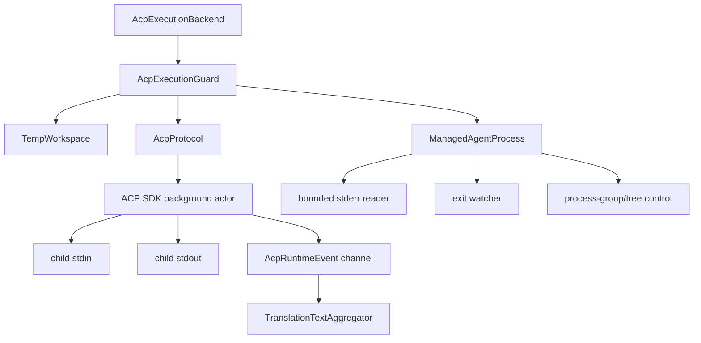

# Detailed Design: ACP Protocol and Managed Process Runtime

| 字段 | 值 |
|---|---|
| 状态 | Implemented |
| 依赖 | `02-architecture-design.md` |
| 参考 | `03-aioncore-reference-code-map.md` |

## 1. 设计范围

本文冻结 Phase 1 的进程、ACP connection、temporary session、event aggregation、取消、超时与 cleanup 语义。

不包含 Tauri DTO、前端 UI 与 Conversation persistence。

## 2. Runtime 组件图



## 3. ManagedAgentProcess

### 3.1 类型

```rust
pub(crate) struct ManagedAgentProcess {
  pid: u32,
  process_group_id: Option<u32>,
  stdin: Mutex<Option<ChildStdin>>,
  stdout: Mutex<Option<ChildStdout>>,
  exit_rx: watch::Receiver<Option<ProcessExit>>,
  stderr: Arc<Mutex<BoundedByteTail>>,
  stderr_task: JoinHandle<()>,
  wait_task: JoinHandle<()>,
  termination: AtomicU8,
}
```

`termination` 至少区分：

```text
0 running
1 graceful_requested
2 force_requested
3 reaped
```

实现可以使用 enum + Mutex，重点是幂等和可观测。

### 3.2 Spawn 输入

```rust
pub(crate) struct ManagedAgentProcessSpec {
  pub(crate) program: PathBuf,
  pub(crate) args: Vec<String>,
  pub(crate) env: Vec<(OsString, OsString)>,
  pub(crate) cwd: PathBuf,
  pub(crate) stderr_cap: usize,
}
```

program 必须是 Registry resolver 输出，不接受 frontend path。

### 3.3 Spawn 步骤

1. 构造 `tokio::process::Command`。
2. 应用 program/args/cwd/env。
3. 配置独立 process group/tree。
4. stdin/stdout/stderr 全部 piped。
5. spawn。
6. 立刻取出 stdio；任一缺失则 force kill + wait 后返回 error。
7. 启动 stderr drain。
8. 启动 child wait task。
9. 发布 pid 与 running observation。

### 3.4 Stdio 所有权

```rust
pub(crate) async fn take_stdio(&self) -> Result<(ChildStdin, ChildStdout), ProcessError>
```

规则：

- 第一次返回 handles。
- 第二次返回 `StdioAlreadyTaken`。
- stderr 不交给 protocol。
- `take_stdio` 失败不应改变 process cleanup 能力。

### 3.5 Stderr tail

推荐按 bytes 保存最后 N bytes，而不是只按行保存：

```rust
struct BoundedByteTail {
  bytes: VecDeque<u8>,
  cap: usize,
  truncated: bool,
}
```

要求：

- reader 持续 drain 到 EOF；
- 超 cap 丢弃最旧 bytes；
- diagnostic 转 UTF-8 时使用 lossy；
- 对外 error 不直接包含全文；
- test 可读取 tail 验证；
- 日志不逐行打印可能包含 secret 的 stderr，默认只记录长度与 hash。开发 debug 如需 tail，必须经过 redaction。

### 3.6 Exit watcher

wait task 独占 child handle：

```text
child.wait().await -> watch send ProcessExit -> state reaped
```

其他组件不得再次直接 `wait` 同一个 child。kill 通过 pid/process group 发 signal，wait task 完成 reap。

### 3.7 终止

```rust
pub(crate) async fn terminate(&self, grace: Duration) -> ProcessTerminationReport
pub(crate) async fn force_kill_tree(&self) -> ProcessTerminationReport
pub(crate) async fn wait_for_exit(&self) -> Option<ProcessExit>
```

`terminate`：

1. 若已退出，仍检查 process group cleanup 需求。
2. 关闭/丢弃 protocol stdin，由 protocol shutdown 先做。
3. 等待 grace。
4. 未退出则 force kill tree。
5. 等待 exit watcher 有界完成。

### 3.8 Unix

- spawn 时 `process_group(0)`。
- group id 通常记录 pid。
- force kill 对 `-pgid` 发送 signal。
- fallback kill direct child/pid。
- 即使 launcher 已退出，也要对记录的 group 发 signal。

建议顺序：

```text
SIGTERM group -> 200~500 ms -> SIGKILL group -> wait
```

但总 cleanup budget 受 2 秒 close/grace 与 5 秒验收约束。

### 3.9 Windows

Phase 1 可复用当前 `taskkill /PID <pid> /T /F`，失败后 direct kill。若实现 Job Object，应作为后续增强，不影响 Phase 1 API。

## 4. ACP Protocol

### 4.1 依赖

建议：

```toml
agent-client-protocol = "=2.0.0"
tokio-util = { version = "0.7", features = ["compat"] }
```

实现前必须确认其 Rust version 与 AssetIWeave toolchain 兼容。若固定到 2.0.x 的其他 patch，应更新本 Spec、Cargo.lock 和兼容证据。

Tokio 需要的 features 至少评估：

```text
process
io-util
sync
rt
macros（测试或 runtime 需要时）
time
```

ACP SDK 的 `ByteStreams` 使用 `futures::io::{AsyncRead, AsyncWrite}`，而
`tokio::process::{ChildStdout, ChildStdin}` 使用 Tokio I/O trait；生产实现 MUST
通过 `tokio-util::compat::{TokioAsyncReadCompatExt, TokioAsyncWriteCompatExt}`
适配，禁止为此手写 transport。不要一次开启 `tokio/full`，除非现有依赖策略允许并记录原因。

### 4.2 类型

```rust
pub(crate) struct AcpProtocol {
  connection: ConnectionTo<Agent>,
  initialize: InitializeResponse,
  shutdown_tx: Option<oneshot::Sender<()>>,
  alive: Arc<AtomicBool>,
  actor: JoinHandle<()>,
}
```

内部 channel：

```rust
pub(crate) struct AcpProtocolChannels {
  pub(crate) events: mpsc::Receiver<AcpRuntimeEvent>,
  pub(crate) disconnects: watch::Receiver<Option<AcpDisconnect>>,
}
```

### 4.3 Connect API

```rust
pub(crate) async fn connect(
  stdin: ChildStdin,
  stdout: ChildStdout,
  config: AcpConnectConfig,
) -> Result<(Self, AcpProtocolChannels), AcpError>
```

`AcpConnectConfig`：

- client name = `AssetIWeave`；
- client version = app package version；
- initialize timeout；
- event channel capacity；
- policy responder。

### 4.4 Actor 启动顺序

1. 建立 init result oneshot。
2. 建立 connection handle oneshot。
3. 建立 shutdown oneshot。
4. spawn SDK actor。
5. actor 注册 session notification handler。
6. actor 注册 permission request handler。
7. actor 运行 initialize。
8. connect caller 以 timeout 等待 initialize。
9. initialize 成功后拿 connection handle。
10. 返回 protocol 与 event receiver。

任何 init 失败：

- actor 必须退出或可被 shutdown；
- caller 进入 execution cleanup；
- process 不得留存。

### 4.5 Client capabilities

只声明真正实现的 client capability。Translation Phase 1 不实现 terminal、filesystem、MCP、rich permission UI 时，不得宣称支持。

client info 不含用户数据。

### 4.6 Protocol methods

```rust
pub(crate) async fn new_session(
  &self,
  cwd: &Path,
) -> Result<AcpNewSession, AcpError>;

pub(crate) async fn set_model(
  &self,
  session_id: &str,
  model: &str,
  timeout: Duration,
) -> Result<(), AcpError>;

pub(crate) async fn prompt(
  &self,
  session_id: &str,
  text: String,
) -> Result<AcpPromptCompletion, AcpError>;

pub(crate) fn cancel(&self, session_id: &str) -> Result<(), AcpError>;

pub(crate) async fn close_session(
  &self,
  session_id: &str,
  timeout: Duration,
) -> Result<(), AcpError>;

pub(crate) async fn shutdown(&mut self, timeout: Duration) -> Result<(), AcpError>;
```

Prompt 参数必须只含 text content block。Phase 1 不发送 image/resource。

### 4.7 Model selection

优先级：

1. 如果 `session/new` 的 `configOptions` 暴露 model config，可用标准 config option 方法。
2. 若 SDK/OpenCode 兼容路径要求 `session/set_model`，封装在 Protocol 内。
3. 上层只调用 `set_model(session_id, model)`，不知道具体 wire method。

失败语义：

- invalid model -> `ModelSelectionFailed`；
- unsupported method -> `ModelSelectionFailed`；
- timeout -> `ModelSelectionFailed`；
- 不继续 prompt。

记录：model id 可以作为配置元数据记录，但若 model id 可能包含用户私有 endpoint 命名，可只记录 hash/长度。默认日志不记录完整 model。

### 4.8 Close capability

从 initialize response 读取 session close capability：

```text
supports_close = agent_capabilities.session_capabilities.close.is_some()
```

- true：发送 close，2 秒 timeout。
- false：跳过 RPC。
- close error：加入 cleanup failures，但继续 shutdown/kill/wait。

## 5. Internal Runtime Events

### 5.1 Event enum

```rust
pub(crate) enum AcpRuntimeEvent {
  AssistantTextChunk {
    session_id: String,
    text: String,
  },
  ThinkingChunk {
    session_id: String,
  },
  ToolActivity {
    session_id: String,
    tool_call_id: String,
  },
  PermissionRequested {
    session_id: String,
    request_id: String,
  },
  SessionMetaChanged {
    session_id: String,
  },
}
```

不需要把 raw tool input 放进 event。

### 5.2 Session notification mapping

ACP notification handler：

```text
AgentMessageChunk(Text) -> AssistantTextChunk
AgentMessageChunk(non-text) -> ignore/debug
AgentThoughtChunk -> ThinkingChunk
ToolCall / ToolCallUpdate -> ToolActivity
AvailableCommands / Plan / Usage -> ignore/debug
unknown standardized variant -> ignore/debug
wrong/empty session -> still emit with received id; aggregator decides correlation
```

### 5.3 Permission request

Permission handler必须立即选择拒绝：

1. 从 options 选择 `RejectOnce`；
2. 若只有 `RejectAlways`，选择它；
3. 若没有 reject option，使用 protocol cancellation response；
4. 同时发出 `PermissionRequested`；
5. 不等待业务/UI response。

这里需要对 ACP SDK 2.0 的 responder API 编写 fixture test，不能只依赖类型推测。

## 6. TranslationTextAggregator

### 6.1 类型

```rust
pub(crate) struct TranslationTextAggregator {
  session_id: String,
  text: String,
  byte_limit: usize,
  chunks: usize,
  thinking_chunks: usize,
}
```

### 6.2 Apply

```rust
pub(crate) fn apply(
  &mut self,
  event: AcpRuntimeEvent,
) -> Result<AggregatorAction, AiExecutionError>
```

返回：

```rust
pub(crate) enum AggregatorAction {
  Continue,
  CancelAndFail(AiExecutionError),
}
```

规则：

- session id 不匹配：丢弃，计 diagnostic。
- assistant text：append 前检查新总 bytes。
- thinking：计数但不保存内容。
- permission：返回 cancel + `PermissionDenied`。
- tool：返回 cancel + `ToolUseDenied`。
- meta：忽略。

### 6.3 Completion

Prompt response 完成后：

1. 确认 event receiver 已处理 prompt completion 前排队的 chunks。
2. trim 文本。
3. 空 -> `EmptyOutput`。
4. 返回 text。

必须设计一个明确的 drain boundary。推荐 protocol notification handler 与 prompt completion 都通过同一 actor 顺序发送内部 envelope；actor 在 prompt completion 产生 `TurnCompleted` marker，aggregator 读到 marker 后 finalize。不要依赖固定 sleep 等待最后 chunk。

建议增加：

```rust
AcpRuntimeEvent::TurnCompleted { session_id, stop_reason }
```

如果 SDK 保证 prompt response 在所有先前 notification handler 完成后才 resolve，测试仍应冻结该顺序；若不保证，显式 marker 更稳妥。

## 7. AcpExecutionBackend Flow

### 7.1 主流程伪代码

```rust
pub(crate) async fn execute(
  &self,
  definition: &AgentDefinition,
  request: AiExecutionRequest,
  progress: &dyn AiExecutionProgressSink,
) -> Result<AiExecutionResult, AiExecutionError> {
  let mut guard = AcpExecutionGuard::new(request.execution_id());
  let started = Instant::now();

  progress.set(Resolving);
  let program = self.registry.resolve(definition)?;

  progress.set(Spawning);
  guard.workspace = Some(self.workspace.create(...)?);
  guard.process = Some(ManagedAgentProcess::spawn(...).await?);

  let (stdin, stdout) = guard.process().take_stdio().await?;

  progress.set(Initializing);
  let (protocol, channels) = AcpProtocol::connect(stdin, stdout, ...).await?;
  guard.protocol = Some(protocol);

  progress.set(CreatingSession);
  let session = guard.protocol().new_session(guard.workspace().path()).await?;
  guard.session_id = Some(session.id);

  if let Some(model) = request.model.as_deref() {
    progress.set(Configuring);
    guard.protocol().set_model(guard.session_id(), model, ...).await?;
  }

  progress.set(Prompting);
  let text = run_prompt_and_aggregate(&guard, channels, request).await?;

  progress.set(Closing);
  let result = AiExecutionResult::new(text, ...);
  guard.cleanup(Success, progress).await?;
  Ok(result)
}
```

实际实现要用结构化 scope 保证每个 `?` 都经过 cleanup。可采用 inner function：

```rust
let outcome = run_execution(&mut guard, ...).await;
let cleanup = guard.cleanup(outcome.reason(), ...).await;
combine(outcome, cleanup)
```

### 7.2 Prompt 与 cancel race

在 `tokio::select!` 中等待：

- prompt future；
- cancellation token；
- overall deadline；
- tool/policy failure；
- process exit；
- protocol disconnect。

任一非 prompt completion 分支：

1. 记录 primary error；
2. protocol.cancel(session_id)；
3. 等待 cancel grace；
4. 进入 cleanup。

不得通过 drop prompt future 作为唯一 cancel 手段。

## 8. Cleanup Algorithm

### 8.1 顺序

```text
1. phase = CleaningUp
2. if cancellation/timeout/tool: send cancel
3. if session + supports_close: close with timeout
4. protocol.shutdown with timeout
5. drop protocol handles/stdin
6. wait short graceful process exit
7. force kill entire process tree if needed
8. await exit watcher/reap
9. stop/join stderr reader
10. capture safe diagnostic metadata
11. delete temp workspace
12. mark guard cleaned
```

### 8.2 Failure aggregation

Cleanup 不在第一个错误处停止：

```rust
pub(crate) struct CleanupReport {
  pub(crate) failures: Vec<CleanupFailure>,
  pub(crate) process_reaped: bool,
  pub(crate) workspace_removed: bool,
  pub(crate) stderr_truncated: bool,
}
```

例如 close 失败后仍继续 kill；workspace 删除失败不跳过 process wait。

### 8.3 Primary error 与 cleanup error

- primary success + cleanup fail -> `CleanupFailed`。
- primary fail + cleanup success -> primary error。
- primary fail + cleanup fail -> 对外 primary code，内部 attach cleanup report；若 process 未 reaped，则提升为 `CleanupFailed` 并保留 primary code 作为 cause。

进程泄漏风险高于业务错误分类。

## 9. Timeout Hierarchy

| 范围 | 默认 | 触发行为 |
|---|---:|---|
| queue wait | 180 s 总 deadline 内 | 可取消；超时不 spawn |
| initialize | 10 s | shutdown + kill |
| session/new | 剩余总 deadline | cancel/cleanup |
| model | 5 s | fail，不 prompt |
| prompt | 剩余总 deadline | cancel + grace + cleanup |
| close | 2 s | 继续 kill |
| graceful process exit | 2 s 内 | force kill |
| final reap | 3 s 安全上限 | cleanup failed diagnostic |

局部 timeout 不能延长总 deadline。

## 10. Logging Contract

允许：

```text
execution_id
agent_id
protocol
phase
pid
arg_count
env_key_count
cwd_kind = ephemeral
elapsed_ms
text_bytes
chunk_count
stderr_bytes
stderr_truncated
exit_code
error_code
```

禁止：

```text
prompt body
assistant text
raw ACP payload
full args
full env values
auth tokens
raw stderr
```

## 11. Fake ACP Fixture Contract

Fake agent 是 test binary 的模式或独立 test helper，支持环境变量选择行为：

```text
ASSETIWEAVE_FAKE_ACP_MODE=happy
ASSETIWEAVE_FAKE_ACP_MODE=initialize_timeout
ASSETIWEAVE_FAKE_ACP_MODE=chunked
ASSETIWEAVE_FAKE_ACP_MODE=permission
ASSETIWEAVE_FAKE_ACP_MODE=tool_call
ASSETIWEAVE_FAKE_ACP_MODE=wrong_session
ASSETIWEAVE_FAKE_ACP_MODE=model_reject
ASSETIWEAVE_FAKE_ACP_MODE=exit_during_prompt
ASSETIWEAVE_FAKE_ACP_MODE=close_hang
ASSETIWEAVE_FAKE_ACP_MODE=spawn_grandchild
```

Fake agent 必须走真实 NDJSON stdio 与 ACP SDK/schema，不要 mock `AcpProtocol` 后声称协议集成已验证。

## 12. 设计验收

- [ ] stdout 只由 ACP SDK 读取。
- [ ] stderr 独立有界 drain。
- [ ] prompt 与 cancel 可并发。
- [ ] final text 有明确 completion boundary。
- [ ] wrong session chunk 不混入。
- [ ] model failure 不继续 prompt。
- [ ] close failure 不阻断 kill/wait。
- [ ] direct child 提前退出时仍可清理 process group descendants。
- [ ] 所有日志字段符合第 10 节。
