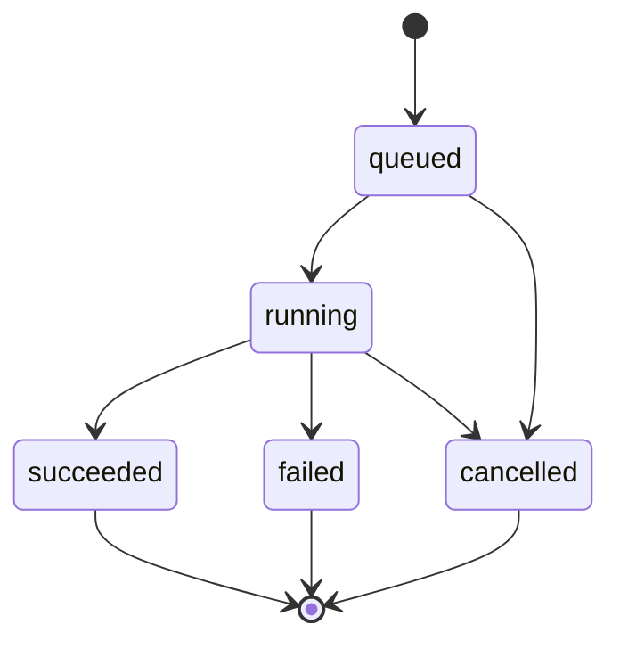

# Installation Lifecycle and Runtime Registry

| 字段 | 值 |
|---|---|
| 状态 | Proposed |
| 生命周期单位 | `(tenant_id, agent_id)` |
| 激活策略 | staging + validate + DB transaction + Registry atomic swap |

## 1. 状态维度

一个 Agent 的状态必须拆为五个维度，API 不得再用单个 `available` 或 `connected` 承载全部语义。

### 1.1 Installation Status

| 值 | 含义 | 是否可进入 Registry |
|---|---|---:|
| `installing` | API overlay：该 Agent 有活跃 install/update/reinstall；不覆盖 DB 中旧 ready row | 旧 ready definition 可继续；新内容否 |
| `ready` | installation definition 和预期入口已成功激活 | 还需 enabled、runtime/protocol ready |
| `disabled` | 用户停用；文件和记录保留 | 否 |
| `incompatible` | core/platform/protocol 版本明确不兼容 | 否 |
| `broken` | 已激活记录的入口缺失、定义损坏或无法恢复 | 否 |

`installing` 默认不作为新 active row 写入 DB：

- 首装期间 Installed API 由 task overlay 返回 installing。
- 更新期间旧 row 保持 ready，API 同时返回 `operation=updating`。
- 这样崩溃不会把可用旧版本替换成半安装状态。

### 1.2 Runtime Status

| 值 | 含义 |
|---|---|
| `unchecked` | 尚无启动/入口观察 |
| `ready` | program 存在，宿主 Runtime 满足，bounded start/probe 可运行 |
| `runtime_missing` | Node/npm/uv 或 System executable 缺失 |
| `entry_missing` | managed local bin/executable 缺失 |
| `failed` | program 启动、版本 probe 或输出限制失败 |

### 1.3 Protocol Status

| 值 | 含义 |
|---|---|
| `unchecked` | 未做 ACP/Native conformance |
| `ready` | 必要 handshake/session 成功 |
| `auth_required` | Runtime 可启动，但认证条件未满足 |
| `failed` | 协议初始化、session 或 clean shutdown 失败 |
| `unsupported` | 协议/能力明确与 core 不兼容 |

### 1.4 Installed / Connected / Execution Ready

```text
installed = installation row exists and expected ownership/entry is recorded
connected = protocol_status == ready
execution_ready =
  installed
  && enabled
  && installation_status == ready
  && runtime_status == ready
  && protocol_status == ready
  && requested purpose is declared
```

`health_stale=true` 表示 `checked_at` 超过显示 TTL，不自动把 `execution_ready` 改为 true 或 false。实际执行仍进行入口校验并返回稳定错误。

## 2. Lifecycle Task 状态机

本节状态机是 lifecycle workflow 的统一内部模型，也是 Desktop/Tauri 的公开后台 task 模型。当前 Go CLI 的 Engine client 每次 `Call` 启动一个 one-shot Engine 进程，stdin EOF 后进程退出，因此 CLI 不得获得一个 task ID 后再用另一个 Engine 进程轮询。Engine adapter 必须提供同步 `*.run` wrapper：在同一请求/进程内运行 workflow 到终态，复用相同 phase/cancellation/cleanup 逻辑，并返回 terminal result。

### 2.1 Task State



### 2.2 Task Phase

```text
queued
preparing
probing_runtime
downloading
installing
validating_integrity
validating_layout
probing_protocol
activating_database
reloading_registry
cleaning_up
succeeded | failed | cancelled
```

System bind 跳过 downloading/installing/integrity，但仍必须经过 preparing、probing_runtime、probing_protocol、activating_database、reloading_registry。

### 2.3 Snapshot 最小字段

```text
AgentLifecycleTaskSnapshot {
  id
  tenant_id?              # Desktop public DTO 可省略，Engine 内部保留
  agent_id
  action                  # install/update/reinstall/uninstall/enable/disable
  state
  phase
  catalog_version?
  agent_version?
  distribution_id?
  distribution_type?
  ownership?
  progress { completed_units, total_units?, downloaded_bytes?, total_bytes? }
  cancellable
  created_at
  updated_at
  finished_at?
  result?: AgentInstallationView
  error?: AgentMarketErrorView
  warnings[]
}
```

禁止在 snapshot/event/log 中携带 secret、package registry token、完整 stderr、raw env 或完整下载 URL query。

Catalog refresh 使用独立的全局 `AgentCatalogRefreshTaskSnapshot`，其 `agent_id` 为空且 action 固定为 `catalog_refresh`；不得用虚构 Agent ID 填充 lifecycle snapshot。它复用相同的 state/phase/error/retention/event + polling 约束，但全局同时最多一个 refresh task。

## 3. 安装预检

`inspect/preview` 必须在开始任务前完成轻量检查：

1. catalog/item/version/distribution 仍存在且匹配。
2. core/platform/arch 兼容。
3. System version 或 Npx/Uvx Runtime 满足。
4. runtime root 可创建、可写，staging 和 active 可原子 rename。
5. 估算/已知 artifact 和解压预算未超限。
6. 同一 Agent 无活跃 lifecycle task。
7. install 目标当前未 ready；update 当前已 installed 且新版本不同；reinstall 当前已 installed。
8. 目标 Agent 无会阻塞 update/uninstall 的 active execution。
9. request 中没有任意 command/args/env/path 注入字段。

预检是 UX 快照，不替代后台任务开始后的再次校验；TOCTOU 条件必须在任务内重查。

## 4. Managed 首装流程

规范步骤：

1. 获取 per-agent lifecycle lease。
2. 重查 catalog identity 和冲突。
3. 创建 `~/.assetiweave/agent-runtimes/.staging/TASK_ID`。
4. 根据 distribution 调用唯一 installer。
5. 应用时间、大小、文件数和路径安全限制。
6. 生成 `MaterializedRuntime`，验证 program/args/env refs。
7. 执行 runtime probe 和 protocol conformance。
8. conformance 失败：任务 failed，删除 staging，不创建 active row。
9. 将 staging 原子 rename 为带唯一 `INSTALLATION_ID` 的 active target。
10. SQLite transaction upsert current installation 和 health。
11. 从 DB 构建 Registry snapshot 并 swap。
12. DB/Registry 任一步失败：删除未提交 target或恢复 DB；不得留下可被执行的孤立 definition。
13. 发布 terminal snapshot/event，清理 staging/lease。

Managed 首装只有在 conformance 满足必要协议能力后才算成功。

## 5. System 绑定流程

System 与 managed 的差异：

1. 不创建 active managed directory。
2. 解析 candidate 到实际 executable，并记录 version/checked_at。
3. 不计算 executable hash，不复制文件。
4. 运行 ACP/Native conformance。
5. conformance 成功：保存 `ready/ready/ready` 并进入 Registry。
6. conformance 失败：允许保存用户确认过的 binding 作为 Installed 诊断记录：
   - installation_status=`ready`
   - runtime_status=`ready`（若 CLI/version probe 成功）
   - protocol_status=`failed|auth_required|unsupported`
   - execution_ready=false
   - 不进入 Registry
7. task 可以 `succeeded` 并带 `degraded` warning，表示绑定动作完成但不可执行；UI 必须清楚显示修复动作。

这种例外用于准确表达“CLI 已安装但 ACP 不通”，不得映射成 connected。

## 6. 更新流程

### 6.1 Managed -> Managed

1. 保留旧 row、旧 active directory、旧 Registry definition。
2. 新版本完整安装和 conformance 均在 staging/新 target 完成。
3. active execution 检查在预检和激活前各执行一次。
4. 激活前设置 per-agent mutation gate，阻止检查后出现新 execution；gate 内重查 active count。
5. DB upsert 新 row；Registry swap 新 definition。
6. 清除 mutation gate 后删除旧 directory。
7. 旧目录删除失败只产生 cleanup warning，由 recovery 重试；新版本仍 active。
8. 任一激活前失败，旧版本完全不变。
9. DB 已更新但 Registry swap 失败时执行补偿 transaction 恢复旧 row。

同版本重装也使用新的 `INSTALLATION_ID` 目录，不覆盖旧路径，因此 Registry swap 前的 execution 永远不会误启动尚未提交的新内容。

### 6.2 System -> Managed / Managed -> System

ownership 切换必须在预览中明确展示，并按 update 流程处理：

- System -> Managed：新 managed 验证成功后切换；不修改 System CLI。
- Managed -> System：System conformance 成功后切换，再删除旧 managed directory。
- 目标 System conformance 失败时不得替换可用 managed 版本。

### 6.3 Manual Only

Catalog 发现新版本只设置 `update_available=true`。不得自动下载、自动激活或在应用启动时更新。

## 7. 重装流程

重装使用当前 installation 的 agent version/distribution ID，重新解析当前有效 catalog：

- managed：像同版本 update 一样 staging + validate + atomic replace。
- System：重新解析 path/version/conformance并刷新记录。
- 当前 catalog 已不包含该精确版本时返回 `catalog_version_unavailable`，不得偷偷改装最新版本。

## 8. 卸载和停用

### 8.1 停用

1. 检查 active execution；有活跃执行时返回 `agent_in_use`。
2. 设置 per-agent mutation gate，并在 gate 内重查 active execution。
3. 更新 `enabled=0`/installation status view disabled。
4. reload Registry 移除 definition并清 gate。
5. 保留文件、版本、health 和 assignment；assignment UI 显示不可用。

### 8.2 卸载

1. 获取 per-agent lease。
2. 检查 active execution 和其他 lifecycle task；真正删除前设置 mutation gate 并再次检查。
3. 计算引用该 Agent 的 capability assignments。
4. 若 request 未明确处理引用，返回 `assignment_conflict` 及引用列表。
5. DB transaction 删除 installation，并按请求清除引用；不得创建替代 assignment。
6. Registry reload 移除 definition；失败时恢复旧 DB row/assignment 并保留旧 Registry、旧文件。
7. 成功或补偿完成后清 mutation gate。
8. 成功时 managed 验证目录在 runtime root 内后删除；System 不操作文件。
9. 文件删除失败时记录结构化 cleanup warning/日志并在启动恢复扫描中重试；不得新增版本历史表，也不得恢复已删除 binding 造成误执行。

若实现阶段选择“先删文件后删 DB”，将破坏原子性，属于不合格实现。

## 9. 取消语义

任务 cancellation token 必须传入：

- HTTP/download loop；
- package manager host process；
- archive extraction loop；
- conformance probe；
- cleanup 等待。

不可取消区间只允许是短小的 DB transaction + Registry swap。进入该区间后 snapshot `cancellable=false`；收到取消请求时完成或补偿激活，再以真实状态结束，不得报告 cancelled 但 installation 已切换。

## 10. 安装后 Conformance

### 10.1 通用 Runtime 检查

- resolved program 存在、类型正确。
- argv/env 通过 `AgentDefinition::validate`。
- 进程在限定时间内启动或返回可分类错误。
- stdout/stderr 有上限，日志只保留脱敏摘要。
- shutdown 后无残留 process tree。

### 10.2 ACP 最小检查

1. spawn resolved local program。
2. ACP initialize。
3. 校验 protocol version/核心需要的 capability。
4. 建立 app-owned 空 workspace 的 `session/new`。
5. 不发送用户 prompt，不注入 MCP，不批准 permission。
6. clean close；必要时 bounded terminate/kill tree。

Model discovery 为独立可选步骤：

- catalog 声明 model discovery 时可以运行；
- 失败写入 model health，但若默认模型可用，不改变 protocol_status=ready；
- 用户显式 model 在实际执行时仍必须成功应用，不得静默回退。

### 10.3 Native 最小检查

使用现有 Native backend 定义的无副作用 health contract。不得为了统一测试把 Native 伪装为 ACP。

## 11. 健康检查策略

### 11.1 触发

- 安装/更新/重装后：强制。
- 应用启动：只做便宜的入口/Runtime 校验；不 probe-all ACP。
- Installed 详情打开：可按单 item 懒检查。
- 用户点击“检查连接”：强制 protocol probe。
- 实际执行：入口和 ready gate 必须重验；协议错误按执行错误返回。

### 11.2 持久化摘要

installation row 保存最近：

- runtime status/error/checked_at；
- protocol status/error/checked_at；
- model discovery status/checked_at（可选）；
- conformance catalog/app version。

这些是 observation，不是远程真相，也不取代实际执行错误。

## 12. Registry Reload 算法

```text
runtime_manager.reload(tenant_id):
  rows = repository.list_candidate_installations(tenant_id)
  definitions = []
  for row in rows:
    if !row.enabled or !row.execution_ready: continue
    definition = decode_and_validate(row.definition_json)
    verify ownership/path boundary
    definitions.push(definition)
  next = AgentRegistrySnapshot::from_definitions(generation + 1, definitions)
  registry.atomic_publish(next)
  emit agent-registry-updated { generation, agent_ids }
```

不变量：

- duplicate agent ID 使整个 reload 失败，旧 snapshot 不变。
- 单条损坏 row 不得静默执行；是否跳过并标记 broken，必须在 repository/lifecycle 中先修复后重载。MVP 采用“标记 broken 后重新构建”，并记录 error。
- snapshot 不包含 catalog distribution/download 字段。

## 13. 启动恢复

启动时在后台执行 bounded recovery：

1. 删除超过 24 小时且没有活跃 task 的 `.staging/TASK_ID`。
2. 遍历 managed installation rows，验证 install_dir/program 仍在 runtime root 内且存在。
3. 缺失入口标记 `broken`、execution_ready=false。
4. 加载 ready + enabled + execution_ready rows 到 Registry。
5. 发现 runtime root 内无 DB row 的旧目录：记录 orphan；仅当可证明是 AssetIWeave 标准布局且超过保留期时清理。
6. 发现旧版本 cleanup warning：重试删除，不影响 active row。
7. 不在启动 recovery 下载、更新或运行全部 ACP handshake。

## 14. 错误模型

稳定错误 code 至少包括：

| Code | 场景 | 可重试 |
|---|---|---:|
| `agent_not_found` | catalog/installed 均无 ID | 否 |
| `agent_not_installed` | 有 catalog/assignment，无 installation | 安装后 |
| `agent_not_ready` | installed 但 readiness gate 未满足 | 修复后 |
| `agent_migration_pending` | post-upgrade assigned Agent 仍在后台探测/绑定 | 等待后 |
| `distribution_unsupported` | 当前平台/架构无候选 | 否/升级后 |
| `runtime_missing` | Node/npm/uv/System command 缺失 | 安装 Runtime 后 |
| `catalog_unavailable` | 无有效 catalog | 是 |
| `catalog_version_unavailable` | 请求固定版本不在有效目录 | 刷新/维护后 |
| `artifact_integrity_failed` | hash/integrity 不匹配 | 不自动 |
| `archive_invalid` | path/link/size/file count 违规 | 否 |
| `installation_conflict` | 同 Agent 有 lifecycle task | 等待后 |
| `agent_in_use` | 有 active execution | 等待后 |
| `agent_lifecycle_busy` | execution 在短激活/停用/卸载 gate 期间到达 | 短暂等待后 |
| `assignment_conflict` | 卸载有 capability 引用 | 确认后 |
| `acp_probe_failed` | ACP conformance 失败 | 视原因 |
| `core_incompatible` | core version 不在范围 | 升级后 |
| `atomic_activation_unavailable` | staging/target 不能原子切换 | 修复路径后 |
| `install_cancelled` | 任务取消并已收敛 | 是 |

错误 view：

```text
AgentMarketErrorView {
  code
  message
  agent_id?
  phase?
  retryable
  action?       # install_runtime / retry / reinstall / refresh_catalog / wait
  details?      # 仅结构化非敏感摘要
}
```

## 15. 事件与轮询

事件名建议：

- `agent-lifecycle-task-updated`
- `agent-registry-updated`
- `agent-installation-health-updated`
- `agent-market-catalog-updated`

每个 task snapshot 必须有单调 `updated_at`；前端 merge 时 terminal 状态不得被旧 running event 覆盖。事件只是加速，`get/list task` 是恢复真相。

Event + polling 适用于 Tauri/Desktop 长驻进程。one-shot Engine/CLI 不对外承诺跨进程 task retention；CLI 的 Ctrl-C/Context cancellation 必须传入当前 Engine workflow，并在 Engine 返回/退出前完成 bounded cleanup。

## 16. 生命周期不变量

1. staging 永不进入 Registry。
2. 新 managed install conformance 失败永不替换旧/创建 active installation。
3. System probe 失败可以留下诊断 binding，但永不 connected 或 execution-ready。
4. active execution 存在时不切换或删除其 installation。
5. mutation gate 建立后新 execution 不得越过临界区启动。
6. 取消终态与真实激活状态一致。
7. System file 永不由卸载器删除。
8. Registry generation 只在成功发布完整 snapshot 时递增。
9. update 失败后旧 definition、DB row 和目录仍一致。
10. 列表页不因展示 Market 而启动所有 Agent。
11. 任何清理只作用于经 canonicalize/ancestor 验证的 app-owned 路径。
